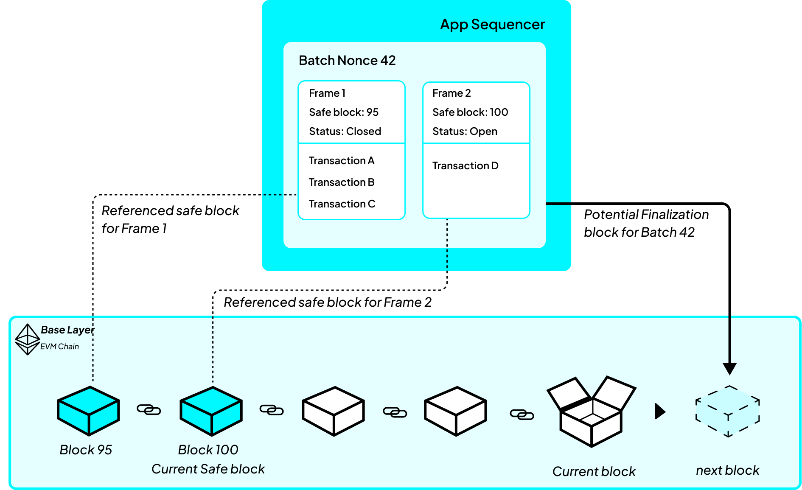

The sequencer does not post transactions to the base layer one at a time. It packages them, and the shape of that package is what lets the machine reconstruct the same order without trusting the sequencer.

## The structure of a batch

A batch contains transactions, frames, and a safe block reference.

- A **batch** is what the sequencer posts to the base layer. It carries a number, its nonce, and a list of frames.
- A **frame** is a group of transactions inside a batch. It carries a **safe block** and a fee price alongside its transactions.
- The **safe block** is a base-layer block number, and it is the instruction that ties the two sides together.

## How the safe block determines execution order

A frame's safe block is a statement by the sequencer: _I have accounted for everything that arrived directly on the base layer up to this block._

The machine does not take that on trust. It acts on it. Before running a frame's transactions, it runs every direct input recorded at or before that frame's safe block. The sequencer's claim and the machine's behaviour are the same rule, so both end up interleaving the two sources of transactions identically.

This is why the sequencer can answer immediately and still be right. It applies the same rule locally when it accepts a transaction, so the state it judges that transaction against already contains the direct inputs that will run ahead of it.

## Why batches contain multiple frames

A batch could have carried a single safe block for everything in it. Frames exist so the number can move forward part way through.

While the sequencer is filling a batch, the base layer keeps producing blocks and direct inputs keep arriving. Frames let one batch record that some transactions were evaluated at block 100 and later transactions at block 105. The batch can therefore remain open while the sequencer's base-layer view advances.



```
Batch, nonce 42
  frame 1   safe block 100   transactions A, B, C
  frame 2   safe block 105   transaction D
```

Run by the machine, that becomes:

```
run direct inputs recorded up to block 100
run A, B, C
run direct inputs recorded up to block 105
run D
```

## Rules for a valid batch

The machine checks a batch before running it, and rejects one that is not well formed.

- **A frame cannot claim the future.** Every frame's safe block must be at or before the block the batch itself was recorded in. A batch cannot claim to have accounted for base-layer activity that had not happened when it was posted.
- **Safe blocks cannot go backwards.** Across the frames of a batch they must be non-decreasing. The sequencer's view of the base layer only moves forward, so a batch that goes backwards is malformed.
- **Batches arrive in numbered order.** Each batch carries the next expected nonce. One that carries the wrong number is rejected.
- **A batch must not be too old.** Measured from its **first** frame's safe block, a batch that reaches the base layer 1200 blocks or more after that block is skipped as stale.

## How a stale batch affects later batches

A batch that is accepted consumes its nonce, and the machine then expects the next number. A batch that is **skipped as stale does not consume its nonce**. The machine is still waiting for that same number.

Every later batch then carries a number the machine does not expect, so each is rejected in turn. No application state is corrupted and no machine state needs to be reversed because those batches never take effect. The resulting loss covers everything from the missed batch onward.

It is also what makes repair possible. Because the nonce never advanced, a rebuilt batch can reuse it and be accepted as though the skipped one had never been sent. See [Soft confirmations](./soft-confirmations.md) for what this means for a user.

## How transaction-level failures are handled

Once the machine begins executing a valid batch, a problem with one transaction does not stop the remaining transactions. The machine skips only the affected transaction when:

- its signature cannot be used to identify the sender;
- the application rejects it; or
- its maximum fee is lower than the price set for that part of the batch.

A skipped transaction makes no change to the application state. The machine continues with the rest of the batch, and the batch still advances the expected batch number.

Transactions submitted through the public API normally fail before reaching this stage. The API checks the signature first and returns `400` if it is invalid. The sequencer then checks the transaction against the application and the current price, returning `422` if either check fails. Only a transaction that passes these checks is stored in a batch. See [Submitting operations](../usage/submitting-operations.md).

The machine still needs its own rule because it cannot assume that every batch was constructed correctly. If unexpected transaction data reaches the base layer, the machine must produce a predictable result. Skipping only the invalid transaction allows the remaining valid transactions to continue without invalidating the entire batch.

## Related concepts

- To see where this sits in the whole system, read [Architecture at a glance](../foundations/architecture.md).
- To see how the two ways in differ, read [Direct inputs vs sequenced transactions](./direct-vs-sequenced.md).
