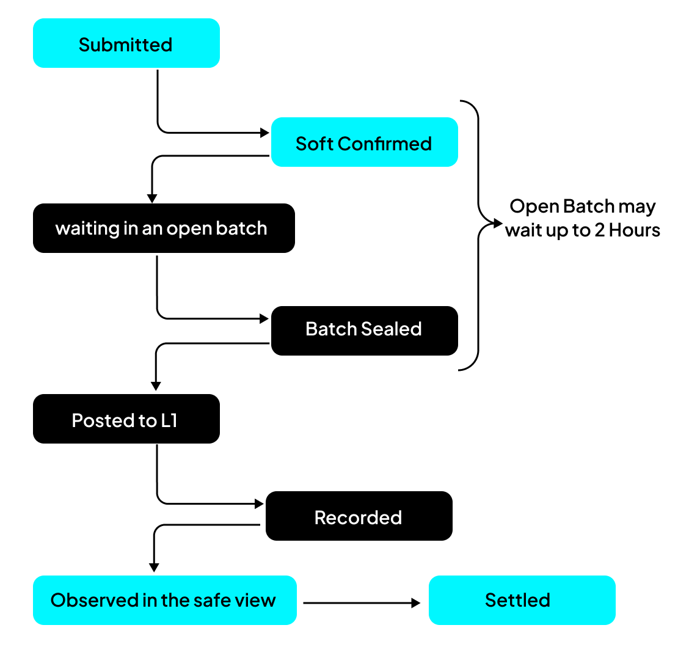

A **soft confirmation** is the sequencer's immediate answer to a user. It notifies the user that a transaction has been validated, executed against current state, and durably placed in the sequencer's current ordering. It arrives as soon as the sequencer has processed the transaction, long before anything reaches the base layer.

It is a prediction. A reliable one under normal condition, but a prediction nevertheless.

## What a Soft Confirmation Means

A soft confirmation says the sequencer has accepted the transaction, executed it, and placed it in the ordering it intends to post.

It does **not** hand back a position. The response carries the sender and the nonce it accepted, not an offset, a batch, or a frame. A position exists only once the transaction appears in the feed, and a client that needs one reads it there.

The prediction is trustworthy because the sequencer is not guessing. It applies the same ordering rules the machine will apply later, so under normal running the position it reports is the position the application ends up using. See [Architecture at a glance](../foundations/architecture.md) for how the two sides stay aligned.

## Transaction lifecycle and settlement timing

While the speed of execution of a transaction via the sequencer is described as "Fast" below is the complete path it takes:

| Stage                        | What it means                      | Typical time from submission            |
| ---------------------------- | ---------------------------------- | --------------------------------------- |
| **Submitted**                | The sequencer has it               | Immediate                               |
| **Soft confirmed**           | Accepted, ordered, and answered    | Immediate                               |
| **Sealed into a batch**      | The batch it belongs to has closed | **Anything up to 2 hours**              |
| **Posted to the base layer** | The batch has been submitted       | Seconds after sealing                   |
| **Recorded**                 | It is in a block                   | One block, about 12 seconds on Ethereum |
| **Settled**                  | Deep enough to be irreversible     | About 13 minutes after recording        |

**A batch closes on one of two conditions: it reaches its size target, or it has been open too long.** The second is a wall clock limit, and it defaults to **2 hours**.

What that means in practice depends entirely on traffic:

- **A busy application** fills batches by size, so they close often and the sealed row is small.
- **A quiet application** does not, so a transaction can sit in an open batch for up to 2 hours before it is even posted despite being soft confirmed the whole time.

So a soft confirmation is immediate, and settlement can still be hours away. Both statements are true, and an interface that treats "confirmed" as "nearly settled" will be wrong on a quiet application.

## Limits of a soft confirmation

A soft confirmation is **not** settlement. It does not mean the transaction has reached the base layer, and it does not mean the result can never change.

The gap matters because a user acts on it. Someone who is shown a completed trade or a successful move has been told something that is, at that instant, still a prediction.

## When a Soft Confirmation Can Be Invalidated

A soft confirmation is invalidated when its transaction does not become part of canonical execution. The main liveness case is a batch that reaches the base layer after the protocol deadline and is skipped by the scheduler.

[Staleness and the danger zone](./staleness.md) explains the deadline, why stale batches are skipped, and how one missed batch affects the sequence that follows it.

## How Invalidation Affects Later Batches

Because batches use consecutive numbers, invalidation can affect a suffix of provisional history, not just one batch. Recovery removes that suffix and resumes from the accepted canonical frontier. The staleness page gives a worked example of this numbering effect.

## How Long Transactions Remain at Risk

The risk begins when the sequencer issues a soft confirmation. It ends only after the transaction's batch has reached the base layer and the application can confirm its outcome from a sufficiently settled view of that layer. There is no single fixed duration for this process.

Before submission, a transaction may remain in an open batch for up to the configured batch limit, which defaults to two hours. The batch must then be submitted, recorded, and allowed to settle. On Ethereum, reaching the settled view used by the sequencer typically takes about two epochs, or roughly 13 minutes after the batch is recorded. Submission delays or base-layer disruption can extend the total time.

The sequencer monitors this progress and stops issuing new confirmations when it detects that its current view is no longer safe. Detection is not immediate because the relevant base-layer events must first become settled enough to trust. Transactions confirmed before the problem becomes visible may therefore still be affected.

The 13 minute period is the approximate observation delay after base-layer recording, not the complete lifetime of a soft confirmation. For a quiet application, the full period of risk can include up to two hours of waiting for the batch to close, followed by submission and settlement time.

## How Clients Observe Invalidation

The ordered feed does not send rollback messages. A transaction removed during recovery is absent from a later replay, but a client that already received it gets no live retraction. [Reading the sequenced feed](../usage/reading-the-feed.md) explains cursor storage, replay, and reconciliation.

## How clients should handle soft confirmations

- **Show a soft confirmation as fast, not as final.** Distinguish it in the interface from something that has settled on the base layer. A user should be able to tell the difference between "accepted" and "settled".
- **Treat feed delivery as provisional.** Appearance in the feed means the transaction belongs to the current valid local ordering. It does not prove base-layer acceptance or settlement.
- **Reconcile outstanding transactions.** The feed does not announce rollbacks. A client must track its outstanding transactions and compare them against later reads or safe application state to detect a lapse.
- **Size the caution to the stakes.** Adding ceremony everywhere throws away the point of the sequencer, so scale it instead:
  - *Low value or easily repeated*, such as a move in a game or a post: act on the fast answer.
  - *Meaningful but recoverable*, such as a transfer inside the application: act on it, but mark it as not yet settled.
  - *Expensive or irreversible*, such as anything paying out or crossing a boundary: wait for settlement.

## Next steps

- To see how the two sides stay aligned, read [Architecture at a glance](../foundations/architecture.md).
- To see what the sequencer is and is not trusted for, read [Trust model and guarantees](../foundations/trust-model.md).
