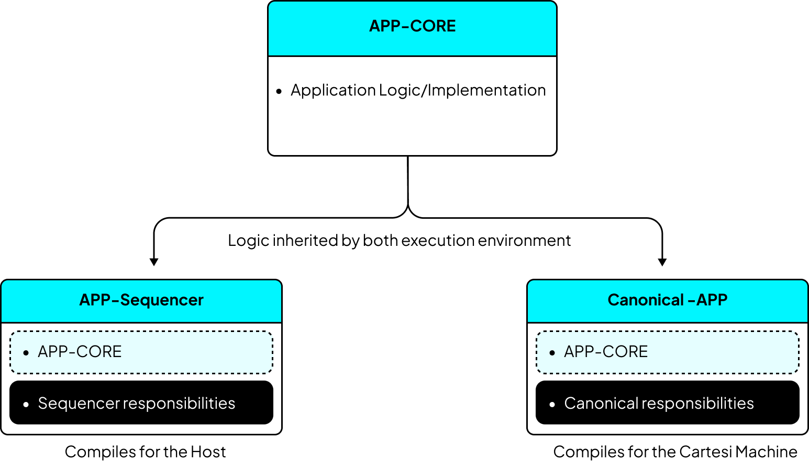

Adding the app-specific sequencer produces two programs that use the same application logic:

| Component             | Runs in         | Responsibility                                                                                                      |
| --------------------- | --------------- | ------------------------------------------------------------------------------------------------------------------- |
| Application core      | Both programs   | Validates operations, changes application state, handles direct inputs, and serializes state                        |
| Sequencer binary      | Off-chain host  | Accepts signed operations, predicts their results, creates batches, and submits those batches to the base layer     |
| Canonical application | Cartesi machine | Reads recorded inputs, applies the authoritative scheduling rules, and emits the application's notices and vouchers |

The sequencer accelerates an existing application. It does not replace the Cartesi machine or change where settlement occurs.

## Recommended project structure

Keep the application logic in a library that both programs can compile. A practical workspace looks like this:

```text
my-application/
├── app-core/          # Application trait implementation and domain logic
├── app-sequencer/     # Small off-chain binary using sequencer::run_main
└── canonical-app/     # Cartesi machine entry point using the canonical scheduler
```

`app-core` depends on `sequencer-core`, which contains the shared protocol types and the `Application` trait. `app-sequencer` depends on the higher-level `sequencer` crate. `canonical-app` depends on `sequencer-core` and the rollup I/O library used to read inputs and emit outputs inside the machine.

This separation is important when application dependencies need different host and RISC-V implementations. The CMA wallet, for example, uses the same ledger API in both environments, with a host-backed buffer for prediction and a persistent machine drive for canonical execution.



## Step 1: implement the shared application core

Implement `sequencer_core::application::Application` on the state type shared by the host sequencer and canonical machine. The interface covers payload limits, validation and execution, direct inputs, progress tracking, durable dumps, and canonical state bytes.

[Application integration requirements](./application-requirements.md) is the authoritative method contract and verification checklist. Complete that contract before wiring either executable. At this stage, the integration-specific goal is to keep the implementation in a dependency that can compile for both the host and the Cartesi machine, with target-specific storage hidden behind the same logical interface.

## Step 2: build the application-specific sequencer

The sequencer repository provides a library, so each application builds its own executable. The binary is intentionally small because command parsing, setup, recovery, HTTP services, and batch submission are supplied by the `sequencer` crate.

A typical crate declares these dependencies:

```toml
[dependencies]
app-core = { path = "../app-core" }
sequencer = { path = "../sequencer/sequencer" }
tokio = { version = "1.35", features = ["macros", "rt-multi-thread"] }
tracing-subscriber = { version = "0.3", features = ["env-filter"] }
```

Adjust the paths or version declarations to match the sequencer release used by your project. The entry point then supplies the application constructor:

```rust
use app_core::{MyApp, MyAppConfig};
use tracing_subscriber::EnvFilter;

#[tokio::main]
async fn main() -> std::process::ExitCode {
    tracing_subscriber::fmt()
        .with_env_filter(
            EnvFilter::try_from_default_env()
                .unwrap_or_else(|_| EnvFilter::new("info")),
        )
        .init();

    sequencer::run_main(|| {
        MyApp::genesis(MyAppConfig::from_env())
            .expect("failed to initialize application state")
    })
    .await
}
```

The constructor closure runs during `setup`, when the genesis dump is created. A normal `run` restores the application from a dump. Configuration that affects execution must therefore be stored in the dump, or checked against the stored deployment configuration, instead of depending only on the current process environment.

The resulting executable supports `setup`, `run`, and `flush-mempool`. The sequencer repository's `examples/wallet-sequencer` crate is the smallest reference for this composition.

## Step 3: include the canonical scheduler in the machine

The Cartesi machine must process batches and direct inputs according to the canonical scheduler. Its entry point needs to:

1. initialize the rollup I/O connection;
2. create the same application state type used by the off-chain sequencer;
3. create `SchedulerConfig` with the batch submitter's address;
4. pass each advance-state request to `Scheduler::process_input` with its sender, inclusion block, EIP-712 domain, and payload;
5. emit every returned notice and voucher through the rollup I/O connection;
6. serve canonical state bytes for supported inspect requests.

The reference I/O loop is in `examples/canonical-app/src/scheduler/mod.rs` in the sequencer repository. With that loop available to the application, the machine entry point has this shape:

```rust
use app_core::{MyApp, MyAppConfig};
use canonical_app::{run_scheduler_forever, SchedulerConfig};
use trolley::cmt::RollupCmt;

fn main() {
    let rollup = RollupCmt::try_new()
        .expect("failed to initialize rollup I/O");
    let app = MyApp::genesis(MyAppConfig::from_env())
        .expect("failed to initialize application state");

    run_scheduler_forever(
        rollup,
        app,
        SchedulerConfig::new(BATCH_SUBMITTER_ADDRESS),
    );
}
```

Here, `canonical_app` represents the application's I/O shell based on the reference example. `run_scheduler_forever` is not exported by `sequencer-core` itself.

### Keep the batch identity consistent

The canonical scheduler classifies an input by its base-layer sender:

- an input from `SchedulerConfig.sequencer_address` is decoded as a sequencer batch;
- an input from any other address is queued as a direct input.

The address passed to `SchedulerConfig::new` must match both `CARTESI_SEQUENCER_BATCH_SUBMITTER_ADDRESS` used during `setup` and the address derived from the private key used during `run`. A mismatch causes valid batches to be handled as direct inputs.

Do not confuse the batch submitter with an application-level fee recipient. They may use the same address, but they serve different purposes. The CMA wallet keeps them as separate configuration values.

### Flush machine-backed state when required

Applications that keep canonical state on a persistent machine drive must ensure writes reach that drive before the rollup yields and a machine snapshot is taken. The CMA wallet adapts the reference I/O loop to synchronize its accounts drive before each request boundary. An in-memory application does not need this extra step.

Compile the canonical program for the machine target, package it with its runtime dependencies, and build a new machine image. Because the scheduler becomes part of that image, its template hash changes. Integrating the sequencer into an existing deployment therefore requires deployment of the new image.

## Step 4: prove that both paths agree

After the application-level checks in the [requirements checklist](./application-requirements.md#verification-checklist) pass, test the assembled integration at three boundaries:

1. **Scheduler agreement:** give direct inputs and batches to `Scheduler<MyApp>`, replay the same operations through the prediction path, and require byte-identical canonical state.
2. **Machine execution:** boot the built Cartesi machine image, send a direct input followed by a covering batch, and verify the notices and vouchers produced inside the machine.
3. **End-to-end synchronization:** run the sequencer and rollups node against the same base layer, submit an operation through the sequencer, and compare the predicted state with the machine's finalized state.

The CMA integration contains examples of each important layer:

| Path                                                       | What it demonstrates                                                                                   |
| ---------------------------------------------------------- | ------------------------------------------------------------------------------------------------------ |
| `sequencer-integration/cma-app-core`                       | A real application adapter, deterministic execution, target-specific state backing, and complete dumps |
| `sequencer-integration/cma-sequencer`                      | The thin `run_main` composition                                                                        |
| `sequencer-integration/cma-canonical-app`                  | The canonical scheduler loop and machine-drive synchronization                                         |
| `sequencer-integration/cma-canonical-app/tests/duality.rs` | Byte-for-byte agreement between canonical scheduling and off-chain prediction                          |
| `sequencer-integration/cma-machine-test`                   | Execution of direct inputs and a batch in the built machine image                                      |

Application-specific choices in that demo, including its ERC-20 portal format, SSZ method union, libcma ledger, and `/dev/pmem1` drive, are examples and are not sequencer protocol requirements.

## Step 5: set up and run the service

After building the application-specific binary, initialize one data directory for each deployment with `setup`, then start it with `run` and the matching submitter key. Follow [Configure, set up, and run the sequencer](../operations/setup-and-running.md) for the complete commands and configuration. Use [Process supervision and recovery operations](../operations/orchestration.md) when preparing the production process.

## Step 6: add the client fast path

Clients that use the sequencer must:

1. encode the application's method payload;
2. sign a `UserOp` using the deployment's EIP-712 domain;
3. submit it to `POST /tx`;
4. treat the successful response as a soft confirmation;
5. consume the ordered WebSocket feed and reconcile later status changes.

The original direct-input route remains available. The application decides which actions that route supports through `execute_direct_input`.

See [Submitting operations](./submitting-operations.md), [Reading the sequenced feed](./reading-the-feed.md), and [Soft confirmations](../concepts/soft-confirmations.md) before updating production clients.

## Integration checklist

- The same deterministic application logic compiles for the host and the Cartesi machine.
- The `Application` implementation covers execution, progress, persistence, and canonical state bytes.
- Dumps restore every value that can affect future execution and are durable when created.
- The application satisfies the `Clone`, `Send`, `Sync`, and `'static` bounds required by `run_main`.
- The canonical machine runs the scheduler before application execution.
- The batch submitter address is identical in setup, runtime key configuration, and `SchedulerConfig`.
- Persistent machine state is synchronized before snapshots when the storage design requires it.
- Agreement tests compare canonical bytes, not only high-level balances or outputs.
- The new machine image and its template hash are deployed before the sequencer is opened to clients.

## Next steps

- Run the local transaction flow in the [Quickstart](./quickstart.md).
- Send a signed transaction with [Submitting transactions](./submitting-operations.md).
- Re-check any interface rule in [Application requirements](./application-requirements.md).
