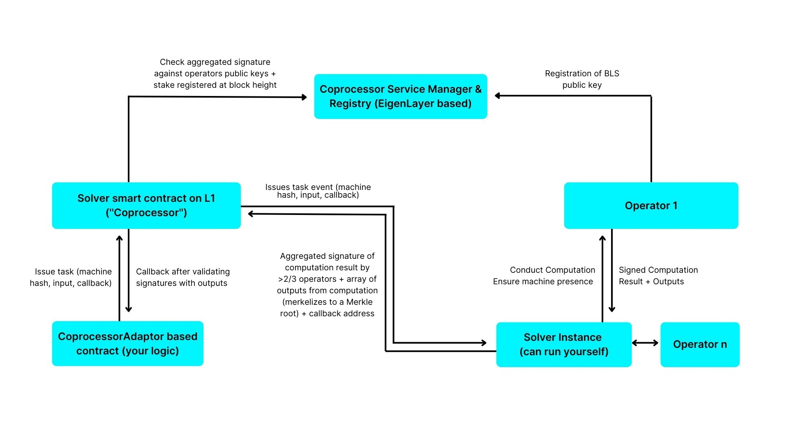
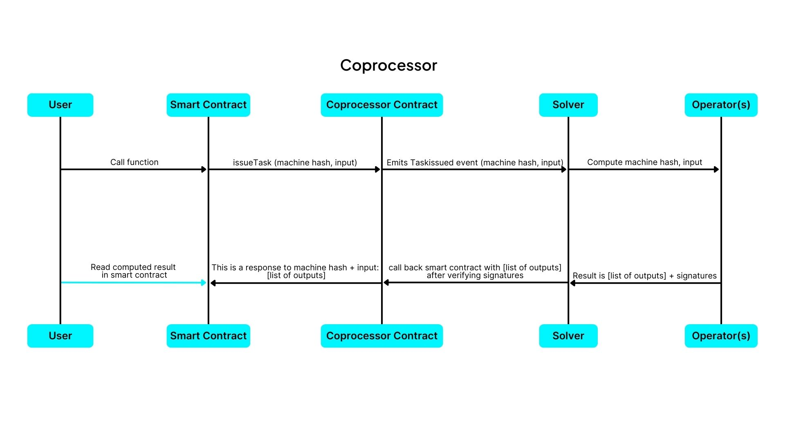

# Architecture

The Cartesi Coprocessor Architecture is designed to enable processing complex computations in specialized computers off-chain. By introducing a new layer called Coprocessors, complex application logic can be executed externally on these specialized computers, all while preserving the application's state on-chain. This integration is composed of two major components: the on-chain layer and the off-chain layer.

### On-chain components

The on-chain components are a set of smart contracts deployed to the base layer, they are the point of contact with regular users interacting with applications deployed to the Cartesi Coprocessor. It is composed of key contracts like:

- **Application smart Contract:** This is a regular smart contract existing on a base layer like Ethereum. It contains logic to request for certain executions to be executed off-chain. It's also designed to receive and handle the result of these executions according to a developer's specification.

- **Coprocessor Contract:** This is a single contract deployed to the base layer. It contains functions that can be called by any application smart contract to request for executions. It's designed to receive requests from application contract, relay these request to the off-chain components of the Coprocessor then receive the results of these requests and forward them back to the application which requested them.

### Off-Chain components

The off-chain components are a collection of external components consisting of servers and also specialized machines called operators which execute operations on request.

- **Solver:**
  The Solver is a specialized server that listens for events emitted by the Coprocessor contract. These events contain requests for external computation. The Solver relays these requests to specialized machines called operators, which execute the computations. Additionally, the Solver ensures that the operators follow the developer-defined logic required to process these requests. Once the operation is successfully completed, the Solver signs the results and sends them, along with an aggregated signature from the operators, back on-chain to the Coprocessor contract.

- **Operators:**
  Operators are a network of specialized machines that execute complex operations using predefined user logic. They do not maintain program state but perform tasks when called and return the results to the caller. Operators are incentivized with tokens based on operation complexity. Currently, the Cartesi Coprocessor integration utilizes operators on the EigenLayer.

