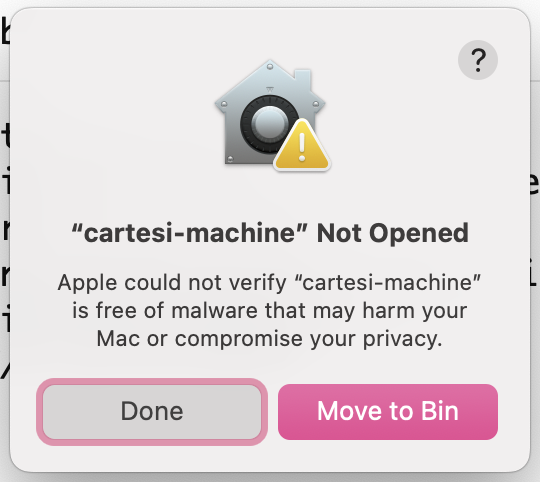
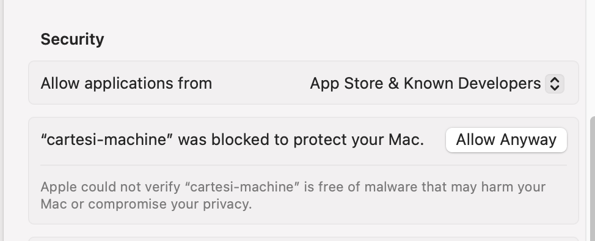

# Troubleshooting Guide

## Introduction

This page covers errors that might arise while following the Cartesi Coprocessor integration guide. The goal is to cover errors/ issues ranging from installation to interaction with each issue being accompanied by a detailed fix.

:::note Actively Updated
This section of the docs is actively being updated and new errors and fixes will be added as they are discovered. If you run into any error during the installation or interaction steps, do inform us on [Cartesi Discord Server](https://discord.gg/cartesi).
:::

### **1. Cartesi Machine blocked by Mac security feature:**

For Mac users, you might run into issues running the Cartesi machine after downloading and installing because of the Mac built-in security feature. You might get a popup similar to this:

### **Fix:**

- Click on the apple icon in the top left corner of the screen.
- Next navigate to and click on "system settings".
- On the left side menu, click on "Privacy and Security".
- Scroll down to the security section, there should be a section referencing the Cartesi Machine, toggle the side menu besides that then select "Allow Anyway".

