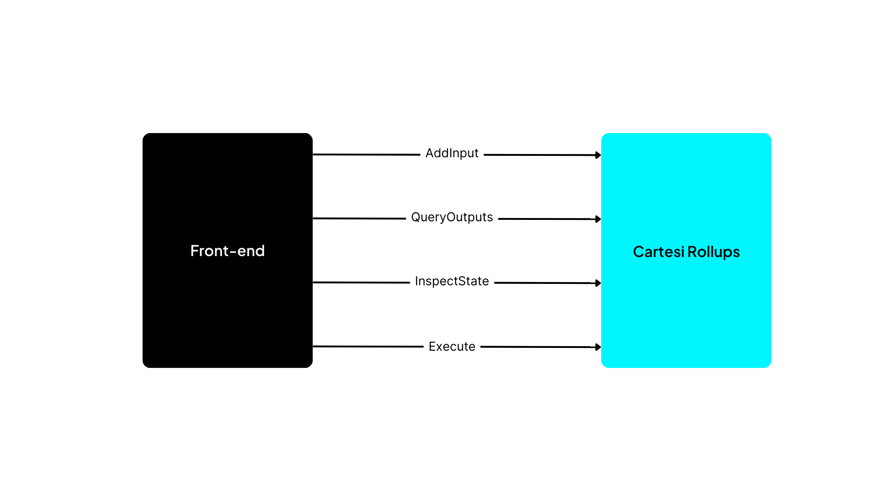

In a Cartesi dApp, the frontend and backend components communicate through the Rollups framework via HTTP APIs.

When designing the APIs for this communication with the framework, we wanted to ensure developers could create their applications without worrying too much about the low-level components of Cartesi Rollups. In particular, we wanted to allow the backend code to abstract away whether it ran inside a specific virtual machine.

With this in mind, we decided to offer APIs on top of HTTP as a convenience layer for this communication, leveraging a well-known standards in software engineering.

## Backend APIs

The dApp's backend interacts with the Cartesi Rollups framework by retrieving processing requests and submitting corresponding outputs.

This is accomplished by calling a set of HTTP endpoints, as illustrated by the figure below:


First, the backend retrieves a new request as follows:

- Finish — Communicates that any previous processing has been completed and that the backend is ready to handle the next request. This next request is returned as the call's response and can be of the following types:

  - **Advance** — Provides input to be processed by the backend to advance the application's state. When processing an `Advance` request, the backend can call the methods `/voucher`, `/notice`, and `/report`. For such requests, the input data contains the payload and metadata, such as the account address that submitted the input.

  - **Inspect** — This function submits a query about the application's current state. When running inside a Cartesi Machine, this operation is guaranteed to leave the state unchanged since the machine is reverted to its exact previous condition after processing. For Inspect requests, the input data has only a payload.

Here is a simple boilerplate application that handles Advance and Inspect requests:

import Tabs from '@theme/Tabs';
import TabItem from '@theme/TabItem';

<Tabs>
  <TabItem value="JavaScript" label="JavaScript" default>
<pre><code>

```javascript
const rollup_server = process.env.ROLLUP_HTTP_SERVER_URL;
console.log("HTTP rollup_server url is " + rollup_server);

async function handle_advance(data) {
  console.log("Received advance request data " + JSON.stringify(data));
  return "accept";
}

async function handle_inspect(data) {
  console.log("Received inspect request data " + JSON.stringify(data));
  return "accept";
}

var handlers = {
  advance_state: handle_advance,
  inspect_state: handle_inspect,
};

var finish = { status: "accept" };

(async () => {
  while (true) {
    const finish_req = await fetch(rollup_server + "/finish", {
      method: "POST",
      headers: {
        "Content-Type": "application/json",
      },
      body: JSON.stringify({ status: "accept" }),
    });

    console.log("Received finish status " + finish_req.status);

    if (finish_req.status == 202) {
      console.log("No pending rollup request, trying again");
    } else {
      const rollup_req = await finish_req.json();
      var handler = handlers[rollup_req["request_type"]];
      finish["status"] = await handler(rollup_req["data"]);
    }
  }
})();
```

</code></pre>
</TabItem>

<TabItem value="Python" label="Python" default>
<pre><code>

```python
from os import environ
import logging
import requests

logging.basicConfig(level="INFO")
logger = logging.getLogger(__name__)

rollup_server = environ["ROLLUP_HTTP_SERVER_URL"]
logger.info(f"HTTP rollup_server url is {rollup_server}")

def handle_advance(data):
   logger.info(f"Received advance request data {data}")
   return "accept"

def handle_inspect(data):
   logger.info(f"Received inspect request data {data}")
   return "accept"


handlers = {
   "advance_state": handle_advance,
   "inspect_state": handle_inspect,
}

finish = {"status": "accept"}

while True:
   logger.info("Sending finish")
   response = requests.post(rollup_server + "/finish", json=finish)
   logger.info(f"Received finish status {response.status_code}")
   if response.status_code == 202:
       logger.info("No pending rollup request, trying again")
   else:
       rollup_request = response.json()
       data = rollup_request["data"]
       handler = handlers[rollup_request["request_type"]]
       finish["status"] = handler(rollup_request["data"])

```

</code></pre>
</TabItem>

</Tabs>

As the backend processes each request, it can access a set of HTTP endpoints provided by the Rollups framework to inform it of the computed results and consequences, as shown below:

- `/voucher` — Called to specify a collateral effect in the form of a transaction that can be carried out on L1 (e.g., a transfer of ERC-20 tokens). The backend can only add new vouchers when processing an Advance request.

- `/notice` — Provides information in a form that any third party on base layer can verify. Notices inform users about a new relevant application state. Like vouchers, you can only add notices when processing an Advance request.

- `/report` — Outputs arbitrary data in a non-provable form. Reports provide diagnostics and logs associated with requests. You can generate a report in an Advance request. Inspects requests Reports return results of Inspect calls or provide diagnostics and logs associated with processing requests.

After handling each request, the backend should always initiate a call to `"Finish"` to signal the completion of processing and retrieve the subsequent request for processing as a response.

## Frontend APIs

The frontend component of the dApp needs to access the Cartesi Rollups framework to submit user requests and retrieve the corresponding outputs produced by the backend.

The figure below details some of the main use cases for these interactions:



- [`addInput()`](../api/json-rpc/input-box.md/#addinput) — This function submits input data to the InputBox smart contract on the base layer as a regular JSON-RPC blockchain transaction. When that transaction is mined and executed, an event containing the submitted input’s index is emitted, which the frontend can later use to query associated outputs.

- [`executeOutput()`](../api/json-rpc/application.md/#executeoutput) — Submits a JSON-RPC blockchain transaction to request that a given voucher or notice be executed by the [`Application`](../api/json-rpc/application.md) smart contract on the base layer.

- Query outputs — You can submit a query to a Cartesi node to retrieve vouchers, notices and reports, as specified by the Cartesi Rollups GraphQL schema.

- Inspect state — You can make a HTTP call to the Cartesi node to retrieve arbitrary dApp-specific application state.

:::note
The complete specification for these endpoints can be found in the Rollups HTTP APIs reference.
:::
