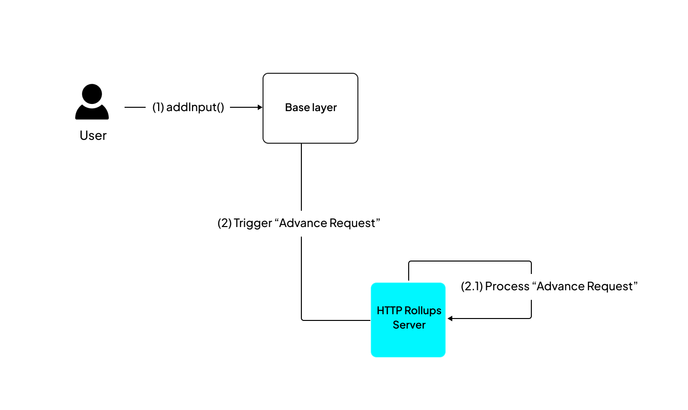
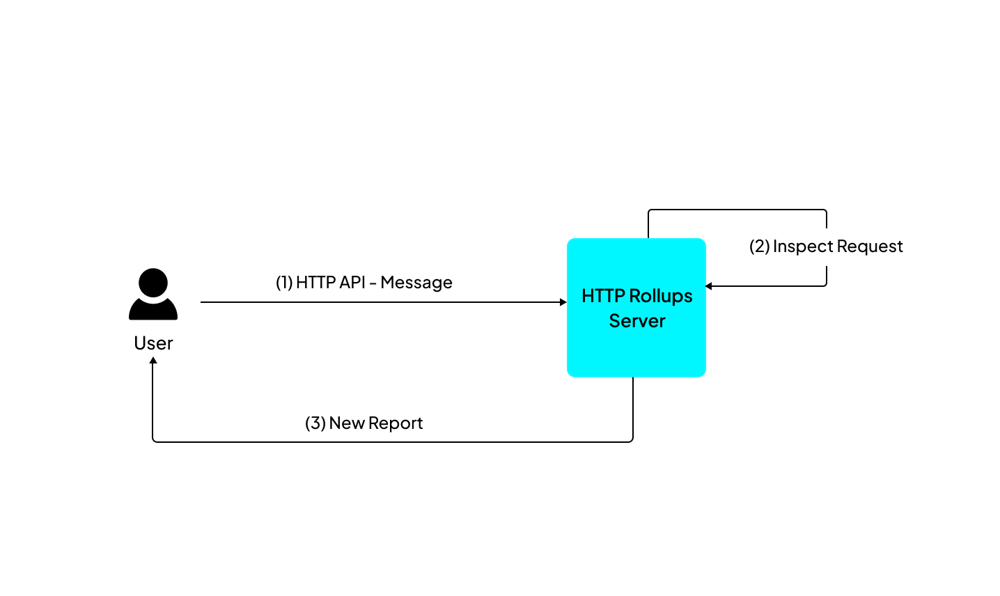

You can send two requests to an application depending on whether you want to change or read the state.

- **Advance**: In this request, any input data changes the state of the dApp.

- **Inspect**: This involves making an external HTTP API call to the Cartesi Node to read the dApp state without changing it.

## Advance and Inspect Requests

Here is a simple boilerplate application that handles Advance and Inspect requests:

import Tabs from '@theme/Tabs';
import TabItem from '@theme/TabItem';

<Tabs>
  <TabItem value="JavaScript" label="JavaScript" default>
<pre><code>

```javascript
const rollup_server = process.env.ROLLUP_HTTP_SERVER_URL;
console.log("HTTP rollup_server url is " + rollup_server);

async function handle_advance(data) {
  console.log("Received advance request data " + JSON.stringify(data));
  return "accept";
}

async function handle_inspect(data) {
  console.log("Received inspect request data " + JSON.stringify(data));
  return "accept";
}

var handlers = {
  advance_state: handle_advance,
  inspect_state: handle_inspect,
};

var finish = { status: "accept" };

(async () => {
  while (true) {
    const finish_req = await fetch(rollup_server + "/finish", {
      method: "POST",
      headers: {
        "Content-Type": "application/json",
      },
      body: JSON.stringify({ status: "accept" }),
    });

    console.log("Received finish status " + finish_req.status);

    if (finish_req.status == 202) {
      console.log("No pending rollup request, trying again");
    } else {
      const rollup_req = await finish_req.json();
      var handler = handlers[rollup_req["request_type"]];
      finish["status"] = await handler(rollup_req["data"]);
    }
  }
})();
```

</code></pre>
</TabItem>

<TabItem value="Python" label="Python" default>
<pre><code>

```python
from os import environ
import logging
import requests

logging.basicConfig(level="INFO")
logger = logging.getLogger(__name__)

rollup_server = environ["ROLLUP_HTTP_SERVER_URL"]
logger.info(f"HTTP rollup_server url is {rollup_server}")

def handle_advance(data):
   logger.info(f"Received advance request data {data}")
   return "accept"

def handle_inspect(data):
   logger.info(f"Received inspect request data {data}")
   return "accept"


handlers = {
   "advance_state": handle_advance,
   "inspect_state": handle_inspect,
}

finish = {"status": "accept"}

while True:
   logger.info("Sending finish")
   response = requests.post(rollup_server + "/finish", json=finish)
   logger.info(f"Received finish status {response.status_code}")
   if response.status_code == 202:
       logger.info("No pending rollup request, trying again")
   else:
       rollup_request = response.json()
       data = rollup_request["data"]
       handler = handlers[rollup_request["request_type"]]
       finish["status"] = handler(rollup_request["data"])

```

</code></pre>
</TabItem>

</Tabs>

In a typical Cartesi backend application, two functions, `handle_advance` and `handle_inspect,` are defined to handle the two different types of requests.

This script listens to rollup requests, handles them asynchronously using defined handler functions, and communicates the completion status to the rollup server.

Every starter project you create has this base code as a template, ready to receive inputs!

### Initiate an advance request

You can initiate an advance request by sending input from the CLI using Cast, Cartesi CLI, or a custom frontend client.

Advance requests involve sending input data to the L1 through a JSON-RPC call, allowing the information to reach the dApp backend and trigger a change in the application's state.



In the dApp architecture, here is how an advance request plays out.

- Step 1: Send an input to the [`addInput(address, bytes)`](../rollups-apis/json-rpc/input-box.md/#addinput) function of the InputBox smart contract.

- Step 2: The Cartesi Node reads the data and gives it to the Cartesi machine for processing.

- Step 3: After the computation, the state is updated, and the results are sent back to the rollup server.

You can send inputs to your application with [Cast](https://book.getfoundry.sh/cast/), Cartesi CLI, or a custom web interface.

#### 1. Send inputs with Cast

```shell
cast send <InputBoxAddress> "addInput(address,bytes)" <DAppAddress> <EncodedPayload> --mnemonic <MNEMONIC>
```

This command sends the payload to the InputBox smart contract, initiating the advance request.

Replace placeholders like `<InputBoxAddress>`, `<DAppAddress>`, `<EncodedPayload>`, and `<MNEMONIC>` with the actual addresses, payload, and mnemonic for your specific use case.

You can obtain the relevant addresses by running `cartesi address-book`.

#### 2. Send inputs with Cartesi CLI

Cartesi CLI provides a convenient way of sending inputs to a dApp.

To send an input, run:

```shell
cartesi send
```

```shell
$ cartesi send
? Select send sub-command (Use arrow keys)
❯ Send DApp address input to the application.
  Send ERC-20 deposit to the application.
  Send ERC-721 deposit to the application.
  Send ether deposit to the application.
  Send generic input to the application.
```

There are five types of inputs using a sub-command: `dapp-address`, `erc20`, `erc721`, `ether`, `generic`.

Unlike the asset-type sub-commands (Ether, ERC20, and ERC721), the generic input command allows you to send inputs with any payload format (hex, string, and ABI).

```shell
$ cartesi send generic
? Chain (Use arrow keys)
❯ Foundry
? Chain Foundry
? RPC URL http://127.0.0.1:8545
? Wallet Mnemonic
? Mnemonic test test test test test test test test test test test junk
? Account 0xf39Fd6e51aad88F6F4ce6aB8827279cffFb92266 9999.969240390387558666 ETH
? DApp address 0x70ac08179605AF2D9e75782b8DEcDD3c22aA4D0C
? Input String encoding
? Input (as string) Hello World
✔ Input sent: 0x27a140b65feb714342a1dda31b6bfa2f8a83518231bb3b2da4bac506e0559007
```

#### 3. Send inputs via a custom web app

You can create a custom frontend that interacts with your application.

Here is a [React.js + Typescript template](https://github.com/prototyp3-dev/frontend-web-cartesi) with the functionalities to build on Cartesi.

### Make Inspect calls

Inspect requests are directly made to the rollup server, and the Cartesi Machine is activated without modifying its state.

:::caution Inspect requests
Inspect requests are best suited for non-production use, such as debugging and testing. They may not function reliably in production environments, potentially leading to errors or disruptions.
:::



You can make a simple inspect call from your frontend client to retrieve reports.

To perform an Inspect call, use an HTTP GET request to `<address of the node>/inspect/<request path>`. For example:

```shell
curl http://localhost:8080/inspect/mypath
```

Once the call's response is received, the payload is extracted from the response data, allowing the backend code to examine it and produce outputs as **reports**.

From a frontend client, here is an example of extracting the payload from an inspect request:

```javascript
const response = await fetch("http://localhost:8080/inspect/mypath");
const result = await response.json();
for (let i in result.reports) {
  let payload = result.reports[i].payload;
}
```
