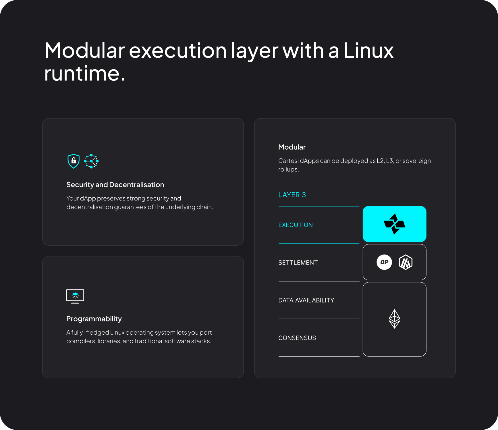

Welcome to the framework that helps you build decentralized blockchain applications using well-known and beloved stacks!

Cartesi Rollups is a modular execution layer where Linux and blockchain meet. As an app-chain, your dApp will control computation resources, ensuring efficiency and preventing network competition. 

At the heart of your dApp, you will find the Cartesi Virtual Machine (based on RISC-V). This allows you to focus more on building and less on the lack of programmability. It has been made possible by deterministically running a full-fledged Linux OS, virtually giving you a blockchain server to run your dApp.

Now, you can leverage industry-grade software tooling and libraries as you do in traditional software development, making it easier to bring your decentralized applications to life.

