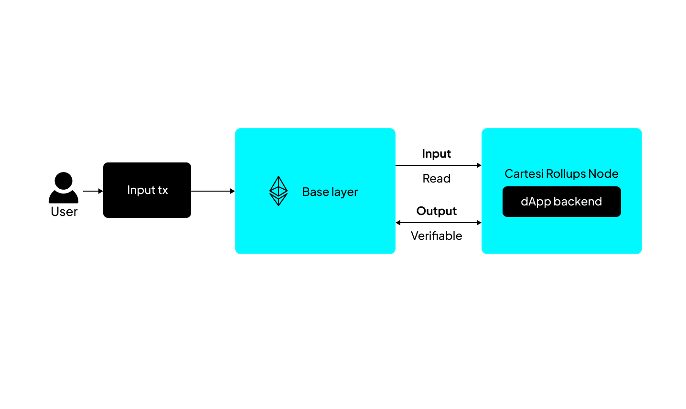

Welcome to Cartesi Rollups, where decentralized application development meets unprecedented flexibility. With a foundation built on the Linux operating system, Cartesi Rollups offers modular stacks that allow developers to tailor consensus, data availability, and settlement layers according to their project requirements.

Utilizing the Cartesi Machine for transaction processing, developers can effortlessly implement sophisticated logic using their preferred programming language or tool. Explore the possibilities and streamline your decentralized application development journey with Cartesi Rollups.


## Introduction 

Let's delve into the workings of a Cartesi Rollup at a high level.




At its core, the Cartesi Rollup executes the Cartesi Machine - a robust RISCV deterministic emulator running Linux OS - fueled by ordered inputs and custom application code. Inputs from the data-availability layer are read by the Cartesi Node, where the Cartesi Machine processes them and generates outputs. After the optimistic rollup dispute window passes, these outputs are verifiable and possibly executable on the settlement layer.

In its simplest configuration, the Cartesi Rollup framework seamlessly integrates with Ethereum, acting as the sole data availability, consensus, and settlement layer. Input transactions are directed to specific smart contracts, where the dApp code operates to produce outputs. Following the settlement period, these outputs are verified and may also be executed on Ethereum, as required.

## Example

Below is a simple Node.js example demonstrating how to read an input and reply with a [notice](./core-concepts/rollup-http-api/backend/notices.md) (a type of output).

```javascript
const { ethers } = require("ethers");
const axios = require("axios");

const rollup_server = process.env.ROLLUP_HTTP_SERVER_URL;

let finish = { status: "accept" };

(async () => {

  while (true) {
    const { data } = await axios.post(rollup_server + "/finish", finish);
    const rollup_message = data;

    if (rollup_message.request_type === "advance_state")  {
      const decodedMsg = ethers.toUtf8String(rollup_message.data.payload);
      const payload = ethers.encodeBytes32String(`Got your message: ${decodedMsg}`);
      await axios.post(rollup_server + "/notice", { payload });
    }
    finish.status = "accept";
})();

```

To ensure flexibility across different programming languages and stacks, Cartesi dApps are implemented as infinite loops that manage their transaction cycles through HTTP POST requests to the `/finish` endpoint. You can learn more about this abstraction [here](./core-concepts/rollup-http-api/backend/introduction.md).

In the Cartesi Rollup framework, all inputs sent to the base layer trigger an "advance_state" [request](./development/send-requests.md#initiate-an-advance-request), which alters the state of the Cartesi Machine and consequently the Rollup. Since inputs originate on-chain, they are hex-encoded following the EVM message standard.

Notices can be understood as "provable" events, as such they can be sent to an EVM chain to be verified, so it follows that they are also hex-encoded.
 
Finally, in this example no errors a treated, thus, we end the cycle accepting the input (`status: accept`). However, if any input causes the application to enter a faulty state or violates business logic, the application can end the process by calling the endpoint `/finish` with `status: reject` to revert the state of the machine (and rollup) to the state before the arrival of the current input. 

