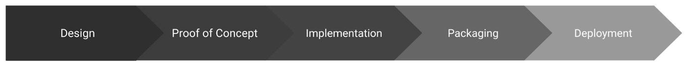

Now that we have described the [architecture of a Cartesi dApp](./dapp-architecture.md) and how [the front-end and back-end communicate with the Cartesi Rollups framework](./http-api.md), let’s step back a bit to discuss how a dApp can be implemented in practice.

As mentioned before, we at Cartesi wanted to provide a development experience that would feel as familiar as possible for mainstream developers. With that in mind, we defined a series of _stages_ covering the entire life cycle of a Cartesi dApp’s development. The intention here is to allow developers to use their usual mainstream development environment for the larger part of their projects, and to make that possible Cartesi will provide the necessary tools and infrastructure.

## Stage 1: Design

This would involve the overall conceptual design of the application, specifying the main scope of the front-end and back-end logic, as well as general technology requirements (e.g., whether it will use an SQL database, execute a trained AI model, etc.)

## Stage 2: Proof of Concept

Checkpoint stage to implement a proof of concept ensuring the feasibility of executing the intended back-end logic and tech stacks inside a Cartesi Machine. This stage might involve cross-compiling a library to Cartesi’s RISC-V Linux OS and verifying that the performance of running the intended software in the Cartesi Machine is satisfactory.

## Stage 3: Implementation

This is the stage where the front-end and back-end logic are actually implemented, representing the bulk of the work in the dApp’s development life cycle.

At this stage, the dApp developer will make use of the _Cartesi Rollups Host Environment_ to implement the front-end and back-end modules of the dApp using common mainstream technologies and tools. This environment provides the very same HTTP API as the regular one, mimicking the behavior of the actual L1 and L2 components. This way, the front-end and back-end modules can be tested as any regular application, such as having a web application front-end in the browser and a native back-end running on localhost. This allows the developer to run and debug them using familiar tools, such as an IDE.

We expect this feature to be a game-changer in terms of dApp development productivity. The Cartesi Rollups Host Environment can be executed by simply running a Docker Compose file, and detailed instructions about using it can be found in our [Rollups Github repository](https://github.com/cartesi/rollups-examples).

## Stage 4: Packaging

In this stage, the back-end part is packaged to run inside a Cartesi Machine, to be executed by a real L2 node (i.e., not a development version in which the back-end runs directly on the host). The feasibility of running it inside a Cartesi Machine should have already been accessed during Stage 2, and now we will just see if the full dApp implementation runs satisfactorily as well.

Since the back-end will keep using the very same HTTP API as before, it remains unchanged. The only difference is that this time around it will interact with a service running inside the Cartesi Machine itself, instead of directly communicating with the Rollups Host infrastructure as in Stage 3.

## Stage 5: Deployment

With the full application working fine inside a Cartesi Machine, the final step is to deploy it. This can be tested on a local environment in which a [Hardhat instance acts as a local blockchain](https://hardhat.org/hardhat-network/), but the ultimate goal is of course to deploy it to a remote public blockchain network.

This stage involves publishing the dApp back-end so that Cartesi L2 nodes can execute its logic inside a Cartesi Machine. To that end, the dApp developer will use a [deployment procedure](./build-dapps/deploying-dapps.md) that will register the dApp in the target blockchain and upload the back-end machine configuration so that it can be used by the target Cartesi nodes.
