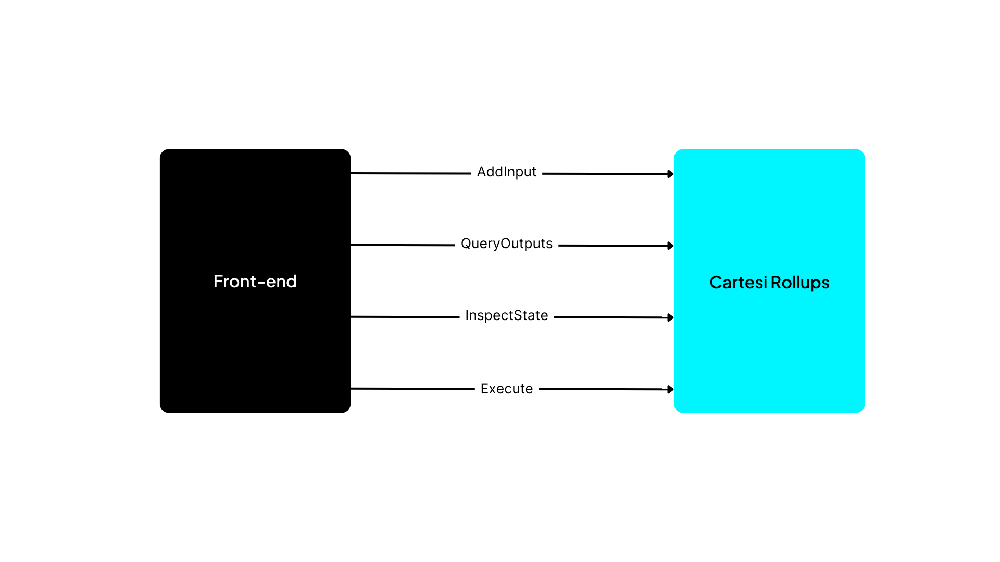

In a Cartesi dApp, the front-end and back-end parts of the application [communicate with each other through the Rollups framework](./dapp-architecture.md#communication) via a set of HTTP APIs.

When designing the APIs for this communication with the framework, we wanted to ensure developers could create their applications without worrying too much about the idiosyncrasies of blockchain technology or our rollups solution. In particular, we wanted to allow the back-end code to abstract away whether it was running inside a specific virtual machine or not.

With this in mind, we decided to offer APIs on top of HTTP as a convenience layer for this communication, leveraging a well-known and ubiquitous standard instead of having applications deal with any kernel-level or VM-specific devices, or having to understand how our rollups solution encodes and decodes data.

## Back-end API

The dApp's back-end interacts with the Cartesi Rollups framework by retrieving processing requests and then submitting corresponding outputs. This is accomplished by calling a set of HTTP endpoints, as illustrated by the figure below:

First, the back-end retrieves a new request as follows:

- [**Finish**](./api/rollup/finish.api.mdx) — Communicates that any previous processing or initialization has been completed, and that the back-end is now ready to handle the next request. This next request is itself returned as the call's response, and can be of the following types:

  - **AdvanceState** — Provides an input to be processed by the back-end in order to advance the application's state. When processing an AdvanceState request, the back-end can call the methods [AddVoucher](./api/rollup/add-voucher.api.mdx), [AddNotice](./api/rollup/add-notice.api.mdx) and [AddReport](./api/rollup/add-report.api.mdx), as detailed below. For such requests, the input data contains the payload and some metadata, such as the account address that submitted the input.

  - **InspectState** — Submits a query about the application's current state. When running inside a Cartesi Machine, this operation is guaranteed to leave the state unchanged, since the machine is reverted to its exact previous condition after processing is completed. For _InspectState_ requests, the input data contains only a payload.

As the back-end processes each request, it can access a set of HTTP endpoints provided by the Rollups framework to inform it of the computed results and consequences, as shown below:

- [**AddVoucher**](./api/rollup/add-voucher.api.mdx) — Called to specify a collateral effect in the form of a transaction that can be carried out on L1 (e.g., a transfer of ERC-20 tokens). The back-end can only add new vouchers when processing an _AdvanceState_ request.

- [**AddNotice**](./api/rollup/add-notice.api.mdx) — Provides information in a form that can be verified by any third-party on L1. This can be used to notify about a new relevant state of the application, such as updated player rankings. As vouchers, notices can only be added when processing an _AdvanceState_ request.

- [**AddReport**](./api/rollup/add-report.api.mdx) — Outputs arbitrary data in a non-provable form. This can be used to return results of _InspectState_ calls, or to provide diagnostics and logs associated with the processing of any request.

As noted before, after each request is handled the back-end should always call [Finish](./api/rollup/finish.api.mdx) to notify that processing is complete, and retrieve as response the subsequent request to be processed. This call will also inform the request's final status as either "accept" or "reject". If an _AdvanceState_ request is rejected, any vouchers and notices generated during its processing are discarded. On top of that, when the back-end is running inside a Cartesi Machine the Rollups framework will completely revert the machine to its previous state, so that rejected inputs have absolutely no effect on the application's subsequent behavior. Reports, on the other hand, are not discarded when a request is rejected, and can still be used for logging purposes.

It should also be noted that _AdvanceState_ requests can originate both from the front-end or directly from a L1 smart contract. In particular, when a Cartesi dApp is deployed, the Rollups framework ensures that the very first request is an initial or _setup_ input submitted by the application itself. This request's purpose is to securely inform the back-end of the dApp's configuration, such as its address on L1. This information is relevant for the back-end to be able to safely distinguish subsequent messages sent by the framework itself (such as deposit notifications) from any user-specified inputs.

Finally, it should be noted that the back-end API also provides a [RegisterException](./api/rollup/register-exception.api.mdx) endpoint to allow the dApp to inform that it has reached an unrecoverable state and cannot proceed with any further request processing. This effectively communicates that the dApp will no longer function, and as such represents the last method ever called by the back-end, which should not even expect the call to return.

:::tip
The complete specification for these endpoints can be found in the [Rollups HTTP APIs reference](../api/back-end).
:::

## Front-end APIs

The front-end part of the dApp needs to access the Cartesi Rollups framework to submit user requests and retrieve the corresponding outputs produced by the back-end. The following figure and table detail some of the main use cases for these interactions:

- [**AddInput**](./api/json-rpc/sol-input.md#addinput) — Submits input data to the Rollups' [InputBox](./api/json-rpc/sol-input.md) smart contract on L1 as a regular [JSON-RPC blockchain transaction](https://ethereum.org/en/developers/docs/apis/json-rpc/). When that transaction is mined and executed, an event is emitted containing the submitted input’s index, which the front-end can later use to query associated outputs. In the future, there will also be support for sending inputs via an aggregator service.
- [**QueryOutputs**](./api/graphql/basics.md) — Submits a query to a Cartesi L2 node to retrieve vouchers, notices and reports, as specified by the Cartesi Rollups [GraphQL schema](https://github.com/cartesi/rollups/blob/main/offchain/graphql-server/schema.graphql).
- [**InspectState**](./api/inspect/inspect.api.mdx) — Submits a query to a Cartesi L2 node to retrieve arbitrary dApp-specific application state.
- [**ExecuteVoucher**](./api/json-rpc/sol-output.md#executevoucher) — Submits a JSON-RPC blockchain transaction to request a given voucher to be executed by the [Cartesi dApp](./api/json-rpc/sol-output.md) smart contract on L1. This is how a dApp’s results, such as a transfer of assets, can take effect on the underlying blockchain. It should be noted that the contracts will only actually execute the voucher if it has been finalized, meaning that its contents can no longer be disputed. Finalization is explained in more detail in the [Main concepts](./components.md#epochs) section and in the [Rollups On-chain article](https://medium.com/cartesi/rollups-on-chain-d749744a9cb3).

:::tip
The complete specification for these front-end APIs, including additional endpoints, can be found in the [Rollups HTTP APIs reference](../api/front-end).
:::
