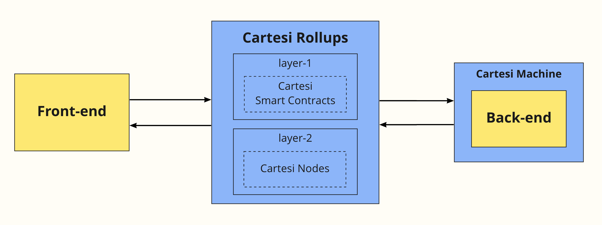
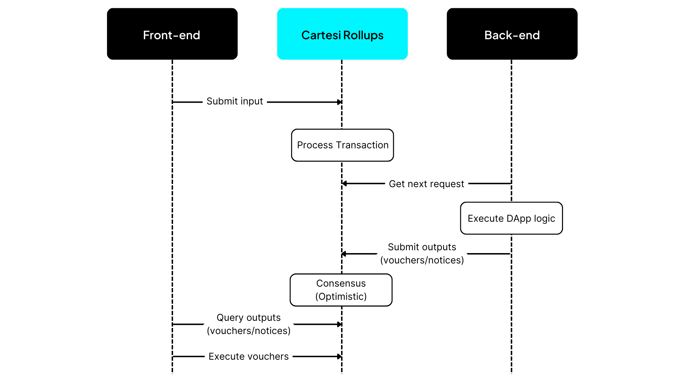

Borrowing from familiar mainstream terminology, from a developer’s point of view a Cartesi dApp is developed by implementing two main components: a [**front-end**](#front-end) and a [**back-end**](#back-end).

Here, the black boxes represent the parts that the developer needs to implement to build a dApp, which are discussed in more detail below. On the other hand, the parts in cyan correspond to the general Rollups framework provided by Cartesi. This framework includes both the underlying L1 blockchain, with Cartesi Rollups smart contracts deployed, and the L2 off-chain nodes.

## Back-end

The back-end of a Cartesi dApp contains the business logic of the application, similar to what traditional systems would run inside a server. The difference here — and the reason for using blockchain technology in general — is that decentralized applications need this back-end logic to be verifiable and hence trustless. As such, it is executed inside the Cartesi Rollups framework.

The back-end stores and updates the application state as user input is received and produces corresponding outputs. These outputs can come in the form of [vouchers](./components.md#vouchers) (transactions that can be carried out on L1, such as a transfer of assets), [notices](./components.md#notices) (informational statements, such as the resulting score of a game), or [reports](./components.md#reports) (application logs and diagnostic information, such as error or warning messages).

In practical terms, a Cartesi dApp back-end can be seen as an advanced smart contract.

## Front-end

The front-end of a Cartesi dApp corresponds to the user-facing interface, which will often provide a GUI (e.g., a web application) but may also be just a command-line interface, such as a Hardhat task using ethers.js, or a command-line tool written in Python.

The front-end's job is usually to collect user input and submit it to the dApp, as well as to query and show the dApp's state.

## Communication

When compared to traditional software development, the main difference of a Cartesi dApp is that the back-end is deployed to a decentralized network of L2 nodes, which continuously verify the correctness of all processing results. As a consequence, the front-end and back-end do not communicate directly with each other. Rather, the front-end sends inputs to the Cartesi Rollups framework, which in turn makes them available to the back-end instances running inside each node. After the inputs are processed by the back-end logic, the corresponding outputs are then informed back to the Rollups framework, which enforces their correctness and makes them available to the front-end and any other interested parties.

The sequence diagram below illustrates how all of this works:

:::note
The Cartesi Rollups framework provides a set of APIs to specify how the dApp's front-end and back-end should communicate with it. These APIs are explained in detail in the [next section](./http-api.md).
:::

## Other components

Aside from the back-end running inside the Cartesi Rollups infrastructure, the dApp front-end may also use external resources such as third-party services. Indeed, for more complex dApps it is expected that there will be other back-ends besides the one running verifiable logic. They would be used whenever the application doesn’t need a service to be decentralized and trustless, such as providing fast and accessible data caches, helping users communicate with each other, or interfacing with other non-blockchain services.

Conversely, it is also possible for complex dApps to provide more than one front-end application, with the goal of supporting different kinds of users and use cases.
