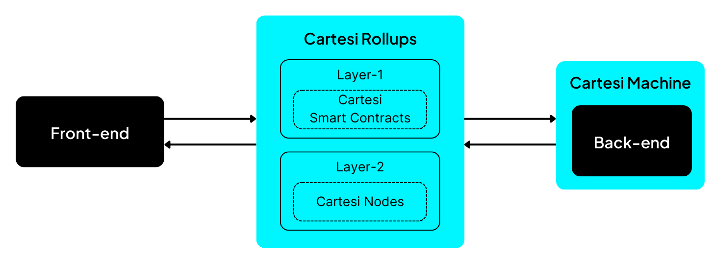

The combination of [an Optimistic Rollups framework](https://github.com/cartesi/rollups) and [the Cartesi Machine Emulator](https://github.com/cartesi/machine-emulator) enables the development of smart contracts and dApps using any package or library that is available for Linux. This allows developers to break free from the scalability limitations of the Ethereum Virtual Machine (EVM), and brings the rise of a new blockchain era to handle real-life and complex use cases.

A dApp running on Cartesi Rollups consists of the following main components:

- [**Cartesi Rollups**](./components.md), a set of on-chain and off-chain components that implement an Optimistic Rollups solution and provide the general framework for building dApps.
- [**Cartesi Machine**](/machine/intro), a virtual machine (VM) that runs an entire Linux OS, in which each dApp's [back-end](./dapp-architecture.md#back-end) is executed.
- [**dApp Back-end**](./dapp-architecture.md#back-end), the application's state and verifiable logic, which corresponds to the dApp's smart contract. The back-end runs inside the Cartesi Machine as a regular Linux application.
- [**dApp Front-end**](./dapp-architecture.md#front-end), the application's user-facing interface, such as a web app.

The diagram below shows the overall architecture:

:::note
You can [**run a simple dApp**](./build-dapps/run-dapp.md) that we already built using Python
:::

## What is a blockchain rollup?

A rollup is a blockchain scalability solution that pushes complex computations "off-chain", meaning that they run on a separate computing environment (execution layer) outside of the main network (base layer, such as Ethereum). When employing rollups, the blockchain's role becomes solely to receive transactions and log them. On rare occasions in which parties disagree with the outcomes of a computation, the blockchain also gets involved in resolving these disputes.

Offloading the blockchain from complex computations along with aggregating and compressing data is expected to increase the number of transactions a blockchain can process by a factor of at least 40x. Additionally, transactions can now involve much more complex logic since applications running in a rollup are able to perform virtually any computation and can also take advantage of more powerful virtual machines (VMs) running on the execution layer.

## How does a rollup work?

Users interact with a rollup through transactions on the base layer. They send messages (inputs) to the rollup on-chain smart contracts to define a computation to be processed, and as such advance the state of the computing environment on the execution layer. Interested parties run an off-chain component (a node on the execution layer) that watches the blockchain for inputs, understanding and executing the state updates.

Once in a while, the state of the machine is checkpointed on-chain, at which point the state is considered to be _finalized_ and can thus be accepted by any smart contract on the base layer. It is of course vital to ensure this operation is secure, meaning that the execution layer node needs to somehow _prove_ the new state to the base layer.

Let’s think about this question:
**"How does a blockchain system, such as Ethereum, know that the data posted by an off-chain L2 node is valid and was not submitted in a malicious way?"**

The answer depends on the rollup implementation, which basically falls within one of two categories according to the type of proof used:

- [Zero-knowledge Rollups (ZK Rollups)](https://ethereum.org/en/developers/docs/scaling/zk-rollups), which use validity proofs
- [Optimistic Rollups (ORs)](https://ethereum.org/en/developers/docs/scaling/optimistic-rollups/), which use fraud proofs

In validity proof schemes, every state update comes accompanied by a cryptographic proof, created off-chain, attesting its validity. The update is only accepted if the proof successfully passes verification on-chain. [Zero-knowledge proofs](https://en.wikipedia.org/wiki/Zero-knowledge_proof) are frequently used for this, which is why these types of rollups are usually referred to as ZK Rollups. Validity proofs bring the big benefit of instant finality — as soon as a state update appears on-chain, they can be fully trusted and acted upon. The choice, however, also brings less than ideal properties: generating ZK proofs for general-purpose computations is, when possible, immensely expensive and each on-chain state update must pay the extra gas fee from including and verifying a validity proof.

Fraud-proof schemes work by a different paradigm. State updates come unaccompanied by proofs, they’re proposed and, if not challenged, confirmed on-chain. Challenging a state update proposal is done by the use of fraud proofs, which can be divided into two categories: non-interactive fraud proofs and interactive fraud proofs.
Non-interactive refers to the fact that the challengers can prove that a state update is invalid in one single step. With interactive fraud proofs, the claimer and challenger have to, mediated by the blockchain, partake in something similar to a verification game. The assumption that state updates will most likely be honest often gives solutions like this the name of Optimistic Rollups. Naturally, this optimism comes paired up with financial incentives for honest behavior and guarantees that, unless the proposed false state is undisputed for a significant amount of time, it will never get accepted.

:::note Summary of a rollup solution

- Executes transaction computations off-chain. This way the computations are not carried out by the base layer. Instead, they are executed in a separate computation environment and the rollup protocol ensures transaction validity via either validity proofs or fraud proofs.
- Capable of compressing data from several transactions into a bundle to decrease both transaction costs and size, increasing overall efficiency.
- Allows blockchains to scale while keeping the security guarantees of its consensus mechanism.
  :::

## Cartesi Rollups

**Cartesi’s version of Optimistic Rollups** uses interactive fraud proofs. The model was chosen because it imposes a higher ceiling to the size of computations that can be executed. In other words, with this model the blockchain base layer is never responsible for executing entire computations: either there are no disputes and no computation takes place there, or, if a dispute occurs, it only needs to compute a single instruction to distinguish between misbehavior and honesty. In either case, the results themselves are always computed off-chain, and as a consequence the computation involved can be massive.

In the next sections:

1. We will discuss the [main concepts of the Cartesi Rollups framework](./components.md) and how they work
2. We will explain how to [send requests](./sending-requests.md) to a Cartesi dApp, and how a Cartesi dApp [reads outputs](./reading-outputs.md) and [manages assets](./assets-handling.md)
3. We will dig deeper into the [architecture of dApps](./dapp-architecture.md) that run on our rollups framework, as well as the [APIs that developers can use](./http-api.md) to communicate with it
4. We will share our vision of a [step-by-step process for developing applications](./dapp-life-cycle.md) on Cartesi Rollups, from the initial design stage up to its final deployment

## Cartesi Machine

Central to Cartesi Rollups is the [Cartesi Machine](/machine/intro), which is a virtual machine designed to perform off-chain computations for blockchain applications. When examined from a high level of abstraction, the Cartesi Machine can be compared to an AWS Lambda function, with similarities that encompass:

- **Code execution**: Code is executed based on specific inputs to perform computations, process data, or run custom logic, depending on the requirements of the task at hand.
- **Abstraction of infrastructure**: The underlying infrastructure is abstracted away, allowing you to focus on writing code without worrying about managing servers, hardware, or networking resources.
- **Flexibility in programming languages**: You have flexibility in the choice of programming languages.
- **Scalability**: Scalability is the primary driver of the whole infrastructure.

The Cartesi Machine is a state machine that remains idle until a new request arises. The concept of state in this case is tied to both the input requests that the Cartesi Machine receives and the execution of the RISC-V instructions that the machine follows to process those requests. The Cartesi Machine handles:

- **Discrete states**: RISC-V instructions are executed in a step-by-step manner, transitioning from one state to another.
- **State transitions**: State transitions happen deterministically as the emulator processes these RISC-V instructions, changing the state of the system to a new discrete state.
- **Determinism**: Given the same initial state and input, Cartesi Machine will always produce the same output and final state to ensure that off-chain computations can be verified and agreed upon.

To engage with Cartesi Rollups, you either interact by [sending requests](./sending-requests.md) or by [accessing generated outputs](./reading-outputs.md).

## See Also

- [Everything you need to know about Optimistic Rollup in general](https://research.paradigm.xyz/rollups)
- [Fraud proofs and virtual machines](https://medium.com/@cpbuckland88/fraud-proofs-and-virtual-machines-2826a3412099) or go into more details [here](https://tlu.tarilabs.com/cryptography/fraud-proofs#what-are-fraud-proofs)
