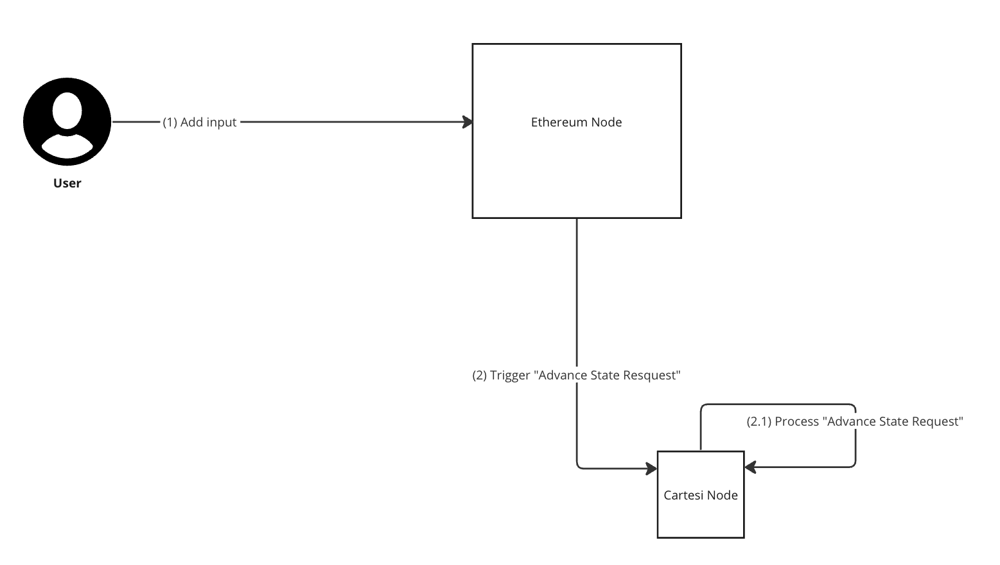
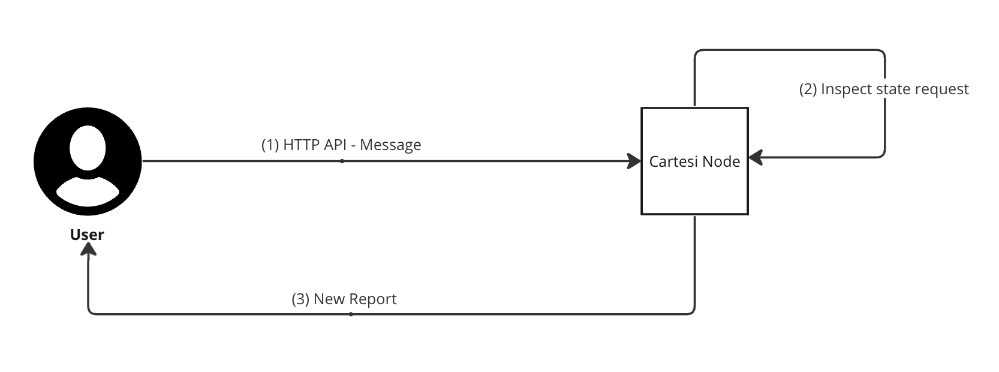

In Cartesi Rollups, there are two kinds of requests that can be made to the dApp:

* **Advance** - Utilizing the [addInput()](./api/json-rpc/sol-input.md#addinput) function call via JSON-RPC to the [InputBox contract](./api/json-rpc/sol-input.md) to send data and change the state of the dApp.
* **Inspect** - Making an external HTTP API call to the [Cartesi Node](./components.md#cartesi-nodes) to read dApp state without changing it.

When you initiate your [node](./components.md#cartesi-nodes) for development purposes, you are effectively deploying Cartesi Rollups on a localhost testnet chain, which serves as your Ethereum network for development and mimics the Mainnet's behavior (for example, Ganache, Anvil, Hardhat node). This means you will be sending transactions to contracts on this local chain.

## Advance



The *Advance* request involves sending input data to Ethereum nodes, so that they can reach the dApp back-end to change the application's state.
To do that, it is important to know that JSON-RPC is the common interface for interacting with Ethereum nodes, allowing communication with the blockchain through remote procedure calls using JSON data structures.

In the context of Cartesi Rollups, we focus on two specific [JSON-RPC methods](https://ethereum.org/en/developers/docs/apis/json-rpc/):

* `eth_sendRawTransaction`. This method accepts signed transaction data as a parameter and returns a transaction hash. This method is particularly useful in production environments where security and privacy are essential, as the transactions are pre-signed with the sender's private key.

* `eth_sendTransaction`. This method is particularly suitable for development and testing environments, as it sends unsigned transactions that are signed by the Ethereum node using the specified account's private key.

These methods are used to call the [InputBox.addInput(address, bytes)](./api/json-rpc/sol-input.md#addinput) function of the dApp smart contract, using as parameters the alias address of your dApp Rollup and the content to submit.

The following snippet uses the [Cast](https://book.getfoundry.sh/cast/) tool to call this function on a local Ethereum node:

```shell
cast send 0xInputBoxAddress123 "addInput(address,bytes)" 0xDAppAddress456 0xEncodedPayload789
```

Advance requests are handled within the Cartesi Machine using the [/finish](./api/rollup/finish.api.mdx) endpoint, by which you inform the final status of the previous request and retrieve input data.

The following Python code example shows how a dApp back-end can read the input payload into a variable:

```python
from os import environ
import requests

rollup_server = environ["ROLLUP_HTTP_SERVER_URL"]

while True:
    response = requests.post(rollup_server + "/finish", json={"status": "accept"})
    rollup_request = response.json()
    if rollup_request["request_type"] == "advance_state":
        payload = rollup_request["data"]["payload"]
```

The payload data is retrieved from the `rollup_server`'s response and stored in the payload variable for further processing.

## Inspect



The *Inspect* call is a direct request to the Rollup Node, which activates the Cartesi Machine (CM) without allowing it to modify its state. It serves as a way to examine the current state without making changes. To perform an Inspect call, you need to use an HTTP GET request to `<address of the node>/inspect/<request path>`, for example:

```shell
curl http://localhost:5005/inspect/mypath
```

As before, the dApp's back-end code needs to call the [/finish](./api/rollup/finish.api.mdx) endpoint to retrieve the payload that was submitted. Once the call's response is received, the payload is extracted from the response data, allowing the back-end code to examine it and produce outputs in the form of [Reports](../main-concepts#reports). In the example below, the output produced is simply a copy of the payload that was submitted:

```python
while True:
    response = requests.post(rollup_server + "/finish", json={"status": "accept"})
    rollup_request = response.json()
    if rollup_request["request_type"] == "inspect_state":
        payload = rollup_request["data"]["payload"]
        requests.post(rollup_server + "/report", json={"payload": payload})
```
 
After finishing processing the call, the Cartesi Rollups framework will revert the Cartesi Machine to its previous state, as if nothing has happened.

Finally, the following Javascript code shows how a client can retrieve the outputs generated from an inspect request:

```javascript
const response = await fetch("http://localhost:5005/inspect/mypath");
const result = await response.json();
for (let i in result.reports) {
    let payload = result.reports[i].payload;
}
```

Now that we know how to handle generic payloads in our dApp, it is important to mention the concept of handling standardized Solidity interfaces, specifically ERC20 and ERC721 assets. To receive this special kind of *input data*, the Cartesi Rollup Framework provides a set of contracts called the [Portals](./components.md#portals), which are specifically designed to [handle assets](./assets-handling.md) on behalf of your dApp.

