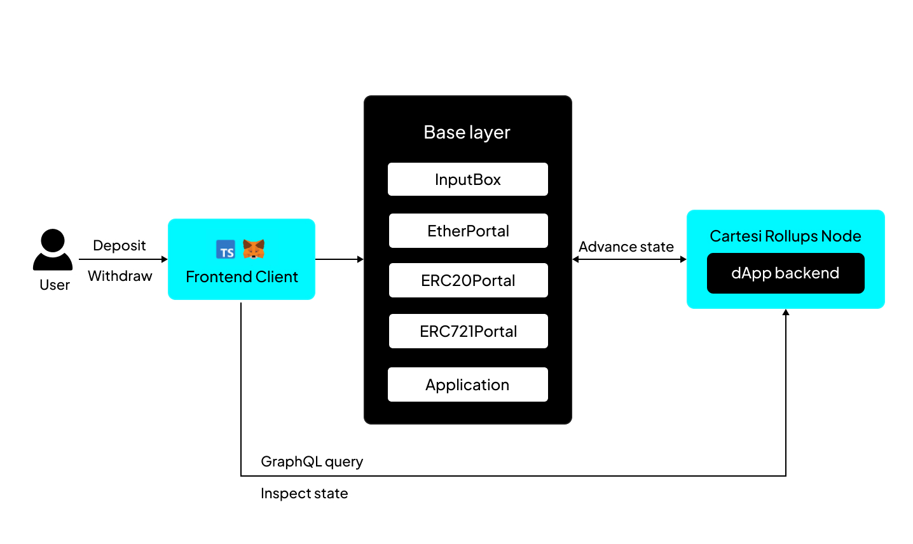
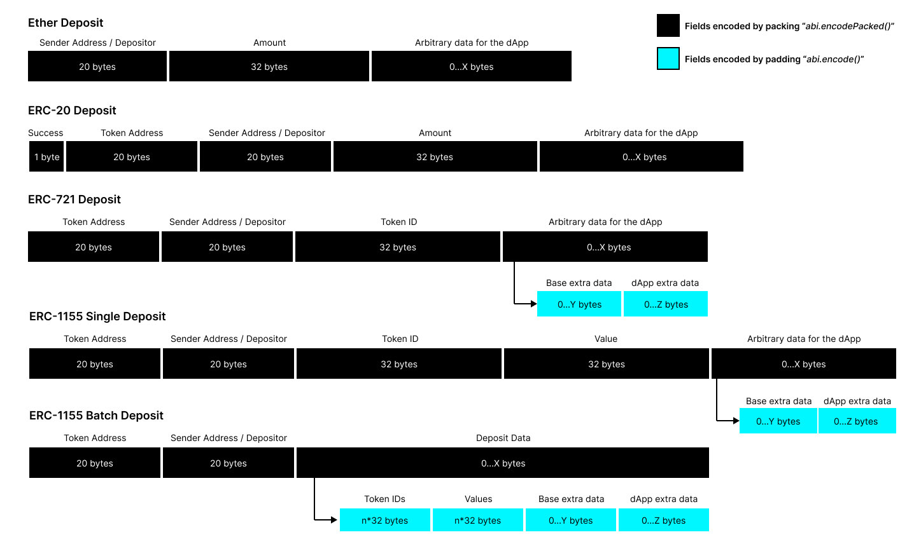

Assets exist on the base layer, where they have actual meaning and value.

As with any execution layer solution, a Cartesi dApp that wants to manipulate assets needs a secure way of "teleporting" the assets from the base layer to the execution layer and then a way to "teleport" them back to the base layer.

Currently, Cartesi Rollups support the following types of assets:

- [Ether (ETH)](../rollups-apis/json-rpc/portals/EtherPortal.md)
- [ERC-20](../rollups-apis/json-rpc/portals/ERC20Portal.md)
- [ERC-721](../rollups-apis/json-rpc/portals/ERC721Portal.md)
- [ERC-1155 Single](../rollups-apis/json-rpc/portals/ERC1155SinglePortal.md)
- [ERC-1155 Batch](../rollups-apis/json-rpc/portals/ERC1155BatchPortal.md)

## Deposits

Portals enable the safe transfer of assets from the base layer to the execution layer. Users authorize portals to deduct assets from their accounts and initiate transfers to dApps.

When an asset is deposited, it is on the base layer but gains a representation in the execution layer. The corresponding Portal contract sends an input via the `InputBox` contract describing the type of asset, amount, and some data the depositor might want the dApp to read. The off-chain machine will then interpret and validate the input payload.

Deposit input payloads are always specified as packed ABI-encoded parameters, as detailed below.

### ABI encoding for deposits

| Asset             | Packed ABI-encoded payload fields                                                                                                                       | Standard ABI-encoded payload fields                                                                                              |
| :---------------- | :------------------------------------------------------------------------------------------------------------------------------------------------------ | :------------------------------------------------------------------------------------------------------------------------------- |
| Ether             | <ul><li>`address sender`,</li><li>`uint256 value`,</li><li>`bytes execLayerData`</li></ul>                                                              | none                                                                                                                             |
| ERC-20            | <ul><li>`bool success`,</li><li>`address token`,</li><li>`address sender`,</li><li>`uint256 amount`,</li><li>`bytes execLayerData`</li></ul>            | none                                                                                                                             |
| ERC-721           | <ul><li>`address token`,</li><li>`address sender`,</li><li>`uint256 tokenId`,</li><li>standard ABI-encoded fields...</li></ul>                          | <ul><li>`bytes baseLayerData`,</li><li>`bytes execLayerData`</li></ul>                                                           |
| ERC-1155 (single) | <ul><li>`address token`,</li><li>`address sender`,</li><li>`uint256 tokenId`,</li><li>`uint256 value`,</li><li>standard ABI-encoded fields...</li></ul> | <ul><li>`bytes baseLayerData`,</li><li>`bytes execLayerData`</li></ul>                                                           |
| ERC-1155 (batch)  | <ul><li>`address token`,</li><li>`address sender`,</li><li>standard ABI-encoded fields...</li></ul>                                                     | <ul><li>`uint256[] tokenIds`,</li><li>`uint256[] values`,</li><li>`bytes baseLayerData`,</li><li>`bytes execLayerData`</li></ul> |

## Decoding Deposits

Deposit input payloads arrives applications as an abi-encoded hex, this hex input would need to be decoded to obtain the contained deposit parameters. This decode process could either be handled manually by the developers or could be automated using the assets' manager library.

The **parser submodule** of the asset manager library simplifies the decode process for deposit payloads by abstracting an already implemented logic to decode the deposit payload for all major assets (ERC721, ERC20, ERC721), it exposes a method called decode input, which the application logic transfers the deposit payload to then receives a struct containing all the parameters contained in the deposit payload. A more detailed guide on the parser library can be found in this [Asset management library section.](../rollups-apis/asset-management-library/parser-submodule.md)

## Managing and Recording Deposits

Once a deposit occurs on the base layer, the application receives all necessary details pertaining to the deposit. It's important that the application maintain a record of an address to a token and finally the balance of the address for that token, without a proper record, the application is unable to tell the exact token and also the amount of token that each address owns on the dApp.

This record can either be implemented manually by the developer or the application could simply import the Asset manager library then leverage the **ledger submodule** to manage and keep this record.

The ledger submodule can be likened to a plug in wallet for applications, it contains a storage struct which tracks the assets balance for each address as well as the total supply for each token deposited to the wallet, finally it exposes methods to handle deposit, transfer and withdrawal of these assets in the record. For a detailed explanation of the ledger library, check this [Asset management library section.](../rollups-apis/asset-management-library/ledger-submoule.md)

## Withdrawing assets

Users can deposit assets to a Cartesi dApp, but only the dApp can initiate withdrawals. When a withdrawal request is made, it’s processed and interpreted off-chain by the Cartesi Machine running the dApp’s code. Subsequently, the Cartesi Machine creates a voucher containing the necessary instructions for withdrawal, which is executable when an epoch has settled.

Vouchers are crucial in allowing dApps in the execution layer to interact with contracts in the base layer through message calls. They are emitted by the off-chain machine and executed by any participant in the base layer. Each voucher includes a destination address and a payload, typically encoding a function call for Solidity contracts.

The dApp’s off-chain layer often requires knowledge of its address to facilitate on-chain interactions for withdrawals, for example: `transferFrom(sender, recipient, amount)`. In this case, the sender is the dApp itself.

By calling [`relayDAppAddress()`](../rollups-apis/json-rpc/relays/relays.md), function of the `DAppAddressRelay` contract, it adds the dApp’s address as a new input for the Cartesi dApp to process. Next, the off-chain machine uses this address to generate a voucher for execution at the [`executeVoucher()`](../rollups-apis/json-rpc/application.md/#executevoucher) function of the `CartesiDApp` contract.

:::note epoch length
By default, Cartesi nodes close one epoch every 7200 blocks. You can [manually set the epoch length](/get-started/cli-commands/#run) to facilitate quicker asset-handling methods.
:::

Here are the function signatures used by vouchers to withdraw the different types of assets:

| Asset    | Destination    | Function signature                                                                                                                          |
| :------- | :------------- | :------------------------------------------------------------------------------------------------------------------------------------------ |
| Ether    | dApp contract  | `withdrawEther(address,uint256)` [:page_facing_up:](../rollups-apis/json-rpc/application.md/#withdrawether)                            |
| ERC-20   | Token contract | `transfer(address,uint256)` [:page_facing_up:](https://eips.ethereum.org/EIPS/eip-20#methods)                                               |
| ERC-20   | Token contract | `transferFrom(address,address,uint256)` [:page_facing_up:](https://eips.ethereum.org/EIPS/eip-20#methods)                                   |
| ERC-721  | Token contract | `safeTransferFrom(address,address,uint256)` [:page_facing_up:](https://eips.ethereum.org/EIPS/eip-721#specification)                        |
| ERC-721  | Token contract | `safeTransferFrom(address,address,uint256,bytes)` [:page_facing_up:](https://eips.ethereum.org/EIPS/eip-721#specification)                  |
| ERC-1155 | Token contract | `safeTransferFrom(address,address,uint256,uint256,data)` [:page_facing_up:](https://eips.ethereum.org/EIPS/eip-1155#specification)          |
| ERC-1155 | Token contract | `safeBatchTransferFrom(address,address,uint256[],uint256[],data)` [:page_facing_up:](https://eips.ethereum.org/EIPS/eip-1155#specification) |

Structuring a voucher to these signatures can either be done manually or by using the **Parser submodule** of the asset management library.