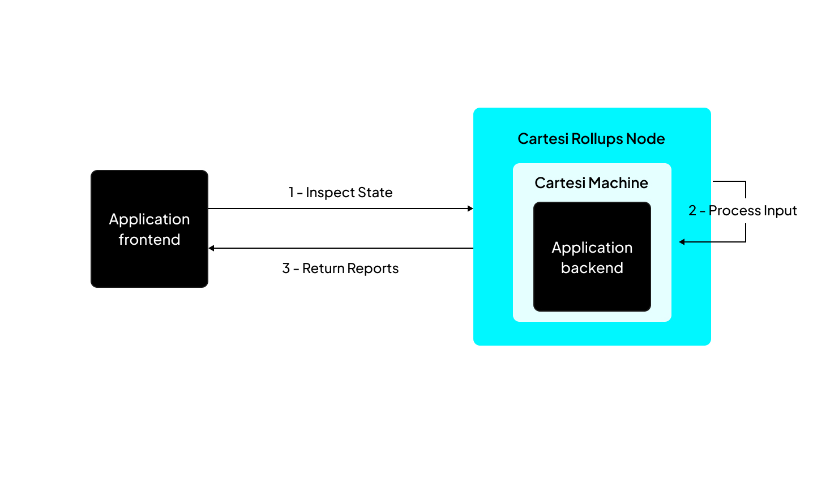

The Cartesi Rollups framework is designed to enable complex computations off-chain while maintaining the security guarantees of blockchain technology. It consists of two primary components: **the on-chain base layer** (such as Ethereum), where the dApp contract is deployed, and **the off-chain execution layer**, where the dApp's backend logic operates.

A decentralized application (dApp) built on Cartesi incorporates several key elements:

- Cartesi Rollups: A set of _on-chain(rollups contracts)_ and _off-chain(rollups node)_ components that implement an Optimistic Rollup solution, providing the general framework for building dApps.

- Cartesi Machine: A virtual machine (VM) that runs a complete Linux operating system, serving as the environment for executing the dApp's backend.

- Backend: The application's state and verifiable logic run inside the Cartesi Machine as a standard Linux application.

- Frontend: The application’s user-facing interface, typically implemented as a web application or a command-line interface tool.

## What is a Blockchain Rollup?

A rollup is a blockchain scalability solution that offloads complex computations "off-chain," meaning they run on a separate computing environment (execution layer) outside the base layer, such as Ethereum.

When employing rollups, the blockchain receives and logs transactions. In rare instances of an active attack or the involvement of a malicious agent, parties may disagree with a computation’s outcomes, and the blockchain will resolve these disputes. However, it's important to note that disagreements are not expected to occur under normal circumstances.

Users interact with a rollup through transactions on the base layer. They send messages (inputs) to the rollup on-chain smart contracts to define a computation to be processed and, as such, advance the state of the computing environment on the execution layer. Interested parties run an off-chain component (a node on the execution layer) that watches the blockchain for inputs, understanding, and executing the state updates.

Once in a while, the state is checkpointed on the chain; at this point, it is considered finalized and can thus be accepted by any smart contract on the base layer.

Ensuring this operation is secure is vital, meaning that the execution layer node must somehow prove the new state to the base layer.

Consider this question: _"How does Ethereum know that the data posted by an off-chain L2 node is valid and was not submitted maliciously?"_

The answer depends on the rollup implementation, which falls within one of two categories according to the type of proof used:

1. **Zero-knowledge Rollups (ZK Rollups)**, which use validity proofs.

2. **Optimistic Rollups (ORs)**, which use fraud proofs.

### Zero-knowledge Rollups (ZK Rollups)

In ZK rollups, which use validity proof schemes, every state update is accompanied by a cryptographic proof created off-chain, attesting to its validity. The update is only taken if the proof successfully passes verification on-chain. Validity proofs(ZK Rollups) bring the enormous benefit of instant finality—as soon as a state update appears on-chain, it can be fully trusted and acted upon.

The choice, however, also brings less than ideal properties: generating ZK proofs for general-purpose computations is, when possible, immensely expensive, and each on-chain state update must pay the extra gas fee for including and verifying a validity proof.

### Optimistic Rollups (ORs)

Optimistic Rollups, which use fraud-proof schemes, work by a different paradigm. State updates come unaccompanied by proofs; they’re proposed and, if not challenged, confirmed on-chain. Challenging a state update proposal using fraud proofs has two categories: **non-interactive** and **interactive**.

Non-interactive refers to the fact that the challengers can prove that a state update is invalid in one step. With interactive fraud proofs, the claimer and challenger must, mediated by the blockchain, partake in something similar to a verification game.

The assumption that state updates will likely be honest often gives solutions like this the name of Optimistic Rollups.

This optimism is reinforced by financial incentives that reward honest behavior. Furthermore, any proposed false state will only be accepted if it remains undisputed for a prolonged period.

The main advantage of Optimistic Rollups is that they are much cheaper than ZK Rollups. Posting a state update on-chain is minimal, and challenging a state update is also low.

The main disadvantage is that state updates take time to finalize and are not entirely accepted immediately. During this period, they are considered "optimistic" and can be challenged.

## Cartesi Rollups

Cartesi's Optimistic Rollups adopt interactive fraud proofs to handle disputes.

The base layer isn't burdened with executing all computations, allowing for more extensive computational tasks.

Transactions and computations occur off-chain, leading to more intricate logic within transactions; hence, applications leverage powerful virtual machines (VMs) on the execution layer for complex computations.

Cartesi's architecture specializes in app-specific rollups(appchains). Each dApp has its dedicated rollup for off-chain computation, enhancing scalability and performance. 

## Cartesi Machine

The Cartesi Machine forms the core of Cartesi's off-chain computation capabilities. It is a virtual machine based on the [RISC-V](https://riscv.org/) instruction set architecture (ISA), designed to provide a deterministic and isolated execution environment.

Key features of the Cartesi Machine include:

- Full Linux OS support: This allows developers to use familiar tools and libraries for backend development. You have flexibility in the choice of programming languages and all open-source libraries available on Linux.

- Isolation and reproducibility: The machine operates independently, ensuring consistent behavior across executions.

- Scalability: By leveraging significant off-chain computing power, the Cartesi Machine enables complex computations while maintaining blockchain-level security.

- The Cartesi machine is self-contained and can't make an external request. It runs in isolation from any external influence on the computation to achieve reproducibility.

The Cartesi Machine achieves its unique balance of scalability and security by performing computations off-chain but providing mechanisms to verify these computations on-chain when necessary.

## On-chain components

The on-chain part of Cartesi Rollups consists of [several smart contracts](../api-reference/json-rpc/overview.md) deployed on the base layer. 

Here is an overview of the major contracts, with each serving a specific role in the dApp ecosystem:

### InputBox
The [InputBox](../api-reference/json-rpc/input-box.md) contract is the entry point for user interactions with the off-chain layer. All inputs destined for a Cartesi dApp are first submitted to this contract, which then emits events that the off-chain components can process.

### CartesiDApp
Each Cartesi dApp is associated with a unique instance of the [CartesiDApp](../api-reference/json-rpc/application.md) contract. This contract acts as the on-chain representation of the dApp and can hold ownership of digital assets on the base layer, including Ether, ERC-20 tokens, and NFTs.

### CartesiDAppFactory
The [CartesiDAppFactory](../api-reference/json-rpc/application-factory.md) contract simplifies the deployment process for CartesiDApp contracts. It allows developers to deploy new CartesiDApp instances with a single function call, enhancing convenience and security. This factory approach ensures the deployed contract bytecode remains unaltered, assuring users and validators.

### Portals

Portal contracts facilitate the secure transfer of assets between the base layer and the Cartesi execution environment. Currently, Cartesi supports the following types of asset transfers:

- [Ether (ETH)](../api-reference/json-rpc/portals/EtherPortal.md)
- [ERC-20 (Fungible tokens)](../api-reference/json-rpc/portals/ERC20Portal.md)
- [ERC-721 (Non-fungible tokens)](../api-reference/json-rpc/portals/ERC721Portal.md)
- [ERC-1155 Single transfers](../api-reference/json-rpc/portals/ERC1155SinglePortal.md)
- [ERC-1155 Batch transfers](../api-reference/json-rpc/portals/ERC1155BatchPortal.md)

These Portal contracts implement the logic to "teleport" assets safely between layers, maintaining their integrity and ownership throughout the transfer process.
 
## Off-chain layer
The off-chain execution layer is centered around the Cartesi Rollups Node, the crucial middleware between the on-chain contracts and the Cartesi Machine. The node is responsible for:

1. Processing inputs: It reads inputs from the base layer and forwards them to the Cartesi Machine for processing.

2. State management: The node manages the state of the dApp, ensuring consistency between on-chain and off-chain representations.

3. Validation: It can act as a validator, generating claims at the end of each epoch to be submitted on-chain.

4. Inspection: The node handles requests to inspect the dApp state, facilitating queries without altering the state.

5. Output management: It operates a GraphQL server that allows clients to query the outputs produced by the dApp.

The Cartesi Rollups Node can operate in two primary modes:

**1. Validator Nodes**: These nodes have full responsibilities, including processing inputs, generating claims, and ensuring the validity of on-chain state updates. They can operate in secure, isolated environments as they don't need to expose endpoints for external state queries.

**2. Reader Nodes (In Development)**: These nodes focus on advancing the off-chain state and making it publicly available. They consume information from the blockchain but do not participate in the validation process.

:::caution important
All Cartesi Nodes function as Validator Nodes, with Reader Node functionality under active development.
:::

## Data Flow and Processes

The Cartesi architecture facilitates several key processes that enable the functioning of dApps. These processes include:

### Advance state

The `advance-state` process changes the application state, and it involves the following steps:

- The application frontend submits an advance-state input to the `InputBox` smart contract on the base layer.

- The node monitors events from the `InputBox` contract and retrieves the input data.

- The node sends the input to the application backend inside the Cartesi Machine.

- The Cartesi Machine processes the input and generates verifiable outputs ([vouchers](../api-reference/backend/vouchers.md), [notices](../api-reference/backend/notices.md), and [reports](../api-reference/backend/reports.md)).

- The application frontend can query these outputs using the node's [GraphQL API](../api-reference/graphql/basics.md).

### Inspect state

The `inspect-state` process allows for querying the application backend without altering its state:

- The application frontend sends an inspect-state input directly to the Cartesi Node.

- The node forwards this input to the Cartesi Machine.

- The Cartesi Machine processes the input and generates a [report](../api-reference/backend/reports.md).

- The node returns this report to the frontend via a [REST API](../api-reference/backend/introduction.md/#advance-and-inspect).

:::note Inspect requests
It's important to note that `inspect-state` inputs do not produce vouchers or notices, and the current implementation processes inputs sequentially, which may impact scalability for applications heavily reliant on inspect-state functionality.
:::

### Validation

The validation process ensures the integrity of the off-chain computations:

- The Cartesi Node bundles multiple `advance-state` inputs into an epoch.

- At the end of an epoch, the node computes a claim summarizing the epoch's state changes.

- The node submits this claim to the Cartesi Rollups smart contracts on the base layer.

- The application frontend can fetch proofs for specific outputs within a closed epoch.

- These proofs can validate outputs on-chain, such as validating notices or executing vouchers.

## Introducing Dave — an interactive fraud-proof system

[Dave](https://github.com/cartesi/dave) is Cartesi's dispute resolution algorithm designed to address shortcomings in existing fraud-proof protocols. Traditional fraud-proof systems often face challenges such as delay attacks and vulnerability to Sybil attacks, where malicious nodes can disrupt operations by continuously challenging transactions or overwhelming honest validators.

Dave introduces an approach where the resources required to defend against disputes grow logarithmically with the number of opponents. This means that defending against challenges remains affordable for a single honest node, even in the face of multiple attackers.

With Dave, a single honest participant can effectively defend their claims on-chain, ensuring the integrity of transactions without relying on trust in validators. Based on the [Permissionless Refereed Tournaments algorithm](https://arxiv.org/abs/2212.12439), this protocol empowers anyone to validate rollups and uphold correct states on-chain, enhancing transaction security and reliability.

Similar to how a consensus algorithm is crucial for achieving agreement on a single state of the blockchain among all nodes in a base-layer chain, Dave plays a fundamental role in ensuring the integrity and trustworthiness of state transitions within Cartesi Rollups.

