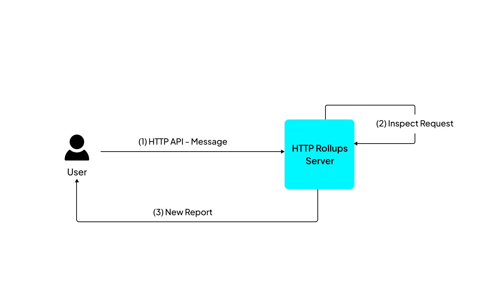

The backend of a Cartesi dApp processes requests in the following manner:

  - **Finish** — Called via [`/finish`](./finish.md), indicates that any previous processing has been completed and the backend is ready to handle the next request. The subsequent request is returned as the call's response and can be of the following types:

    - **Advance** — Provides input to be processed by the backend to advance the Cartesi Machine state. When processing an Advance request, the backend can call the [`/voucher`](./vouchers.md), and [`/report`](./reports.md) endpoints. For such requests, the input data contains both the payload and metadata, including the account address that submitted the input.

    - **Inspect** — Submits a query about the application's current state. When running inside a Cartesi Machine, this operation is guaranteed to leave the state unchanged, as the machine reverts to its exact previous condition after processing. For Inspect requests, the input data contains only a payload, and the backend can only call the [`/report`](./reports.md) endpoint.

  - **Exception** — Called by the backend when it encounters an unrecoverable error during request processing. This signals to the Rollup HTTP Server that the current request processing failed and should be terminated. See [`/exception`](./exception.md) for more details.
  
## Advance and Inspect

Here is a simple boilerplate application that handles Advance and Inspect requests:

import Tabs from '@theme/Tabs';
import TabItem from '@theme/TabItem';

import RequestHandlingJS from '../../development/snippets/request_handling_js.md';
import RequestHandlingPY from '../../development/snippets/request_handling_py.md';
import RequestHandlingRS from '../../development/snippets/request_handling_rs.md';
import RequestHandlingGO from '../../development/snippets/request_handling_go.md';
import RequestHandlingCPP from '../../development/snippets/request_handling_cpp.md';

<Tabs>
  <TabItem value="JavaScript" label="JavaScript" default>
<pre><code>

<RequestHandlingJS />

</code></pre>
</TabItem>

<TabItem value="Python" label="Python" default>
<pre><code>

<RequestHandlingPY />

</code></pre>
</TabItem>

<TabItem value="Rust" label="Rust" default>
<pre><code>

<RequestHandlingRS />

</code></pre>
</TabItem>

<TabItem value="Go" label="Go" default>
<pre><code>

<RequestHandlingGO />

</code></pre>
</TabItem>

<TabItem value="C++" label="C++" default>
<pre><code>

<RequestHandlingCPP />

</code></pre>
</TabItem>
</Tabs>

An **Advance** request involves sending input data to the base layer via JSON-RPC, allowing it to reach the dApp backend to change the application's state.


Here is how an advance request works in the dApp architecture:

- Step 1: Send an input to the [`addInput(address, bytes)`](../contracts/input-box.md#addinput) function of the InputBox smart contract.

- Step 2: The HTTP Rollups Server reads the data and sends it to the Cartesi Machine for processing.

- Step 3: After computation, the machine state is updated, and the results are returned to the rollup server.

An **Inspect** request involves making an external HTTP API call to the rollups server to read the dApp state without modifying it.



You can make a simple inspect call from your frontend client to retrieve reports.

To perform an Inspect call, make a HTTP POST request to `<address of the node>/inspect/<application name>` with a payload in the request body. For example:

```shell
curl -X POST http://localhost:8080/inspect/<application name> \
    -H "Content-Type: application/json" \
    -d '{"payload": "0xdeadbeef"}'
```

The payload should be a hex-encoded string starting with '0x' followed by pairs of hexadecimal numbers.

After receiving the call's response, the payload is extracted from the response data, allowing the backend code to examine it and produce outputs as **reports**.

The direct output types for **Advance** requests are [vouchers](./vouchers.md), [notices](./notices.md), and [reports](./reports.md), while **Inspect** requests generate only [reports](./reports.md).
