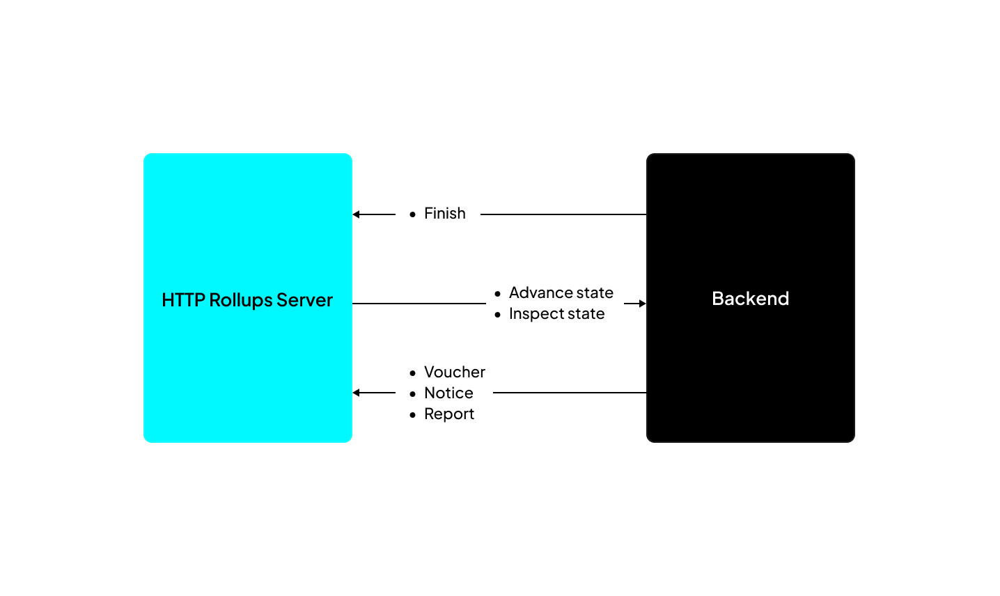
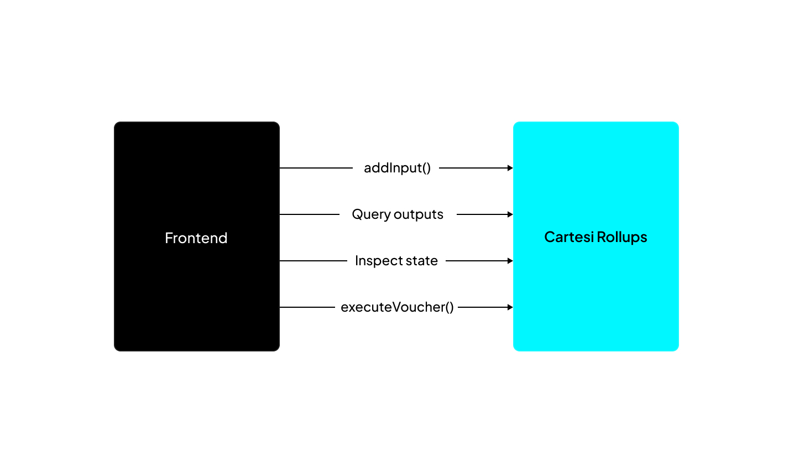

In a Cartesi dApp, the frontend and backend components communicate through the Rollups framework using HTTP and GraphQL APIs.

When designing the APIs for this communication with the framework, we wanted to ensure developers could create their applications without worrying too much about the low-level components of Cartesi Rollups. 

## Backend APIs

In a typical Cartesi dApp, the backend contains the application's state and verifiable logic. The backend runs inside the Cartesi Machine as a regular Linux application. 

The dApp's backend interacts with the Cartesi Rollups framework by retrieving processing requests and submitting corresponding outputs.

This is accomplished by calling a set of HTTP endpoints, as illustrated by the figure below:

You can send two requests to an application depending on whether you want to change or read the state.

- **Advance**: In this request, any input data changes the state of the dApp.

- **Inspect**: This involves making an external HTTP API call to the Cartesi Node to read the dApp state without changing it.

## Base Layer Contracts

The frontend component of the dApp needs to access the Cartesi Rollups framework to submit user requests and retrieve the corresponding outputs produced by the backend.

The figure below details some of the main use cases for these interactions:

- [`addInput()`](./json-rpc/input-box.md/#addinput) — This function submits input data to the InputBox smart contract on the base layer as a regular JSON-RPC blockchain transaction. When that transaction is mined and executed, an event containing the submitted input’s index is emitted, which the frontend can later use to query associated outputs.

- [`executeVoucher()`](./json-rpc/application.md/#executevoucher) — Submits a JSON-RPC blockchain transaction to request that a given voucher or notice be executed by the [`CartesiDApp`](./json-rpc/application.md) smart contract on the base layer. Vouchers can only be executed when an epoch is closed.

- Query outputs — You can submit a query to a Cartesi node to retrieve vouchers, notices, and reports, as specified by the Cartesi Rollups GraphQL schema.

- Inspect state — You can make an HTTP call to the Cartesi node to retrieve arbitrary dApp-specific application state.

