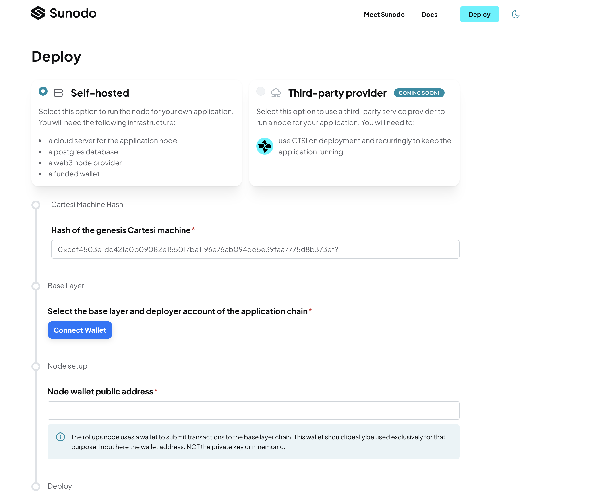
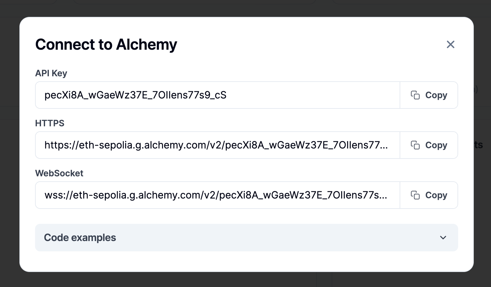
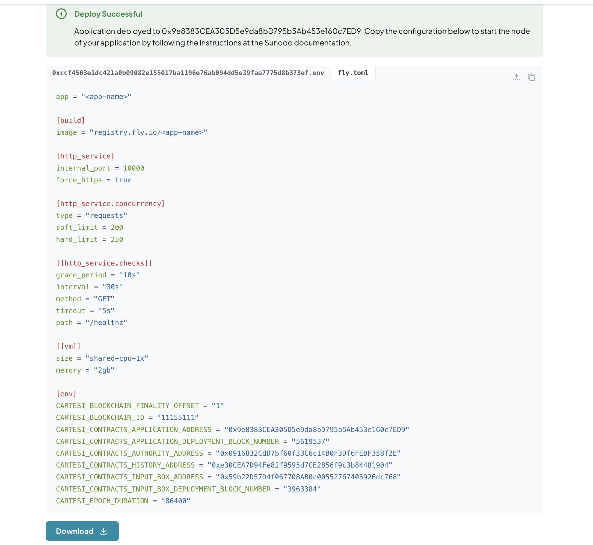

The self-hosted deployment involves running your infrastructure locally or on a remote cloud server to host your application node.

Here are the requirements:

- Wallet with sufficient funds on the chosen network.
- A cloud server
- A PostgreSQL database
- A web3 provider for interacting with the selected network

## Initiating deployment

1. Compile your application into RISC-V architecture and consequently build a Cartesi machine by running:

   ```shell
    cartesi build
   ```

2. Run the command below to start the deployment process.

   ```shell
     cartesi deploy --hosting self-hosted --webapp https://sunodo.io/deploy
   ```

  The command generates a Docker image containing the rollups node and machine. You will be redirected to a web application to deploy the necessary smart contracts.

  

## Deploying the contracts

On the deploy web interface, the hash of the Cartesi machine will be automatically configured.

1. Connect your wallet to set the application chain’s base layer and deployer account.

2. Create a wallet specifically for Cartesi rollups node transactions. The Cartesi rollups node will use this wallet to submit transactions to the base layer. Paste the public address of this wallet.

  :::note create a wallet
  You can use [Cast](https://book.getfoundry.sh/reference/cast/cast-wallet-new-mnemonic) to create a new wallet by running `cast wallet new-mnemonic --words 24`. For increased security, you can use a wallet managed by [AWS KMS](https://aws.amazon.com/blogs/database/part1-use-aws-kms-to-securely-manage-ethereum-accounts/).
  :::

3. After successful deployment, the node’s configuration is presented in a `.env` file and a `.toml` format. This config file includes the addresses of the deployed smart contracts and information on the base layer chain.

  You will need the `.env` when [hosting the node on the cloud provider](./self-hosted.md/#hosting-on-a-cloud-provider) and the `.toml` file when [hosting on Fly.io](./self-hosted.md/#hosting-on-flyio).

<!-- <video width="100%" controls poster="/static/img/v1.3/deploy.png">
    <source src="/videos/Deploy_Success.mp4" type="video/mp4" />
    Your browser does not support video tags.
</video> -->


## Hosting the node

You’ll need a server to host the application node and keep it operational 24/7. This server will expose a single port for client access to the rollups node APIs through GraphQL or Inspect requests.


The server requirements depend on your application's expected usage and the specifications of the Cartesi machine you're using, such as its RAM size and total capacity. Consider a minimum of 8GB of RAM, and adjust as needed.


The Cartesi rollups node is distributed as a Docker image. Any popular cloud provider, like AWS, GCP, Azure, Digital Ocean, or Linode, can run docker containers and hence can be used to host the rollups node.

Alternatively, you can use a service like [Fly.io](https://fly.io/) to deploy your application node.

### Hosting on a cloud provider

1. Download the `.env` configuration file into the root directory of your application.

1. Obtain HTTP and WebSocket URLs from a web3 provider for the `CARTESI_BLOCKCHAIN_HTTP_ENDPOINT` and `CARTESI_BLOCKCHAIN_WS_ENDPOINT` variables.

  Here is an example from [Alchemy](https://dashboard.alchemy.com/):

  

  :::caution important
  The web3 provider URLs and wallet mnemonic are sensitive information that can compromise your application and funds. You should keep it **secure** and **private** at all times.
  :::

1. Create a PostgreSQL database and configure the connection string in the `.env` file.

  The connection string for a PostgreSQL database must be configured at the `CARTESI_POSTGRES_ENDPOINT` variable.

  You can use any PostgreSQL database, whether managed by a cloud provider or set up on your local infrastructure. The key configuration required is the connection string, encompassing the database URL, username, password, and name. The node necessitates a PostgreSQL database to store the application state, which is accessible via the [GraphQL API](../api-reference/graphql/basics.md).

1. With all the config variables set, here is how you can run the node on your local machine:

  ```
  docker run --env-file <env-file> -p 10000:10000 <image-id>
  ```

  Replace `<env-file>` and `<image-id>` with the `.env` file name and `sha256` hash of your Cartesi machine.

  The image can be tagged using [docker tag](https://docs.docker.com/reference/cli/docker/image/tag/).

  You can deploy your node with a cloud provider or use any managed container solution, like Kubernetes. 

### Hosting on fly.io

Fly.io is a platform where you can conveniently deploy applications packaged as Docker containers.

:::caution important
If deploying to Fly.io from macOS with Apple Silicon, create a Docker image for `linux/amd64` with: `cartesi deploy build --platform linux/amd64`
:::

1. [Install the flyctl CLI](https://fly.io/docs/hands-on/install-flyctl/)

1. [Create an account](https://fly.io/docs/hands-on/sign-up-sign-in/)

1. Create an application:

   ```shell
   $ fly app create <app-name>
   New app created: <app-name>
   ```

1. Create a Postgres database application:

   ```shell
   fly postgres create --initial-cluster-size 1 --name <app-name>-database --vm-size shared-cpu-1x --volume-size 1
   ```

   Save the connection string provided by the command output.

1. Attach database to the node application:

   ```shell
   fly postgres attach <app-name>-database -a <app-name>
   ```

1. Download `fly.toml` file from deploying the contracts and move it to your application directory:

   

1. Edit the `fly.toml` file to change all occurrences of `<app-name>` to the name of your application

1. Create secrets for sensitive configuration with the actual values:

   ```shell
   fly secrets set -a <app-name> CARTESI_BLOCKCHAIN_HTTP_ENDPOINT=<web3-provider-http-endpoint>
   fly secrets set -a <app-name> CARTESI_BLOCKCHAIN_WS_ENDPOINT=<web3-provider-ws-endpoint>
   fly secrets set -a <app-name> CARTESI_AUTH_MNEMONIC=`<mnemonic>`
   fly secrets set -a <app-name> CARTESI_POSTGRES_ENDPOINT=<connection_string>
   ```

   Set value of the `connection_string` as provided by step 4.

1. Deploy the node:

   Tag the image produced at the beginning of the process and push it to the Fly.io registry:

   ```shell
   flyctl auth docker
   docker image tag <image-id> registry.fly.io/<app-name>
   docker image push registry.fly.io/<app-name>
   fly deploy -a <app-name>
   ```

  
