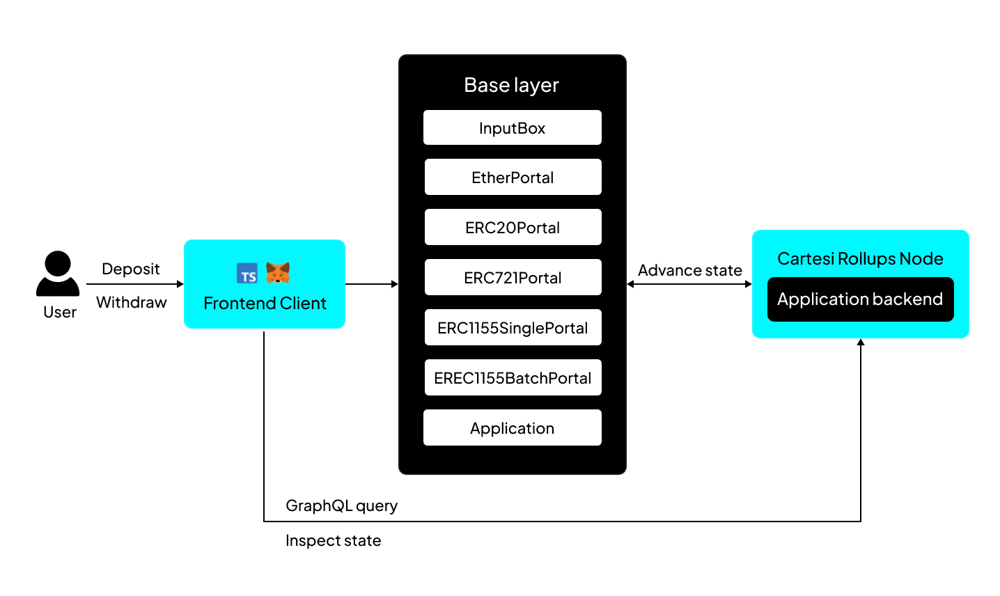
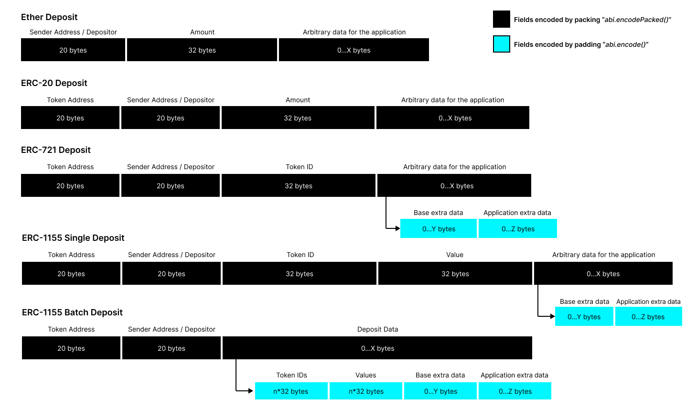

Assets exist on the base layer, where they have actual meaning and value.

As with any execution layer solution, a Cartesi Application that wants to manipulate assets needs a secure way of "teleporting" the assets from the base layer to the execution layer and when necessary, back to the base layer.

Currently, Cartesi Rollups support the following types of assets:

- [Ether (ETH)](../api-reference/contracts/portals/EtherPortal.md)
- [ERC-20](../api-reference/contracts/portals/ERC20Portal.md)
- [ERC-721](../api-reference/contracts/portals/ERC721Portal.md)
- [ERC-1155 Single](../api-reference/contracts/portals/ERC1155SinglePortal.md)
- [ERC-1155 Batch](../api-reference/contracts/portals/ERC1155BatchPortal.md)

## Deposits

Portals enable the safe transfer of assets from the base layer to the execution layer. Users authorize portals to deduct assets from their accounts and initiate transfers to the Application contract.

When an asset is deposited, it is on the base layer but gains a representation in the execution layer. The corresponding Portal contract sends an input via the `InputBox` contract describing the type of asset, amount, and some data the depositor might want the application to read. The off-chain machine will then interpret and validate the input payload.

Deposit input payloads are always specified as packed ABI-encoded parameters, as detailed below.

### ABI encoding for deposits

| Asset             | Packed ABI-encoded payload fields                                                                                                                       | Standard ABI-encoded payload fields                                                                                              |
| :---------------- | :------------------------------------------------------------------------------------------------------------------------------------------------------ | :------------------------------------------------------------------------------------------------------------------------------- |
| Ether             | <ul><li>`address sender`,</li><li>`uint256 value`,</li><li>`bytes execLayerData`</li></ul>                                                              | none                                                                                                                             |
| ERC-20            | <ul><li>`address token`,</li><li>`address sender`,</li><li>`uint256 amount`,</li><li>`bytes execLayerData`</li></ul>                                    | none                                                                                                                             |
| ERC-721           | <ul><li>`address token`,</li><li>`address sender`,</li><li>`uint256 tokenId`,</li><li>standard ABI-encoded fields...</li></ul>                          | <ul><li>`bytes baseLayerData`,</li><li>`bytes execLayerData`</li></ul>                                                           |
| ERC-1155 (single) | <ul><li>`address token`,</li><li>`address sender`,</li><li>`uint256 tokenId`,</li><li>`uint256 value`,</li><li>standard ABI-encoded fields...</li></ul> | <ul><li>`bytes baseLayerData`,</li><li>`bytes execLayerData`</li></ul>                                                           |
| ERC-1155 (batch)  | <ul><li>`address token`,</li><li>`address sender`,</li><li>standard ABI-encoded fields...</li></ul>                                                     | <ul><li>`uint256[] tokenIds`,</li><li>`uint256[] values`,</li><li>`bytes baseLayerData`,</li><li>`bytes execLayerData`</li></ul> |

## Withdrawing assets

Users can deposit assets to a Cartesi Application, but only the Application can initiate withdrawals. When a withdrawal request is made, it’s processed and interpreted off-chain by the Cartesi Machine running the application’s code. Subsequently, the Cartesi Machine creates a voucher containing the necessary instructions for withdrawal, which is executable when an epoch has settled.

### Withdrawing Tokens

Vouchers are crucial in allowing applications in the execution layer to interact with contracts in the base layer through message calls. They are emitted by the off-chain machine and executed by any participant in the base layer. Each voucher includes a destination address and a payload, typically encoding a function call for Solidity contracts.

By calling [`relayDAppAddress()`](../api-reference/json-rpc/relays/relays.md), function of the `DAppAddressRelay` contract, it adds the dApp’s address as a new input for the Cartesi dApp to process. Next, the off-chain machine uses this address to generate a voucher for execution at the [`executeVoucher()`](../api-reference/json-rpc/application.md/#executevoucher) function of the `CartesiDApp` contract.

:::note epoch length
By default, Cartesi nodes close one epoch every 7200 blocks. You can [manually set the epoch length](./cli-commands.md/#run) to facilitate quicker asset-handling methods.
:::

Here are the function signatures used by vouchers to withdraw the different types of assets:

| Asset    | Destination    | Function signature                                                                                                                          |
| :------- | :------------- | :------------------------------------------------------------------------------------------------------------------------------------------ |
| Ether    | dApp contract  | `withdrawEther(address,uint256)` [:page_facing_up:](../api-reference/json-rpc/application.md/#withdrawether)                            |
| ERC-20   | Token contract | `transfer(address,uint256)` [:page_facing_up:](https://eips.ethereum.org/EIPS/eip-20#methods)                                               |
| ERC-20   | Token contract | `transferFrom(address,address,uint256)` [:page_facing_up:](https://eips.ethereum.org/EIPS/eip-20#methods)                                   |
| ERC-721  | Token contract | `safeTransferFrom(address,address,uint256)` [:page_facing_up:](https://eips.ethereum.org/EIPS/eip-721#specification)                        |
| ERC-721  | Token contract | `safeTransferFrom(address,address,uint256,bytes)` [:page_facing_up:](https://eips.ethereum.org/EIPS/eip-721#specification)                  |
| ERC-1155 | Token contract | `safeTransferFrom(address,address,uint256,uint256,data)` [:page_facing_up:](https://eips.ethereum.org/EIPS/eip-1155#specification)          |
| ERC-1155 | Token contract | `safeBatchTransferFrom(address,address,uint256[],uint256[],data)` [:page_facing_up:](https://eips.ethereum.org/EIPS/eip-1155#specification) |
