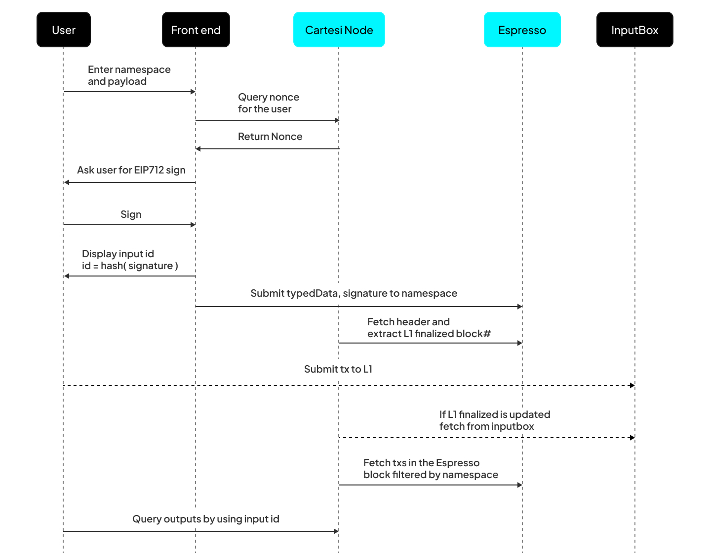

# Introduction

This tutorial is intended for Cartesi DApp developers to understand the Espresso integration with Cartesi Rollups and how to port traditional Cartesi Rollups applications so that inputs can be submitted via Espresso, instead of necessarily requiring a transaction on the base layer.

[Espresso System](https://espressosys.com/) provides a decentralized sequencer and data availability system, which can be very useful to scale layer-2 rollup solutions. Cartesi provides an app-specific rollups solution which could particularly benefit from both.

# Architecture

The Cartesi and Espresso integration is based on the concept that inputs to Cartesi DApps are of two fundamentally different nature:

- **L2 transactions**: These refer to common interactions of users with the application, and refer to application-specific actions such as “_attack goblin_”, “_swap token_”, “_post message_”, etc. These transactions do not require any direct information or logic from the base layer.

- **L1 -> L2 messages**: These refer to information that is relayed from the base layer to the rollup application, such as informing about deposits done via the _Portals_ (asset bridges to Cartesi Rollups), relaying the DApp’s address, ensuring base layer validation for a given input, etc.

This architecture proposes that L2 transactions are to be processed “immediately” (i.e., as soon as they are sequenced), whereas L1->L2 messages are only processed when they are finalized on L1, meaning that they are processed “with a delay”.

Aside from that, from the application’s point of view, few noteworthy things are:

- **Back-end**: Both L2 transactions and L1->L2 messages are received as regular inputs.
- **Front-end**: L2 transactions are signed by the client and submitted to an L2 submission endpoint on the node, which will then forward them to Espresso. L1->L2 messages are submitted as a transaction on L1 that eventually calls the InputBox contract’s `addInput` method.

