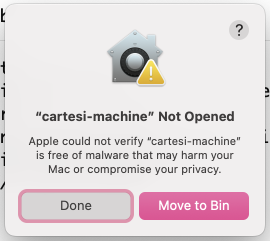
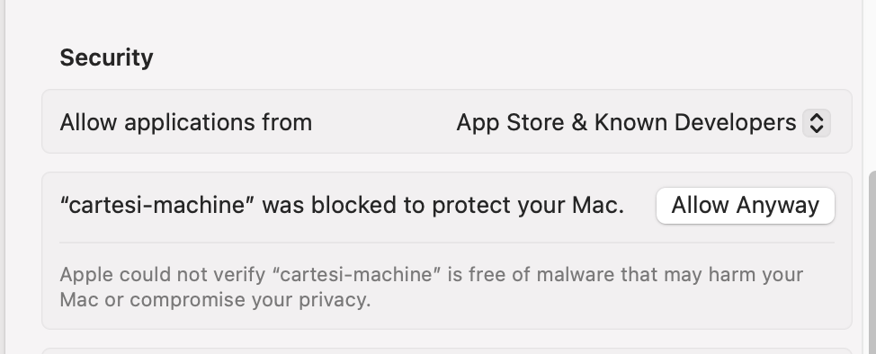

# Troubleshooting Guide

## Introduction

This page covers errors that might arise while following the Cartesi and Espresso integration guide. The goal is to cover errors/ issues ranging from instalation to interaction and each issue is going to be accompanied by a detailed fix.

### **1. Cartesi-machine blocked by Mac security feautures:**

For Mac users, you might run into issues running the cartesi-machine after downloading and installing because of Mac built in security feauture. You might get a popup similar to this:

### **Fix:**

- Click on the apple icon at the top left corner of the screen.
- Next navigate to and click on "system settings".
- On the left side menu, click on "Privacy and Security".
- Sroll down to the security section, there should be a section referencing the cartesi-machine, toggle the side menu besides that then select "Allow Anyway".

