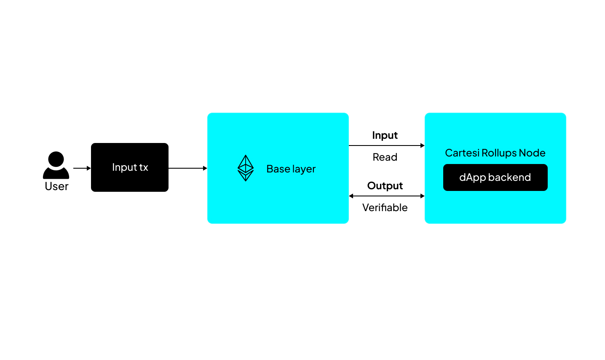

Welcome to Cartesi Rollups, where decentralized application development meets unprecedented flexibility. With a foundation built on the Linux operating system, Cartesi Rollups offers modular stacks that allow developers to tailor consensus, data availability, and settlement layers according to their project requirements.

Utilizing the Cartesi Machine for transaction processing, developers can effortlessly implement sophisticated logic using their preferred programming language or tool. Explore the possibilities and streamline your decentralized application development journey with Cartesi Rollups.


## Introduction 

Let's delve into the workings of a Cartesi Rollup at a high level.




At its core, the Cartesi Rollup executes the Cartesi Machine - a robust RISCV deterministic emulator running Linux OS - fueled by ordered inputs and custom application code. Inputs sourced from the data availability layer are read by the Cartesi Node, inside of which the Cartesi Machine processes them and generates outputs. After the optimistic rollup dispute window passes, these outputs are verifiable and possibly executable on the settlement layer. 

The Cartesi Rollup framework is application-specific, assigning each dApp its rollup app chain and CPU while linking its optimistic rollups' consensus directly to the base layer. This structure ensures that validators—whether permissioned or not—can leverage the security features of the base layer, allowing any honest validator to enforce correct outcomes independently. 

In its simplest form, the Cartesi framework integrates tightly with the base layer, which serves as the sole platform for data availability, consensus, and settlement. Transactions are directed to specific smart contracts where DApp code is executed to produce outputs on the base layer after a verification period.

## Example

Below is a simple Node.js example demonstrating how to read an input and reply with a [notice](./api/backend/notices.md) (a type of output).

```javascript
const { ethers } = require("ethers");
const axios = require("axios");

const rollup_server = process.env.ROLLUP_HTTP_SERVER_URL;

let finish = { status: "accept" };

(async () => {

  while (true) {
    const { data } = await axios.post(rollup_server + "/finish", finish);
    const rollup_message = data;

    if (rollup_message.request_type === "advance_state")  {
      const decodedMsg = ethers.toUtf8String(rollup_message.data.payload);
      const payload = ethers.encodeBytes32String(`Got your message: ${decodedMsg}`);
      await axios.post(rollup_server + "/notice", { payload });
    }
    finish.status = "accept";
})();

```

Cartesi dApps are implemented as infinite loops that manage their transaction cycles through HTTP POST requests to the `/finish` endpoint to ensure flexibility across different programming languages and stacks. You can learn more about this abstraction [here](./api/backend/introduction.md).

In the Cartesi Rollup framework, all inputs sent to the base layer trigger an "advance_state" request, which alters the state of the Cartesi Machine and consequently the Rollup. Since inputs originate on-chain, they are hex-encoded following the EVM message standard.

Notices can be understood as "provable" events; as such, they can be sent to an EVM chain to be verified, so they are also hex-encoded.
 
Finally, in this example, no errors are treated; thus, we end the cycle accepting the input (`status: accept`). However, suppose any input causes the application to enter a faulty state or violates business logic. In that case, the application can end the process by calling the endpoint `/finish` with `status: reject` to revert the machine’s (and rollup’s) state before the arrival of the current input. 


