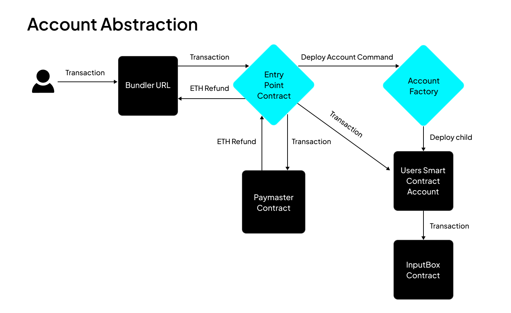

This tutorial will guide you through utilizing the account abstraction infrastructure of the CLI to interact with your dApp while testing locally.

## Introduction

We currently have various architectures and SDKs supporting account abstraction across multiple chains, but there’s currently no dedicated solution for testing this integration in a local environment during dApp development. The latest update to the Cartesi CLI V0.16.0 fixes this by integrating an account abstraction architecture for testing the AA functionality of your dApp on your local machine. 

This architecture relies on external SDKs from some of the popular account abstraction providers (Alchemy, Biconomy and ZeroDev), so it’s expected that the obtained behaviour on local should mirror mainnet completely as long as you’re using the same provider. For this tutorial, we’ll be using the Alchemy SDK. However, at the end of this tutorial, we’ll also provide demo applications for utilizing other supported SDK’s.

## Architecture

The architecture of the CLI implementation for account abstraction is pretty much the same as that of mainnet and testnet applications; the only difference is that the CLI deploys and manages some of the important contracts once you start your local Anvil network by running the `cartesi run` command. What this means is that you don't need to bother yourself with building and deploying these important contracts; you simply utilize any SDK or account abstraction framework to interact with these contracts as you would on mainnet or testnet.



From the architecture above, transactions from the frontend are sent to the `bundler URL`, which controls a private key with which it pays for these transactions and sends them to the `entrypoint contract`. This `entrypoint contract` is a universal contract that forwards all transactions to the `paymaster` and also to the `user's smart contract wallet` if the user has one; if the user doesn't, it calls the `account factory` to deploy a smart wallet for the user. The `paymaster` refunds the gas fees for the execution, while the `user’s smart wallet` submits the transactions to the `input box contract`. 


You can view the addresses for some of these components, like the account factory, entrypoint address, paymaster, etc., by running the command `cartesi address-book`. While the bundler and paymaster addresses are displayed once you start your Cartesi dApp using the `cartesi run` command. Note that for mainnet/testnet integration, you’ll have to replace these with the respective URLs provided by the SDK you’re using. 

## Setting up the frontend environment

We’ll be using React.js along with Wagmi to build this simple frontend application. We’ll also be relying heavily on some other dependencies that we’ll introduce later on.


To bootstrap a React project with Wagmi already configured, we’ll use the CLI command 

```shell
    npm create wagmi@latest
```

This command would create a new React application with a simple UI and wallet connect by wagmi already integrated.


Next, we install other dependencies we would be using by running this code in the terminal: 

```shell
    npm i permissionless@0.1.43 encoding @alchemy/aa-core @alchemy/aa-accounts @cartesi/rollups 
```

This command instals five different dependencies this project will be utilizing. Permissionless, and the two alchemy dependencies can be replaced with the packages for any other AA SDK you decide to use. For this tutorial we’ll be using Alchemy, and as such, we’ve installed the Alchemy aa-core and the aa-accounts dependencies. 

### Configuring wagmi.ts file

Congratulations on successfully bootstrapping a new frontend repo; next we’ll need to properly configure a wagmi client to work on localhost. Once you’re ready for mainnet or testnet, then you can update this configuration to work with any chain you intend to support. To do this, we CD into the src folder, then replace the contents of the `wagmi.ts` file with: 

```javascript
    import { http, cookieStorage, createConfig, createStorage } from "wagmi";
    import { foundry } from "wagmi/chains";
    import { coinbaseWallet, injected } from "wagmi/connectors";

    export function getConfig() {
        return createConfig({
            chains: [foundry],
            connectors: [injected(), coinbaseWallet()],
            storage: createStorage({
                storage: cookieStorage,
            }),
            ssr: true,
            transports: {
                [foundry.id]: http(),
            },
        });
    }

    declare module "wagmi" {
        interface Register {
            config: ReturnType<typeof getConfig>;
        }
    }

```

### Set up an Alchemy file

Next, we setup an implementation for creating a smart account client for the connected account; this client takes in the paymaster and bundler URL, both of which are provided by the CLI once you start your Cartesi dApp, while the Entrypoint contract that’s used in the file is provided by the permissionless SDK we’re utilizing. We’ll name this file `alchemy.ts` since we’re making use of the Alchemy Smart Account client. This file should be located inside the src folder.

```javascript
    import { createLightAccount } from "@alchemy/aa-accounts";
    import {
        createSmartAccountClient,
        SmartAccountClient,
        split,
        WalletClientSigner,
    } from "@alchemy/aa-core";
    import { ENTRYPOINT_ADDRESS_V06, ENTRYPOINT_ADDRESS_V07 } from "permissionless";
    import { createPimlicoPaymasterClient } from "permissionless/clients/pimlico";
    import { useEffect, useState } from "react";
    import { Chain, concat, Transport, zeroHash } from "viem";
    import { foundry } from "viem/chains";
    import { http, usePublicClient, useWalletClient } from "wagmi";

    export type SmartAccountClientOptions = {
        bundlerUrl: string;
        paymasterUrl?: string;
    };

    export const useSmartAccountClient = <
        TTransport extends Transport = Transport,
        TChain extends Chain | undefined = undefined,
    >(
        options: SmartAccountClientOptions,
    ) => {
        const { bundlerUrl, paymasterUrl } = options;
        const publicClient = usePublicClient();
        const { data: walletClient } = useWalletClient();

        // create paymaster client
        const paymasterClient = paymasterUrl
            ? createPimlicoPaymasterClient({
                transport: http(paymasterUrl),
                entryPoint: ENTRYPOINT_ADDRESS_V06,
            })
            : undefined;
        
        console.log("printing paymasterClient");
        console.log(paymasterClient);
        const bundlerMethods = [
            "eth_sendUserOperation",
            "eth_estimateUserOperationGas",
            "eth_getUserOperationReceipt",
            "eth_getUserOperationByHash",
            "eth_supportedEntryPoints",
        ];

        const splitTransport = split({
            overrides: [
                {
                    methods: bundlerMethods,
                    transport: http(bundlerUrl),
                },
            ],
            fallback: http(publicClient.transport.url),
        });

        const [smartAccountClient, setSmartAccountClient] =
            useState<SmartAccountClient>();

        const createClient = async () => {
            if (walletClient !== undefined) {
                const signer = new WalletClientSigner(walletClient, "json-rpc");
                console.log("printing signer...");
                console.log(signer);
                const account = await createLightAccount({
                    chain: foundry,
                    signer,
                    factoryAddress: "0x00004EC70002a32400f8ae005A26081065620D20", // CLI only supports LightAccount 1.1.0 for now
                    transport: http(publicClient.transport.url),
                });
                console.log("printing light account...");
                console.log(account);
                
                const paymaster = "0x28ec0633192d0cBd9E1156CE05D5FdACAcB93947";
                const paymasterData =
                    "0x00000000000000000000000000000000000000000000000000000101010101010000000000000000000000000000000000000000000000000000000000000000cd91f19f0f19ce862d7bec7b7d9b95457145afc6f639c28fd0360f488937bfa41e6eedcd3a46054fd95fcd0e3ef6b0bc0a615c4d975eef55c8a3517257904d5b1c";
                const smartAccountClient = createSmartAccountClient({
                    account,
                    chain: foundry,
                    transport: splitTransport,
                    paymasterAndData: paymasterClient
                        ? {
                            dummyPaymasterAndData: () =>
                                concat([paymaster, paymasterData]),
                            paymasterAndData: async (userOperation, options) => {
                                const callData = await userOperation.callData;
                                const nonce = await userOperation.nonce;
                                // @ts-ignore
                                const initCode = await userOperation.initCode;
                                const { paymasterAndData } =
                                    await paymasterClient.sponsorUserOperation({
                                        userOperation: {
                                            ...userOperation,
                                            callData,
                                            nonce,
                                            initCode,
                                        },
                                    });
                                return {
                                    ...userOperation,
                                    paymasterAndData,
                                };
                            },
                        }
                        : undefined,
                });
                return smartAccountClient;
            }
        };

        useEffect(() => {
            if (walletClient !== undefined) {
                createClient().then(setSmartAccountClient);
            }
        }, [walletClient, options.bundlerUrl, options.paymasterUrl]);

        return {
            smartAccountClient,
        };
    };

```

:::note PaymasterData Implementation
The PaymasterData implementation contained in the code block above is a dummy pre-signed data, and the paymaster itself would sponsor every transaction on localhost, while on mainnet or testnet this paymaster can be configured to only sponsor transactions under certain conditions, and the paymasterData would be different from what we’re currently using now. You can always refer to the respective documentation of the account abstraction provider SDK you’re using for more information on PaymasterData
:::

### Set up the Cartesi Client

The last part of this component we’ll need to set up is the Cartesi client page. This is responsible for integrating the Alchemy file we mentioned in the previous section to relay transactions to the input box; it receives the relayer URL, bunder URL, destination contract address, and the argument as a function argument. Then it uses the smart account client created in the previous section to sponsor these transactions and relay the received arguments to the input box contract. We’ll create this file also in the src folder, then call it `cartesi.ts`.

```javascript
    import { Address, encodeFunctionData, Hash, Hex } from "viem";
    import { useSmartAccountClient } from "./alchemy";
    import { useEffect, useState } from "react";
    import { contracts } from "@cartesi/rollups/export/abi/mainnet.json";

    export type InputBoxAddInputOptions = {
        bundlerUrl: string;
        paymasterUrl?: string;
        args: readonly [Address, Hex];
    };

    export const useInputBoxAddInput = (options: InputBoxAddInputOptions) => {
        const { smartAccountClient } = useSmartAccountClient(options);
        console.log("printing useSmartAccountClient");
        console.log(smartAccountClient);
        // console.log(smartAccountClient?.getAddress);
        const [hash, setHash] = useState<Hash>();
        const [write, setWrite] = useState<() => void>();

        useEffect(() => {
            if (smartAccountClient && smartAccountClient.account) {
                setWrite(() => async () => {
                    const uo = await smartAccountClient.sendUserOperation({
                        account: smartAccountClient.account!,
                        uo: {
                            target: contracts.InputBox.address,
                            data: encodeFunctionData({
                                abi: contracts.InputBox.abi,
                                functionName: "addInput",
                                args: options.args,
                            }),
                        },
                    });
                    const hash =
                        await smartAccountClient.waitForUserOperationTransaction(
                            uo,
                        );
                    setHash(hash);
                    return hash;
                });
            }
        }, [smartAccountClient]);
        return { hash, smartAccountClient, write };
    };

```

### Set Up the Frontend UI

At this point, we have a complete Smart Account client active, and this is ready to relay transactions to the input box contract. However,  one crucial part is missing, which is a user interface for users to be able to pass in any arbitrary payload of their choice to the Cartesi dApp running on the local machine. For this, we’ll CD into the app folder, then replace the contents of `page.tsx` with: 

```javascript
    "use client";

    import { useEffect, useState } from "react";
    import { formatUnits, isHex, stringToHex } from "viem";
    import {
        useAccount,
        useBalance,
        useBlockNumber,
        useConnect,
        useDisconnect,
    } from "wagmi";
    import { useInputBoxAddInput } from "@/cartesi";
    import { useQueryClient } from "@tanstack/react-query";

    function App() {
        const account = useAccount();
        const { connectors, connect, status, error } = useConnect();
        const queryClient = useQueryClient();
        const { disconnect } = useDisconnect();
        const { data: blockNumber } = useBlockNumber({ watch: true });

        const [bundlerUrl, setBundlerUrl] = useState<string>(
            "http://localhost:8080/bundler/rpc",
        );
        const [paymasterUrl, setPaymasterUrl] = useState<string>(
            "http://localhost:8080/paymaster/",
        );
        const [usePaymaster, setUsePaymaster] = useState<boolean>(true);

        const [payload, setPayload] = useState<string>("hello");

        // transaction through hook
        const { hash, smartAccountClient, write } = useInputBoxAddInput({
            bundlerUrl,
            paymasterUrl: usePaymaster ? paymasterUrl : undefined,
            args: [
                "0xab7528bb862fb57e8a2bcd567a2e929a0be56a5e",
                isHex(payload) ? payload : stringToHex(payload),
            ],
        });

        const { data: balance, queryKey } = useBalance({
            address: smartAccountClient?.account.address,
            query: { enabled: !!smartAccountClient },
        });

        useEffect(() => {
            queryClient.invalidateQueries({ queryKey });
        }, [blockNumber, queryClient]);

        return (
            <>
                <div>
                    <h2>Account (Signer)</h2>

                    <div>
                        status: {account.status}
                        <br />
                        addresses: {JSON.stringify(account.addresses)}
                        <br />
                        chainId: {account.chainId}
                        <br />
                        blockNumber: {blockNumber?.toString()}
                    </div>

                    {account.status === "connected" && (
                        <button type="button" onClick={() => disconnect()}>
                            Disconnect
                        </button>
                    )}
                </div>

                <div>
                    <h2>Connect</h2>
                    {connectors.map((connector) => (
                        <button
                            key={connector.uid}
                            onClick={() => connect({ connector })}
                            type="button"
                        >
                            {connector.name}
                        </button>
                    ))}
                    <div>{status}</div>
                    <div>{error?.message}</div>
                </div>

                <div>
                    <h2>Account Abstraction</h2>
                    <div>
                        Bundler URL:
                        <input
                            value={bundlerUrl}
                            size={50}
                            onChange={(e) => setBundlerUrl(e.target.value)}
                        />
                    </div>
                    <div>
                        Paymaster URL:
                        <input
                            value={paymasterUrl}
                            size={50}
                            onChange={(e) => setPaymasterUrl(e.target.value)}
                        />
                    </div>
                    <div>
                        Smart Account Address:
                        <text>{smartAccountClient?.account.address}</text>
                    </div>
                    <div>
                        Smart Account Balance:
                        {balance && (
                            <text>
                                {formatUnits(balance.value, balance.decimals)}{" "}
                                {balance.symbol}
                            </text>
                        )}
                    </div>
                </div>

                <div>
                    <h2>Transaction</h2>
                    <div>
                        payload:
                        <input
                            value={payload}
                            onChange={(e) => setPayload(e.target.value)}
                        />
                    </div>
                    <input
                        type="checkbox"
                        id="usePaymaster"
                        checked={usePaymaster}
                        onChange={() => setUsePaymaster(!usePaymaster)}
                    />
                    <label htmlFor="usePaymaster">Use Paymaster</label>
                    <br />
                    <button onClick={() => write?.()} disabled={!write}>
                        Send Input
                    </button>
                    <text>{hash}</text>
                </div>
            </>
        );
    }

    export default App;
```

We now have a functional frontend and account abstraction infrastructure available to interact with your Cartesi dApp running on localhost. But to complete this tutorial, we’ll need to set up and run a demo Cartesi dApp, as this will deploy all the necessary contracts like the entrypoint contract, relayer contract, and smart account factory, and without these we won't be able to test out the account abstraction implementation.

## Setting up and running a Cartesi dApp backend on localhost

This last section of this article is focused on setting up a Cartesi dApp on a local host; this will be the target of all user executions on the frontend. To do this, we simply run the following commands:.

- Create a new project using the command `cartesi create AA-on-CLI --template javascript`.
- Cd into `AA-on-CLI` Build the dApp by running the command `cartesi build`
- Next, run the command `cartesi run` to start a local anvil node and deploy all necessary contracts.
- Finally, in a new terminal, navigate to our frontend repository and start the frontend by running the command `npm run dev`.


## Testing out the new account abstraction powered dApp
To test out the dApp, we simply visit the page our frontend is running on. We should have a simple UI available with a wallet connect feature and a text box available. First we’ll need to connect our wallet, then after a couple of seconds the frontend displays our smart contract account address; this will be the address that forwards every execution we make to the inputbox contract; therefore, the Dapp on the backend will pick this new address as the sender and not the address we connected initially. Next, we can interact with the dApp by passing in any generic message of our choice into the text box and then hitting the send input button. This should trigger our connected wallet to display a popup asking us to sign a message (which does not require us to pay gas fees) and not the regular transaction verification request. Once we sign this transaction, the message we typed in will be forwarded to our dApp running on localhost. You can check the terminal  the dApp is running on to verify that the message got to our dApp and the actual address that sent the message. 

## Conclusion

We’ve been able to build our first gasless transaction supporting dApp on Cartesi and that’s great. But it’s important to note that the above infrastructure we’ve currently setup is streamlined to localhost but can easily be configured to work with any network of your choice by simply replacing the bundler URL and also the paymaster URL with that provided by Alchemy for the chain you intend to support. You can check the [Alchemy documentation](https://docs.alchemy.com/reference/bundler-api-quickstart) for more information on how to create an account and also obtain a bundler and paymaster URL.

