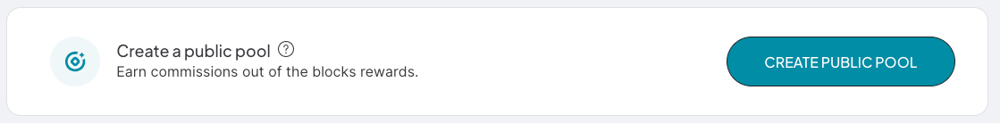

This guide provides more details for individuals or organizations who intend to provide staking services for users by creating Staking Pools and managing Noether nodes.

**Pools** are built on top of the current PoS and aggregate the staking requests from their users.

**Pool operators** are responsible for managing a Noether node, and they earn a commission out of the blocks rewards as compensation for operating the pool and the ETH fees they have to spend.

**Staking Pools** were built on top of the Staking smart contract, so they are subject to the same rules any other direct stakers are, such as the maturation time windows of a minimum of 6 hours for staking and 48 hours for unstaking. Additionally, pools need a larger time window to make sure that the staking, unstaking and withdrawal requests from their users are handled properly.

Individual pool users staking requests may take up to an additional 6 hours, and unstaking requests may take up to an additional 48 hours to complete. The pool performs aggregate staking and unstaking requests to the PoS and at the moment a user issues their individual request, the pool is probably in the middle of waiting for a previously issued staking/unstaking request to be completed. As it would happen with individual users, issuing an overlapping staking/unstaking request would restart the maturation/unlocking counter associated with the pool stake.

**Noether** is a layer-2 solution. It rewards block producers with CTSI, and requires ETH to pay for layer 1 transaction costs. The fees for block production are paid by the pool manager. Users pay ETH fees to initiate staking, unstaking and withdrawal requests, but the pool also needs to pay ETH fees to fulfill those requests (as the users interface with the pool smart contract and the pool then has to fulfill the requests on the PoS smart contracts).
The ETH to fund these transactions must be deposited in the wallet managed by the Noether node, created and managed by the pool manager. As a pool manager, one must keep track of the node’s wallet balance and replenish it as needed to make sure the node always has enough funds to operate correctly.

## Prerequisites

Any organization or individual is free to create and operate a pool. There are no restrictions or special requirements, anyone can create a pool as long as they are willing to pay the necessary ETH fees to create and manage the pool.

The main prerequisites are:
* Set up Ethereum node as the Cartesi node connects to the Ethereum network through a standard gateway. The Ethereum node works with any standard JSON-RPC Ethereum provider. It's important to use a stable and reliable provider, you can use [Infura](https://infura.io/) or [Alchemy](https://www.alchemy.com/) as Ehtereum gateway
* Install Docker enginer, you can download it for [macOS](https://docs.docker.com/desktop/mac/install/) or for [Windows](https://docs.docker.com/desktop/windows/install/)

## Commission

:::note
Once created and configured, the pool manager cannot change the selected commission model. The value of the commission cannot be increased, but can be decreased at any time. This allows for fine adjustments of the economics of the pool, while preserving the public commitment not to increase the commission value.
:::

Pool operators have two main responsibilities:
1. Make sure the Noether node is online and works properly 24x7
2. Pay the Ethereum fees that are necessary for block production and also maintenance operations like staking, unstaking and withdrawing from the Staking contract, on behalf of the users that delegate to their pool.

The first decision the pool owner has to make when creating a pool is choosing the commission model. There are two models available:
* Flat rate commission
* Gas-based commission

### Flat Rate

The Flat rate commission model is straightforward. A flat percentage is taken off the block reward before it is distributed among the pool stakers.

#### Example

A pool is configured with a 10% flat rate. Upon producing a block the pool receives 2,900 CTSI as reward. It takes 290 CTSI as commission, and distributes the remaining 2,610 CTSI to its users, in proportion to each user’s share in the total pool stake.

### Gas Based

A gas based commission model takes into account the gas costs of producing the block. If the gas price at the moment of production is high, the cut will be higher, if the gas price is low, the cut will be lower. This model accommodates a variable gas price and CTSI price, but it’s harder to predict the final fee because of its complexity.

#### Example

A pool is configured to charge 400,000 gas. Upon producing a block this cost is “converted” to CTSI to calculate the commission. First it’s multiplied by the gas price at that moment, provided by a ChainLink oracle. Then it’s converted to CTSI by using an ETH/CTSI pair price provided by Uniswap V2.
Consider the following scenario:
```
gas price = 20 Gwei. 1 ETH = 4,000 CTSI
400,000 gas x 20 Gwei = 0.008 ETH
0.008 ETH x 4000 = 32 CTSI
```
Now consider that the gas price surges to 400 Gwei, and the CTSI price goes up in relation to ETH such that
```
1 ETH = 3200 CTSI
400,000 gas x 400 Gwei = 0.16 ETH
0.16 ETH x 3,200 = 512 CTSI
```
In the first example (20 Gwei gas price) the commission for that block is 1.1% (32/2,900) considering a reward of 2,900 CTSI. In the second example (400 Gwei gas price) the commission for the block is 17.6% (512/2,900) for the same reward amount. Compared to a flat rate pool with a 10% rate, for instance, the gas based commission can have a lower or higher fee depending on the gas price, CTSI price, and ETH price as shown in the previous examples.
No matter the selected commission model, the Cartesi Explorer will show the actual historical commission taken by each pool, as well as an estimate of the commission for the next block. Users can make an informed decision about which pool to choose based on the commission and reliability of pool operators (more about it below).

## Steps to create a public pool

1. Navigate to our [Staking Portal](https://explorer.cartesi.io/)
2. Click on the button "CONNECT TO WALLET" 
3. Navigate to the [Node Runners](https://explorer.cartesi.io/node-runners) option in the top menu
4. Click on the button "CREATE PUBLIC POOL" 
5. Navigate to the section [Create a Pool](https://explorer.cartesi.io/pools/new) and make sure to follow all required steps

:::note
When the pool is created, the account connected to metamask is assigned as the pool owner and management operations can be done using that same account. Pool managers are responsible for running a Noether node and making sure it works properly 24x7, with a reliable internet connection, well funded and using a reliable Ethereum provider.
:::
