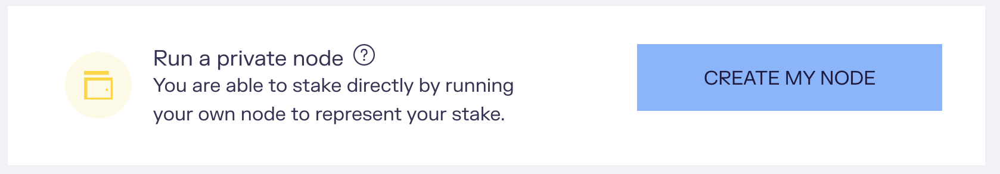

In this guide, you will learn how to run your own Cartesi node and participate in the staking system. By running a node and staking, you will receive CTSI rewards from Cartesi’s Mine Reserve for each block you produce.

The staking system runs on top of Ethereum. Each block is claimed on-chain by its producer, requiring the node to spend gas to execute the corresponding transaction. As you set up a node to produce blocks for you, you need to fund it with enough ETH to complete the setup and also to produce blocks for some time. You can find the cost associated with each required transaction on Ethereum in the [FAQ](../staking-faq/#how-much-eth-do-the-transactions-involved-in-staking-ctsi-cost)

## Prerequisites

The main prerequisites are:
* Set up Ethereum node as the Cartesi node connects to the Ethereum network through a standard gateway. The Ethereum node works with any standard JSON-RPC Ethereum provider. It's important to use a stable and reliable provider, you can use [Infura](https://infura.io/) or [Alchemy](https://www.alchemy.com/) as Ehtereum gateway
* Install Docker enginer, you can download it for [macOS](https://docs.docker.com/desktop/mac/install/) or for [Windows](https://docs.docker.com/desktop/windows/install/)

If your node is down, offline, or with insufficient ETH funds, you will fail to produce blocks and therefore be unable to gain rewards. However, there is no slashing due to any node failure at the moment. Your principal is never at risk and you can always recover it from the staking contract at any time by using the Cartesi Explorer and the wallet you used to stake.
All rewards associated with blocks that your node produces are directly distributed to your personal ERC-20 wallet and therefore not subject to any locking.

## Steps to run a private node

1. Navigate to our [Staking Portal](https://explorer.cartesi.io/)
2. Click on the button "CONNECT TO WALLET" 
3. Navigate to the [Node Runners](https://explorer.cartesi.io/node-runners) option in the top menu
4. Click on the button "CREATE MY NODE" 
5. Navigate to the section [Create a Node](https://explorer.cartesi.io/node/new) and make sure to follow all required steps
