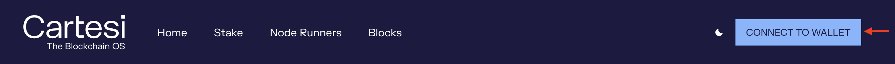
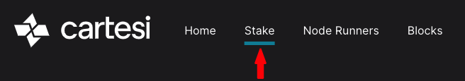
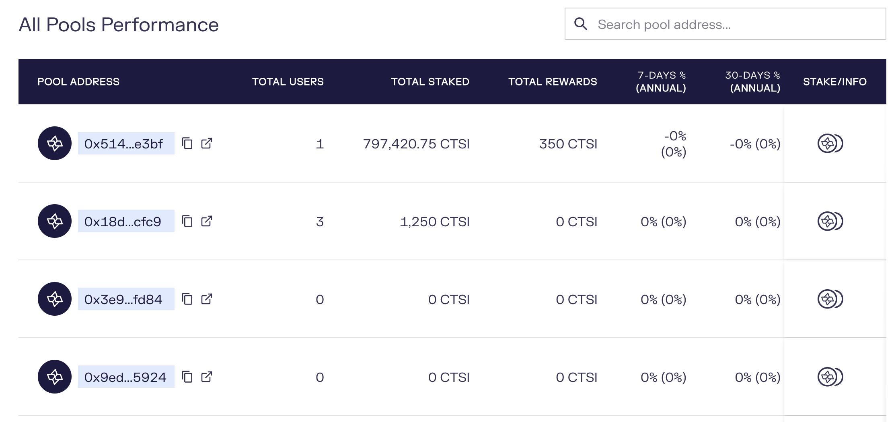
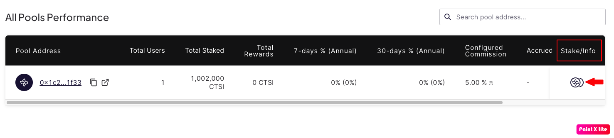
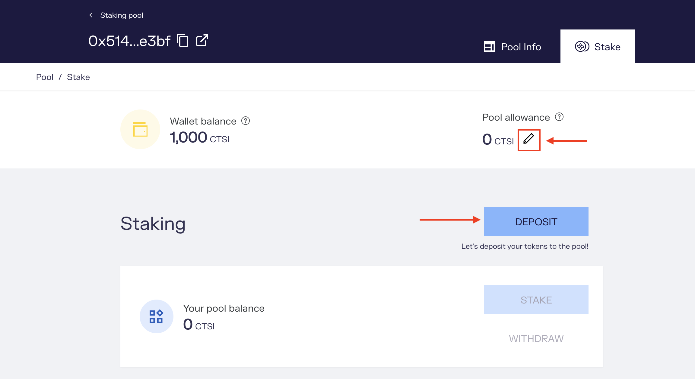
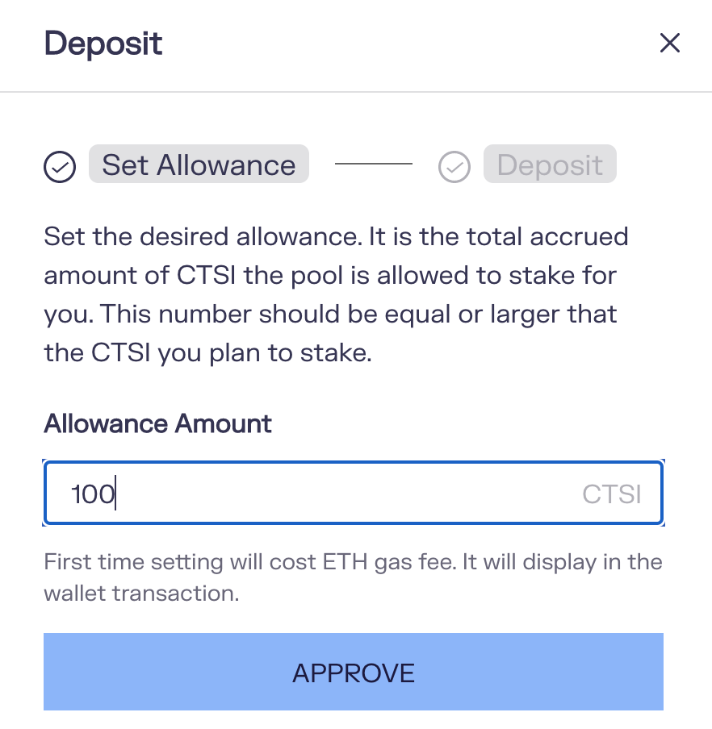
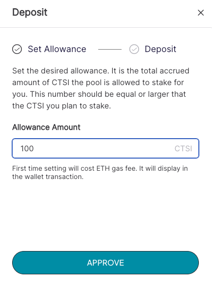
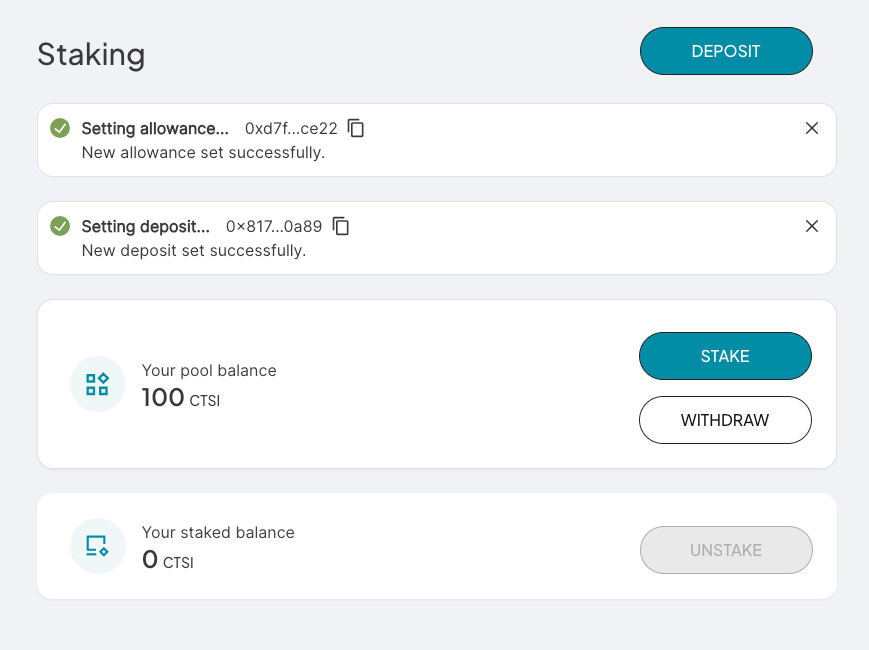
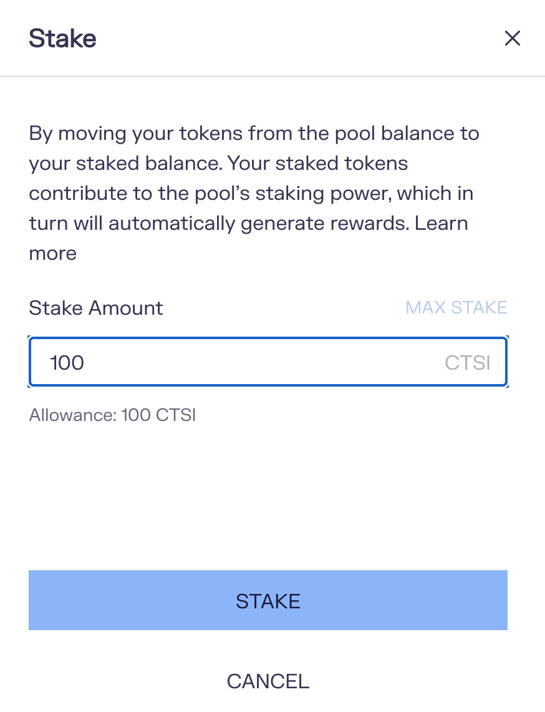

## Prerequisites

First, you need to have [Metamask installed](https://metamask.io/download/) or other crypto wallets such as Ledger, Coinbase wallet or using WalletConnect.

## Staking delegation guide

1. Navigate to our [Staking Portal](https://explorer.cartesi.io/)
2. Click on the button "CONNECT TO WALLET" 
3. Navigate to the Stake option in the top menu 
4. Now you should see the screen below with a different list of pools 
5. Select a pool to delegate your stake and earn rewards. In the example below, we selected the [first pool](https://explorer.cartesi.io/stake/0x5149f711ff8e4b36bba09685ec5f9ad32edce3bf) 
6. Navigate to the tab **Stake**
7. Click on the button "Deposit" 
8. Set an allowance for that particular pool, click on the button "Approve", and then confirm the transaction via Metamask. The allowance is the maximum amount of token the pool smart contract can transfer out of your wallet. You can set it to any value you want, your wallet amount, less or more.

9. Click again on the button **Deposit** to specify the amount of CTSI tokens that you want to deposit to the pool and then confirm the transaction via Metamask. 
10. You should see results similar to the following 
11. Finally, Click on the button **Stake** to specify the amount of CTSI tokens that you want to delegate and then confirm the transaction via Metamask. 
10. From now on, for every block the pool produces you will get a share of the reward minus the commission taken by the pool. The rewards are automatically compounded
11. Congratulations!, you have successfully completed the staking process

## Unstaking

Whenever you decide, you can unstake a specific amount of your tokens or all of them and withdraw back to your wallet. You just need to navigate to the particular pool page and click on the button **Unstake**:

