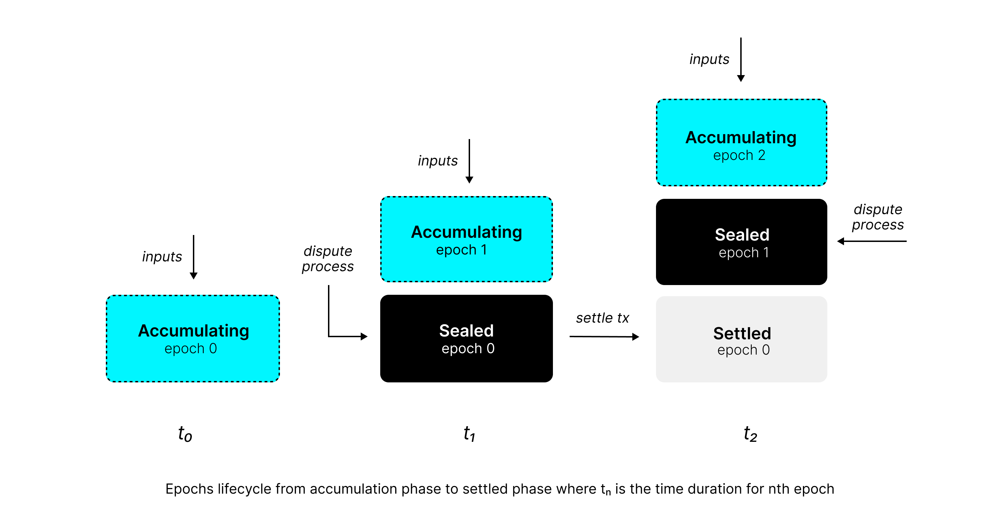

# Epoch Lifecycle

## What are Epochs?

Epochs in Cartesi's fraud proof system are time-based boundaries that define intervals of blockchain inputs to be processed and later to finalise the resulting state. They represent intervals of the form [a,b) based on block numbers and are identified by incremental numbers starting from 0. Each epoch contains a set of inputs that need to be processed together by the Cartesi Machine.

## Role in the Fraud Proof System

Epochs serve several critical roles in Cartesi's fraud proof system:

- Computational Verification Units: Epochs act as the fundamental unit for computation verification, where each epoch's processing results can be disputed through tournaments.

- State Management: The system maintains a specific state structure where at any given time, there is always one sealed epoch (currently being disputed), prior epochs that have been settled (finalized), and one accumulating epoch that is collecting new inputs.

- Dispute Resolution: Each epoch has an associated tournament that handles dispute resolution through the Permissionless Refereed Tournament (PRT) system.

## Epoch Lifecycle Implementation

The system maintains the following epoch states at all times:

1. **Settled Epochs**: Fully finalized state. The outputs generated during these epochs can be validated on-chain.
2. **Sealed Epoch**: The inputs for this epoch are fixed (sealed). This epoch is opened for state claims to be submitted, and if needed, trigger disputes. It takes at least one week for a sealed epoch to be settled by the fraud-proof system to allow anyone to also validate and submit claims.
3. **Accumulating Epoch**: Actively collecting new inputs.

The epoch lifecycle involves four main components working together:

1. **Epoch Creation and Sealing**:
    New epochs are created when previous epochs are settled. The on-chain consensus contract manages this process by emitting `EpochSealed` events that contain epoch boundaries, machine state hashes, and tournament information.
    The contract tracks the current sealed epoch number and input boundaries (lower and upper bounds) to define what inputs belong to each epoch. 

2. **Input Collection and Assignment**:
    The blockchain reader component of the off-chain node monitors blockchain events to collect both inputs and epoch information. It processes `EpochSealed` events to understand epoch boundaries and assigns inputs to their corresponding epochs.

3. **Input Processing and State Generation**:
    The off-chain node processes inputs within epochs by executing them on the Cartesi Machine. It generates state hashes for each input processed and builds commitment trees from these hashes.

    When an epoch is complete, the node finalizes it by adding any remaining _strides_, building the final _computation hash_, and generating output _proofs_.

4. **Settlement and Dispute Resolution**:
    The EpochManager handles epoch settlement by checking if tournaments are finished and submitting settlement transactions. It verifies that the winner's commitment matches the locally computed state and submits the settlement with output Merkle roots and proofs.

    If disputes arise, the EpochManager participates in tournaments by creating Player instances that can respond to challenges using the stored inputs, state hashes, and machine snapshots.

5. **Data Persistence and State Management**:
The StateManager provides persistent storage for all epoch-related data including inputs, state hashes, settlements, and machine snapshots. This ensures that the system can recover and continue processing even after restarts.

