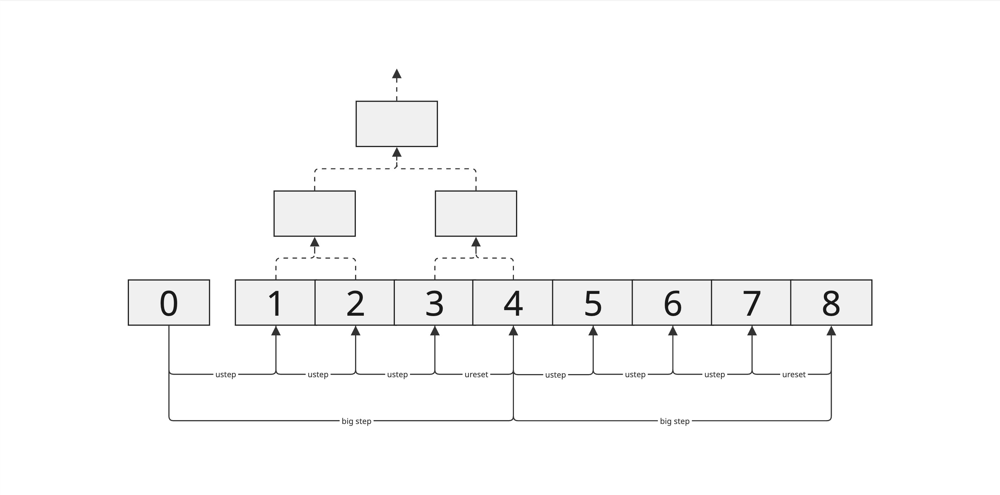

# State Transition Function

## What is a State Transition Function?

In computer science, a **state transition function (STF)** is the rule that defines how a system changes from one state to another in response to an input. It is the core mechanism behind models such as finite state machines and Turing machines, where the STF determines how the machine state evolves.

For instance, in a state machine like Ethereum blockchain, the state represents a global snapshot of the system at a specific block - capturing all account balances, contract code, and contract storage. The transactions act as inputs to the state transition function, processed by the Ethereum Virtual Machine (EVM) to deterministically produce a new state as output. A key design requirement of the STF is determinism, which means for any given input (state + transaction), all nodes must compute the same output. 


## State Transition Function in Cartesi
State transition functions differ across the rollups. Cartesi applications run inside the Cartesi Machine, a deterministic alt-VM based on the RISC-V ISA. For the sake of understanding, we'll assume that the inputs to the Cartesi's STF are only read from the Ethereum base layer such that an input directed to the cartesi app changes the state of the Cartesi Machine as well as the Ethereum. 

Understanding the Cartesi STF would require us to know a few concepts of the Cartesi Machine, like the state of the machine, the structure of the claims and how the novel micro-architecture implementation helps in verifying the state on-chain. These concepts together will also form the basis of the fraud-proof system.


### State of the Cartesi Machine
In the context of Cartesi, the state typically refers to the state of the Cartesi Machine. A Cartesi Machine state is a complete snapshot of the machine’s execution environment at a given point in time. This includes the full address space - contents of physical memory (RAM), all register values, internal cycle counter and input/output flash drive states. 

The **state hash** is a Merkle root representing this snapshot. The machine exposes its entire 64-bit physical address space as a flat array over which a Merkle tree is constructed. Each leaf of the tree corresponds to a 32-bytes memory word, and the root hash serves as a unique and verifiable fingerprint of the machine state. 

A computation on the Cartesi Machine is therefore defined by a transition between two such state hashes. The **initial state hash** encodes all the information necessary to begin execution, while the **final state hash** summarizes the result after the computation has been performed. This structure enables efficient and trustless verification of state transitions on-chain, where only Merkle proofs need to be submitted rather than the full state. 

The machine also supports generation and validation of **access logs** - cryptographic proofs of transition between two state commitments - which are central to enabling interactive dispute resolution protocols.

## Computation Hash
The computation hash is a cryptographic commitment to the entire history of a computation, not just its final state. It is constructed as a Merkle tree, where each leaf node represents a state hash corresponding to a 
_step_ in the computation - from the initial state (implicitly agreed upon) to the final state.

Unlike traditional models that only commit to the end result, this structure allows one to verify any intermediate step. To optimize storage and efficiency - especially for use in PRT (Permissionless Refereed Tournament) - the computation hash is designed to support multi-level hierarchies. This brings us to the next concept, _sparsity_.


In other words, computation hashes therefore lock the temporal evolution of a machine’s state, where the snapshot of each machine state is itself locked by a state hash. 

### Sparsity
The computation hash supports a notion of _stride_, which controls how frequently state transitions are recorded as leaves in the Merkle tree. A stride defines the number of instructions between two recorded states.

- When the stride is 1, every single state transition is included. This results in the densest form of the computation hash, with no sparsity.

- As the stride increases (e.g., 2, 4, 8...), the computation hash becomes sparser, including fewer intermediate transitions.

- The stride is always a power of two, and we typically refer to it using its logarithm base 2 (i.e., log₂(stride)) for convenience.

Each state transition is assigned a unique identifier called a cycle, where Cycle 0 corresponds to the transition from the initial state to the first new state, Cycle 1 is the next transition, and so on. This numbering refers to transitions, not the states themselves.

In the figure of computation hash tree above, the leaves of the tree includes the cycles: 1, 2, 3, 4, 5, 6, 7, 8. The cycle 0 is implicit as it’s the initial state everyone agrees upon. Every consecutive state transition is included which means in logarithmic terms `log₂(stride) = 0`. Since every state transition is recorded, the tree is in its densest possible form. There is no sparsity in this computation hash.

## Microarchitecture
To support efficient and verifiable state transitions on-chain, Cartesi introduces a _micro-architecture_ or a _uarch_ as a simplified execution layer within the Cartesi Machine. It is designed to emulate the full Cartesi Machine architecture which is also referred to as the _big-architecture_ or the _big-arch_.

The **uarch** is a reduced, deterministic subset of the big-arch, designed to be minimal enough for a verifiable on-chain implementation. It supports the 64-bit RISC-V (RV64I) non-privileged instruction set and omits complex features such as TLBs, floating-point operations, compressed instructions, and hypervisor modes. These are handled exclusively by the big-architecture off-chain, which is based on the RV64GC RISC-V standard extension.

The uarch maintains its own registers, cycle counter, and local state independently of the main machine. It ensures full interoperability by reading from and writing to the entire Cartesi Machine state, enabling coordination with memory, I/O, and other subsystems. The uarch state is embedded within the Cartesi Machine’s Merkle tree, ensuring that all state transitions are cryptographically committed and verifiable.

The on-chain **uarch step** is a deterministic state transition function in the RISC-V Solidity Emulator that executes exactly one RISC-V instruction. This implementation of a RISC-V processor maintains bit-by-bit consistency with the off-chain Cartesi Machine Emulator. To ensure correctness and auditability, the Solidity implementation of the uarch is automatically generated from the C++ reference code. This eliminates discrepancies between the off-chain and on-chain logic and enables transparent formal verification processes.

By limiting the on-chain state transition logic to microarchitecture steps, Cartesi maintains a minimal and deterministic on-chain verification surface, while allowing the off-chain emulator to execute complex architectures and system-level behaviors.

## On-chain and Off-chain Implementation
Cartesi distinguishes between off-chain computation (building the full computation hash) and on-chain verification (checking individual transitions). Off-chain, the validator node simulates the entire execution to produce the computation hash of all state transitions. On-chain, fraud-proofs only need to verify one disputed transition. Therefore, on-chain logic only steps the machine state one micro-architecture step forward (given proofs) and checks consistency with the committed computation hash. This yields two “dual” views of state transitions: the off-chain builder of a complete history, and the on-chain transition function validating a single step.

### Simple-Step State Transitions
Before introducing meta-steps, we take a look at simple-step model. Here, the on-chain primitive step performs one Cartesi-machine step, and off-chain advance does the same (fast for many steps). A halted machine state is a fixed-point of step (i.e. `step(s) = s` if `s` is halted). The on-chain state-transition function for this basic model is trivial:

```javascript
function transition_state(state_hash, proofs)
  return step(state_hash, proofs)
end
```

Off-chain, the computation hash is built by repeatedly advancing the machine and recording each new state hash, padding with the final halted state as needed. This simple-step logic corresponds to `log2_stride = 0` in the general schema.

### Meta-Cycles and Primitives
To amortize costs and enable batching of inputs, we introduce meta-steps. A meta-cycle counter encodes three levels of progress: micro-architecture steps, “big-arch” steps (full Cartesi instructions), and inputs (for rollups). Three constants define these granularities:
- **a**: number of bits for micro-steps. One big-step takes 2ᵃ micro-steps.
- **b**: number of bits for big-steps per input. One input is processed every 2ᵇ big-steps.
- **c**: number of bits for inputs per epoch. An epoch contains 2ᶜ inputs.


Thus, the meta-cycle counter has (a + b + c) bits, e.g. bits for input index, big-step index, and micro-step index. In practical settings (Honeypot testnet) the values are large (e.g. a=20, b=48, c=24) to accommodate the Cartesi machine’s complexity. The meta-cycle increments by 1 at each on-chain state transition.

**Primitives:**
- `ustep(state, proofs)`: Execute one micro-architecture step. If the micro-architecture is already halted, ustep returns the same state (fixed-point).
- `ureset(state, proofs)`: Reset the micro-architecture at the end of a big-step (preparing for the next big instruction).
- `send_cmio(state, input, proofs)`: Inject or commit a new input into the machine state (used at input boundaries in rollups).
- Off-chain counterparts include `advance_uarch` (step micro-arch), `advance_bigarch` (simulate a full big-step), and `ureset` to sync states.

### Meta-Step (Compute) Transition
In the meta-step (compute) model, we consider only the Cartesi machine with no external inputs (e.g. a pure computation). The on-chain primitives are ustep and ureset. Off-chain, we can simulate a “big-arch” (full Cartesi instruction) composed of 2ᵃ micro-steps.

Since we need a consistent commitment of states off-chain, we pad the micro-architecture so each big-step always uses exactly 2ᵃ micro-steps. 


This padding means that in the on-chain logic, every 2ᵃ micro-steps we perform a ureset, and otherwise we do a ustep. 

Off-chain, one would build the computation hash by simulating these padded ustep/ureset steps and collecting states.



### Meta-Step (Rollups) Transition
For rollups, we incorporate user inputs (I/O) into the state transition. In this model, Cartesi processes inputs every 2ᵇ big-steps, and there are 2ᶜ inputs per epoch. The on-chain primitives become ustep, ureset, and send_cmio. We again use a meta-cycle counter with (a+b+c) bits. The transition logic must:

1. Process a new input when an input boundary is reached. Every `2^(a+b)` micro-steps (i.e. 2ᵇ big-steps), a new input should be injected. Specifically, if meta_cycle is a multiple of `2^(a+b)`, we compute the input index `i = meta_cycle >> (a+b)` and, if an input exists, do send_cmio before stepping.
2. Reset at the end of each big-step. Every 2ᵃ micro-steps we finish a big-step and should reset the micro-arch.
3. Otherwise just ustep.


In effect, this combines input processing with the padded execution schedule. A halted micro-architecture remains fixed by ustep (i.e. once inputs are exhausted and computation halts, further ustep calls do nothing).


