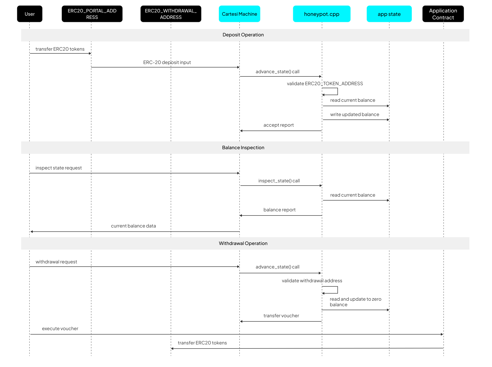

# Application Logic

The Honeypot application is implemented as a single C++ program that interfaces with the Cartesi rollup framework through the `libcmt` library. The application follows an event-driven architecture where it continuously processes rollup requests in an infinite loop.

## User Requests

As a standard Cartesi application, the Honeypot exposes two functions to process user requests:
1. `advance_state()` for advancing state of the application
2. `inspect_state()` for inspecting the state of the application

## Operations Handlers

The application implements three primary operations with specific validation and processing logic:

### 1. Deposit Processing

**Function**: `process_deposit()`
**Trigger**: ERC-20 Portal contract call
**Purpose**: Processes incoming ERC-20 token deposits into the Honeypot application

**Processing Flow**:
1. Validate the input token contract address against the configured token address
2. Perform overflow check before adding to existing balance
3. Update internal balance state with the deposited amount
4. Flush state to persistent storage    
5. Generate success report

**Output**: Report containing deposit status

### 2. Withdrawal Processing

**Function**: `process_withdraw()`
**Trigger**: User-initiated withdrawal request
**Purpose**: Dedicated for the configured withdrawal address to withdraw ERC-20 tokens from the application

**Processing Flow**:
1. Verify that funds exist for withdrawal, generate a report in case of zero balance
2. Generate voucher with entire balance for on-chain token transfer
3. Deduct entire amount from internal balance state
4. Create report with the status of the withdrawal

**Output**: 
- **Voucher**: On-chain executable transaction for token transfer
- **Report**: Confirmation of withdrawal

### 3. Balance Inspection

**Function**: `inspect_state()` 
**Trigger**: Balance query from any address
**Purpose**: Provides read-only access to vault's balance without state changes

**Processing Flow**:
1. Generate report with current balance information

**Output**: Report containing current balance of the Honeypot's vault

## Configuration Constants

The application relies on compile-time configuration constants that define blockchain addresses:

| Constant | Purpose | Source |
|----------|---------|---------|
| ERC20_PORTAL_ADDRESS | Portal contract for deposits | CONFIG_ERC20_PORTAL_ADDRESS |
| ERC20_WITHDRAWAL_ADDRESS | Authorized withdrawal address | CONFIG_ERC20_WITHDRAWAL_ADDRESS |
| ERC20_TOKEN_ADDRESS | Accepted token contract | CONFIG_ERC20_TOKEN_ADDRESS |
| STATE_BLOCK_DEVICE | State persistence device path | "/dev/pmem1" |

These constants are defined at compile-time and cannot be modified during runtime, ensuring the application's security and predictable behavior. The portal address determines which contract can trigger deposits, while the withdrawal address specifies the only authorized source for withdrawal requests. The token address restricts operations to a single ERC-20 token, and the state block device defines where persistent application state is stored.