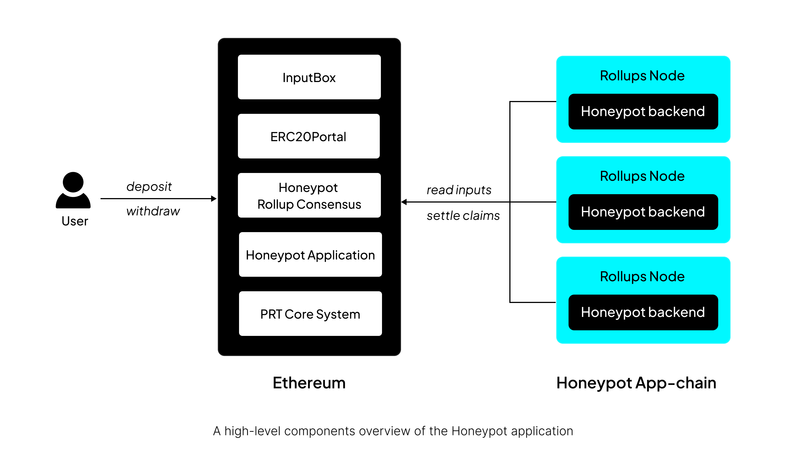

# Introduction

This section focuses on the Cartesi application - the Honeypot - its introduction, application logic and how it demonstrates the PRT fraud-proof system's capabilities in a real-world scenario.

## What is the Honeypot App?

Cartesi’s Honeypot application is a [Stage-2](https://medium.com/l2beat/introducing-stages-a-framework-to-evaluate-rollups-maturity-d290bb22befe) app-specific rollup that is built to test the security of Cartesi Rollups. The application is a secure ERC-20 token vault that operates with asymmetric access controls: it accepts token deposits from any Ethereum address but restricts withdrawals exclusively to a single pre-configured address. This creates a "honeypot" mechanism where tokens accumulate in the vault until the authorized withdrawal address claims them.

The application runs inside a Cartesi Machine (RISC-V virtual environment) and integrates with Ethereum through the Cartesi Rollups framework. It maintains a persistent state, validates all operations, and generates vouchers for authorized withdrawals.

