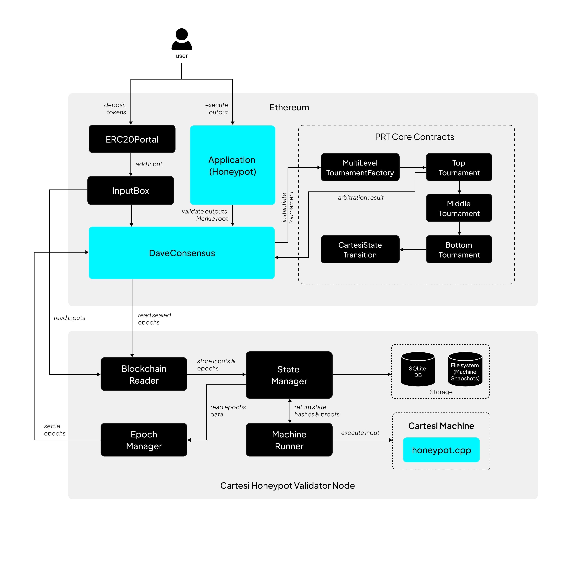

# Honeypot with PRT 

## Architecture Overview

The Honeypot v2 is secured by Permissionless Refereed Tournament(PRT) as the fraud proof system. Its core on‐chain components include the Application contract (the Honeypot app itself) and a separate `DaveConsensus` contract that implements the PRT consensus logic.  In the v2 deployment (Mainnet), Cartesi explicitly uses a 3‑layer PRT consensus (“PRT‑3L”). 

The Application contract holds all user deposits and executes outputs, but it delegates output validity checks to the `DaveConsensus` contract via the `IOutputsMerkleRootValidator` interface.  In practice, the Application simply calls `validateOutput(...)` on any proposed output; that call invokes the DaveConsensus logic to decide if the output’s Merkle root is valid.  This cleanly separates the application’s business logic (escrowing tokens, enforcing withdraw rules) from the fraud‐proof logic (verifying computation correctness).



## On-Chain Components

**Application (Honeypot App) Contract:**  The main application contract (implementing `IApplication`) contains the Honeypot logic.  It inherits standard modules (Ownable, token holder guards, reentrancy guard) and **never embeds any tournament logic**.  Instead, it stores an `IOutputsMerkleRootValidator` instance (initialized in its constructor) to validate outputs. When an off‐chain computation produces an output (e.g. a Voucher or DelegateCallVoucher allowing a withdraw), the app contract’s `executeOutput(bytes output, OutputValidityProof proof)` function is invoked. This function **first calls** `validateOutput(output, proof)`, which in turn checks the Merkle proof against the current validator:

```javascript
function validateOutput(bytes calldata output, OutputValidityProof calldata proof)
    public view override {
    // compute outputsMerkleRoot from proof and output hash (omitted)…
    require(_outputsMerkleRootValidator.isOutputsMerkleRootValid(address(this), outputsMerkleRoot), 
        “Invalid outputs root”);
}
```

Thus, outputs are only accepted if DaveConsensus has marked the corresponding root as valid. Only after validation does the contract perform the application logic (calling voucher/delegate calls, which in practice transfer the ERC‑20 tokens). All application‐level “withdraw” rules (e.g. only a pre‐configured account can receive tokens) are enforced in the off‐chain logic and then honored on‐chain via these voucher calls.

**PRT Consensus (DaveConsensus):**  The DaveConsensus contract implements Cartesi’s PRT protocol for a single application. It keeps track of “epochs” (intervals of inputs) and manages the tournament for each epoch. Importantly, it implements both `IDataProvider` and `IOutputsMerkleRootValidator`. Application outputs are considered valid if and only if DaveConsensus has stored that output-root as acceptable. In DaveConsensus, the function `isOutputsMerkleRootValid(address app, bytes32 root)` simply checks a mapping set during settlement. This value is set to true only when a **tournament has been settled successfully** for that epoch and the outputsMerkleRoot has been verified via on-chain computations.

**PRT Tournament Contracts:**  Under the hood, DaveConsensus uses a `ITournamentFactory` (typically the Cartesi *MultiLevelTournamentFactory*) to spawn a new **TopTournament** at the start of each epoch. Each dispute is handled by a multi‐stage “tournament” on-chain: the TopTournament coordinates bisection of a disputed computation trace, while BottomTournament contracts handle the final step-by-step verification by calling the on-chain Cartesi machine verifier (CartesiStateTransition) for a single contested instruction. All these PRT contracts (TopTournament, BottomTournament, factory) are part of Cartesi’s `prt-contracts` library and are invoked indirectly via DaveConsensus. The Application itself never needs to know about these; it only interacts with the DaveConsensus contract.

## Off-Chain Components

The Honeypot uses Cartesi’s Rollups node software with PRT support. This includes:

* **PRT Node (Dave) Software:** Anyone can run a node that executes the Honeypot machine (with the provided `honeypot.cpp`) and participates in PRT. The node listens for new inputs from the InputBox on L1, advances the Cartesi machine to compute outputs, and either submits a `settle` call or joins disputes. The Cartesi blog emphasizes that “any node can challenge correctness of computations” and that “honest users inherently help guarantee integrity… anyone can run their own node to validate the PRT Honeypot”.
* **Output and Input Bridges:** Off-chain, the Honeypot node also communicates with L1 by adding inputs (via the InputBox) and generating outputs (via Voucher calls). The ERC-20 Portal (for CTSI) is used to actually move tokens on L1 when a Voucher output is executed. These portal contracts are standard Cartesi components, used here to deposit CTSI into the Application contract and later withdraw it to a target address.

Behind the scenes, the off-chain node uses a service (the PRT tournament logic) to monitor the on-chain tournament state. It uses `cartesi-rollups-prt-node` or similar that integrates the `cartesi/dave` libraries. This service automatically triggers tournament moves when disputes arise. These off-chain components are separate processes from the Application logic (the latter being purely EVM code). Thus **application logic (the honeypot rules)** lives entirely in the off-chain machine and Application contract, while **fraud-proof logic** lives in the PRT consensus code and off-chain PRT engines.

## Triggering Claims and Disputes

**Submitting Claims (Outputs):** In Cartesi Rollups, outputs are proposed by rollup nodes whenever an epoch is sealed. A node will call `settle(epoch, outputsMerkleRoot, proof)` on DaveConsensus (as shown in) once it believes an epoch’s execution is complete. If the tournament for that epoch has finished (meaning someone won any dispute), `settle` will perform a Merkle‐proof check against the final machine state, then **mark the outputs root as valid** and start the next tournament. Importantly, once DaveConsensus has accepted an outputsMerkleRoot, the Application contract will honor any outputs (vouchers) under that root.

**Dispute Resolution Workflow:** If any validator disagrees with the proposed output for an epoch, they participate in the PRT tournament. That process is largely *off-chain and decentralized*: anyone running a PRT-aware Cartesi node can join the tournament by fetching the current TopTournament contract from DaveConsensus. They then exchange “claims” by making specific function calls on the TopTournament contract (bisecting the execution trace). Each round eliminates half of the false claims. Eventually, the dispute narrows to a single instruction, and a BottomTournament is spawned to resolve that instruction on-chain. We see this in DaveConsensus’s use of `ITournament` and the events emitted at epoch seal. After resolution, any honest validator (or even anyone) can call `settle` on DaveConsensus to finalize the epoch.

Notably, **claim submission is external to the Application UI**: users don’t call a special contract method to start a dispute. Instead, the act of “claiming” happens via off-chain tools talking to the PRT contracts. The Application’s only on-chain role is to hold funds and execute outputs. If a malicious output is attempted, validators will spot it and challenge it through the PRT tournament before the `outputsMerkleRoot` is accepted.


## Key Abstractions & Patterns

The integration decouples the fraud-proof system from app logic: the Honeypot Application contract doesn’t import or call any PRT-specific code directly. Instead:

* **Validator Interface:** The use of `IOutputsMerkleRootValidator` is a key abstraction. The Application only depends on this interface, not on DaveConsensus specifically. This means the app logic doesn’t need to know how consensus works, only that outputs will be checked. The owner of the app contract can even replace the validator (with `migrateToOutputsMerkleRootValidator`) if needed.
* **Modular Fraud-Proof Contracts:** All tournament and proof logic lives in separate contracts (DaveConsensus, ITournamentFactory, Top/Bottom Tournaments, CartesiStateTransition, etc.). The application simply observes their results. Likewise, Merkle and proof utilities are factored into libraries (`LibOutputValidityProof`, `LibMerkle32`, etc.) for reuse.
* **Epoch-Based Coordination:** DaveConsensus defines clear epoch boundaries and emits an `EpochSealed` event. This event-driven design lets off-chain services (and even users) know exactly when to start a new challenge or accept the results. It cleanly separates “accumulate inputs for epoch” from “finalize epoch” stages.
* **Standardized Output Formats:** The Honeypot app uses Cartesi’s standard Vouchers (`Outputs.Voucher` and `DelegateCallVoucher`) to drive actions. Because these are part of the Cartesi SDK, the PRT system already understands how to verify them via Merkle proofs.

Together, these patterns ensure the Honeypot’s core logic remains fully isolated from the PRT framework.  The app simply promises to honor any output that DaveConsensus agrees is valid, while DaveConsensus handles all disputes by spawning tournaments and consulting the ultimate on-chain verifier.

