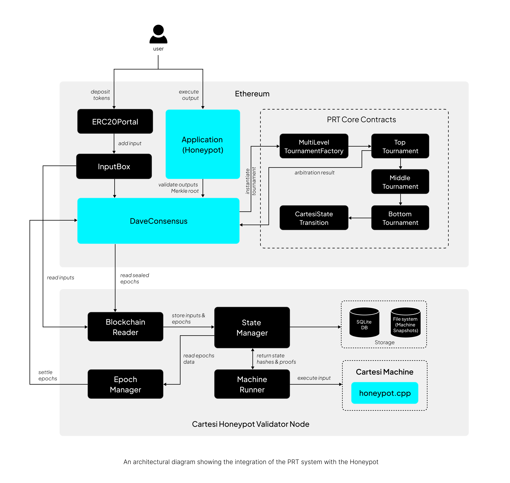

# Honeypot with PRT 

## Architecture Overview

The Honeypot v2 is secured by Permissionless Refereed Tournament(PRT) as the fraud proof system. Its core on‐chain components include the _Application contract_ (the Honeypot app itself) and a separate _Rollups-PRT Consensus contract_ that orchestrates the PRT consensus logic.  In the v2 deployment on Ethereum Mainnet, a 3‑layer PRT consensus (also known as _PRT‑3L_) is used. 

The Application contract holds all user deposits and executes outputs, but it delegates output validity checks to the `DaveConsensus` contract via the `IOutputsMerkleRootValidator` interface.  All applications' outputs can be effectively validated by a `validateOutput(...)` call on the application contract. This call invokes the DaveConsensus logic to decide if the output’s Merkle root is valid.  This cleanly separates the application’s business logic (escrowing tokens, enforcing withdraw rules) from the fraud‐proof logic (verifying computation correctness).



## On-Chain Components

#### **Honeypot Application Contract** 
The main application contract (implementing `IApplication`) is the representation of the Honeypot application on-chain.  It inherits standard modules (Ownable, token holder guards, reentrancy guard) and never embeds any tournament logic.  Instead, it stores an `IOutputsMerkleRootValidator` instance (initialized in its constructor) to validate outputs. When an off‐chain computation produces an output (e.g. a Voucher or DelegateCallVoucher allowing a withdraw), the app contract’s `executeOutput(bytes output, OutputValidityProof proof)` function is invoked. This function **first calls** `validateOutput(output, proof)`, which in turn checks the Merkle proof against the current validator:

```javascript
function validateOutput(bytes calldata output, OutputValidityProof calldata proof)
    public view override {
    // compute outputsMerkleRoot from proof and output hash (omitted)…
    require(_outputsMerkleRootValidator.isOutputsMerkleRootValid(address(this), outputsMerkleRoot), 
        “Invalid outputs root”);
}
```

Thus, outputs are only accepted if DaveConsensus has marked the corresponding root as valid. Only after validation does the contract perform the application logic (calling voucher/delegate calls, which in practice transfer the ERC‑20 tokens). All application‐level “withdraw” rules (e.g. only a pre‐configured account can receive tokens) are enforced in the off‐chain logic and then honored on‐chain via these voucher calls.

#### **PRT-Rollups Consensus (DaveConsensus)** 
The DaveConsensus contract implements Cartesi’s PRT protocol for a single application. It keeps track of “epochs” (intervals of inputs) and manages the tournament for each epoch. Importantly, it implements both `IDataProvider` and `IOutputsMerkleRootValidator`. Application outputs are considered valid if and only if DaveConsensus has stored that output-root as acceptable. In DaveConsensus, the function `isOutputsMerkleRootValid(address app, bytes32 root)` simply checks a mapping set during settlement. This value is set to true only when a **tournament has been settled successfully** for that epoch and the outputsMerkleRoot has been verified via on-chain computations.

#### **PRT Tournament Contracts**  
Under the hood, DaveConsensus uses a `ITournamentFactory` (typically the Cartesi *MultiLevelTournamentFactory*) to spawn a new **TopTournament** at the start of each epoch. Each dispute is handled by a multi‐stage “tournament” on-chain: the TopTournament coordinates bisection of a disputed computation trace, while BottomTournament contracts handle the final step-by-step verification by calling the on-chain Cartesi machine verifier (CartesiStateTransition) for a single contested instruction. All these PRT contracts (TopTournament, BottomTournament, factory) are part of Cartesi’s `prt-contracts` library and are invoked indirectly via DaveConsensus. The Application itself never needs to know about these; it only interacts with the DaveConsensus contract.

## Off-Chain Components

The Honeypot uses Cartesi’s Rollups node with PRT support. This includes:

#### **Honeypot PRT Node** 
The Honeypot-PRT node executes the Honeypot Cartesi Machine (with the provided `honeypot.cpp`) and participates in the PRT fraud proof system. The node listens for new inputs from the _InputBox_ contract on L1, advances the Cartesi machine to compute outputs, and either submits a `settle` call or joins disputes. Running the Honeypot node is permissionless and any node can challenge correctness of computations to guarantee the integrity of the rollup.

:::note Run a Honeypot Node
Checkout the Honeypot wiki to learn how to run a node that participates in PRT [here](https://github.com/cartesi/honeypot/wiki).
:::

When an epoch is sealed and the node detects that no tournaments remain unresolved, it will call `settle(epoch, outputsMerkleRoot, proof)` on DaveConsensus. This settle call verifies the Merkle proof of the final machine state, records the outputs root as valid, and opens the next epoch to receive inputs. Once DaveConsensus has accepted a root in this way, the Honeypot Application contract will honor any vouchers contained within it, such as withdrawals of deposited tokens.

Under the hood, the Honeypot-PRT node listens to the events emitted by the PRT contracts, and tracks tournament state. When disputes arise, it reacts to those events by issuing the required tournament moves.