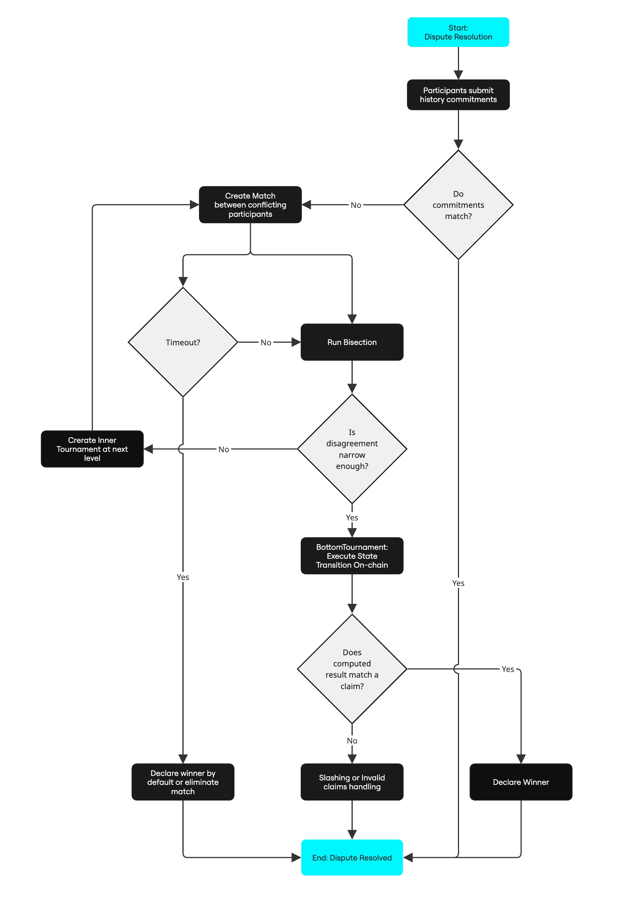

# PRT Algorithm

## Overview
The PRT algorithm implements a hierarchical tournament structure that resolves disputes between parties with conflicting state commitments in O(log n) time complexity, meaning the amount of work required of the honest participant is logarithmic in the number of Sybils, which gives the honest participant an exponential advantage over Sybil attacks. This exponential advantage allows the system to be permissionless. In other words, anyone can participate with affordable bonds and a laptop, while maintaining the security guarantee that a single honest validator can enforce the correct result against any number of malicious participants.

## Components
To understand the PRT algorithm, we need to familiarize ourselves with the key components of the system:

- **Participants**: The validator nodes that join tournaments and take part in the dispute settlement process.

- **PRT-Rollups Consensus**: An on-chain interface that provides API for participants to take part in the core PRT system. 

- **Tournament System**: Creates and manages tournament instances across different levels.

- **Match System**: Keeps track of the matches within a tournament and implements the bisection game through rounds of advancement and sealing. 

- **State Transition Function**: Executes the actual state transition verification in the final stage to determine dispute winners.

## Stages in Tournaments
PRT research paper introduces two types of tournament stages depending on the computational complexity at hand - a _single-level_ and a _multi-level_ tournament.

### Single-Level Tournament
Single Level Tournaments are suitable for simpler dispute scenarios where the computational complexity allows for direct resolution without requiring multiple levels of binary search.

### Multi-Level Tournaments
Multi Level Tournaments are designed for complex disputes involving large computational traces that require hierarchical narrowing through multiple tournament levels to efficiently find the exact point of disagreement. It is organized into a three-level tournament hierarchy, where each level progressively narrows down the scope of dispute:

- **Top Level Tournament**: The root of the dispute. Participants submit their _history commitments_ here. If two or more conflicting claims are found, a match begins. The _sparsity_ is high on this level and gets denser with each subsequent level.

- **Middle Level Tournament**: If a match at the top level can't be resolved directly (i.e., the difference is too large), a new tournament is created at a deeper level to focus on a smaller segment of the computation.

- **Bottom Level Tournament**: At this leaf level, the actual disputed step is computed and verified on-chain by the Cartesi Machine. The result of this execution determines the winner.

## Step-by-Step Flow
To understand the operations of a multi-level tournament setup, we can break it down into the following steps:

### 1. Joining Tournament
A participant joins a tournament by submitting:
- their claimed _final machine state hash_,
- a _Merkle proof_ that this hash appears in a commitment tree of the expected height,
- and the immediate _left_ and _right_ child nodes whose hash concatenation reconstructs the commitment root for this entry.

The tournament verifies that the commitment is valid, sets timing constraints for the participant, and either pairs them with a waiting participant to form a match or places them in a waiting state until another participant joins.

### 2. Match Creation and Progression
When two participants submit conflicting claims, they’re paired in a unique match with an ID and a state. The match advances using the bisection protocol over computation hashes, and its state is updated with the newly assigned right and left leaf node. Participants alternately submit intermediate state hashes. At each round, the disagreement is halved, narrowing the dispute.

This process continues recursively until the exact point of disagreement is found.

### 3. Match Sealing and Inner Tournament Creation
When the diverging point is found in the last step, it is sealed, and an inner tournament is created at a deeper level to find a more granular conflicting point.

The sealed match becomes the root of a new sub-tournament. The process of bisection continues at a finer resolution.

### 4. Leaf Match Resolution

At the Bottom Tournament level, the system directly resolves the dispute by executing the specific computation step in question and verifying the result against both participants' claims.

The on-chain verifier runs the Cartesi Machine to ensure the correct result is computed and a winner is determined.

### 5. Timeout Handling

To maintain liveness, PRT includes timeout mechanisms:

If a participant fails to respond in time during any match round, the match is automatically resolved in favor of the other participant (or eliminated if both time out). This ensures disputes do not stall indefinitely and keeps the protocol moving forward.    

<video width="600" controls>
  <source src="/videos/prt-video-explainer" type="video/mp4" />
  Your browser does not support the video tag.
</video>

## Flowchart
The following flowchart illustrates the PRT algorithm in a simplified manner:

