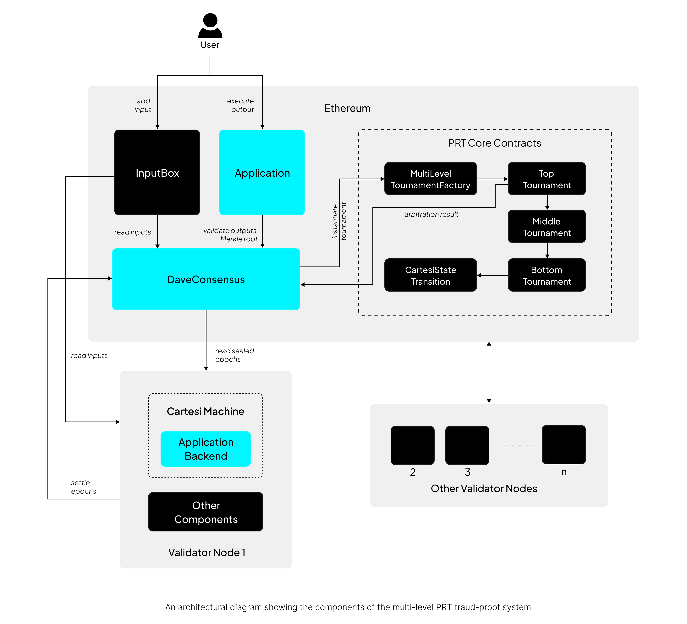
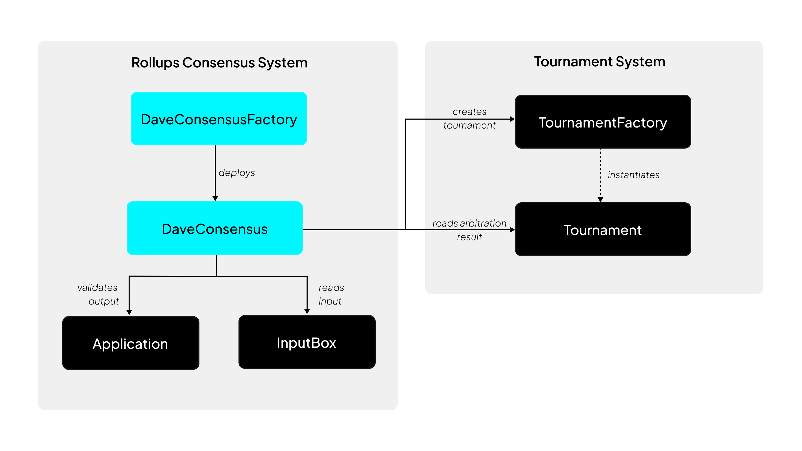

# PRT Architecture

## Overview
PRT implementation consists of three main subsystems that work together to provide a decentralized verification system:

1. **Blockchain Layer**: Includes the Ethereum network, smart contracts (Application, PRT Rollups Consensus), and blockchain events that trigger the system.

2. **Dispute Resolution (PRT Core System)**: The on-chain tournament system that resolves disputes through a permissionless refereed tournament approach. Note that it is a part of the blockchain layer.

3. **Cartesi Rollups Validator Node**: The off-chain node that monitors blockchain events, processes inputs, executes the Cartesi Machine, and manages state.

## On-chain Components

### InputBox Contract
The `InputBox` contract is the entry point for user interactions with a rollups application. All inputs destined for a Cartesi application are first submitted to this contract, which then emits events that the off-chain components can process. It also acts as the data availability source for the `DaveConsensus` contract.

### Application Contract
The `Application` contract defines the application on-chain, stores application assets and executes the outputs of generated by the application. For verifiability, it uses the `DaveConsensus` contract to validate the outputs.

### Portal Contracts
A group of contracts that are used to deposit assets(Ether, ERC20, ERC721, ERC1155) into the rollups application. All portal contracts submit their inputs to the `InputBox` contract. Read more about the portal contracts [here](../../../cartesi-rollups/2.0/api-reference/contracts/portals/EtherPortal/).

### PRT Rollups Consensus (DaveConsensus) Contract
This is the PRT Rollups Consensus contract that acts as an interface to the PRT core contracts in the dispute resolution system. It is the central smart contract that validates outputs from the Cartesi Machine. It manages epoch boundaries, handles epoch settlement, and initiates tournaments for dispute resolution.

### Tournament System
The Tournament System is a group of contracts that implements the core functionality of the Permissionless Refereed Tournament (PRT) for resolving disputes about state transitions. It is responsible for managing tournament participants, matches, and the resolution of disputes.

### State Transition Function
The state transition function is a critical component that bridges the gap between high-level dispute resolution in tournaments and low-level machine state verification. In leaf(bottom-level) tournaments, it's used to verify the correctness of state transitions. The function is called during the `winLeafMatch` process to compute the actual final state and compare it with participant claims. 

The state transition function is implemented in the `CartesiStateTransition` contract, conforming to the `IStateTransition` interface. It determines how application state progresses during disputes in PRT tournaments.

The main entry point is the `transitionState` function, which determines whether to handle compute-only operations or rollups operations based on the presence of a data provider.

The function signature accepts:
- *machineState*: The current machine state hash
- *counter*: The current execution counter
- *proofs*: Binary proof data
- *provider*: Optional data provider for rollups mode

The contract uses two immutable dependencies:
- **IRiscVStateTransition** for RISC-V processor state transitions. `step()` function advances the micro-architecture by one cycle and `reset()` function resets the micro-architecture state. Both methods operate on `AccessLogs.Context` structures and delegate to lower-level step implementations.
- **ICmioStateTransition** for Cartesi Machine I/O operations. `sendCmio()` function sends CMIO responses with yield reasons, data hashes, and lengths. It is used specifically for processing inputs in rollups mode

The state transition system is closely integrated with the MachineInstance component, which provides methods for loading and executing Cartesi machines, generating state transition proofs, handling both compute and rollups scenarios and managing machine state including cycle counters and hash states.

In rollups mode, input processing follows this logic:
1. Extract input length from the first 8 bytes of proofs
2. Extract input data from the following bytes
3. Calculate input index within epoch
4. Validate input existence with the data provider
5. If input exists, send CMIO response with advance state reason
6. Execute RISC-V step

This smart contract layer transition is performed by the Cartesi's [Solidity step emulator](https://github.com/cartesi/machine-solidity-step), an on-chain implementation of a RISC-V processor that maintains bit-by-bit consistency with the off-chain Cartesi Machine Emulator.

## Off-chain Components
The off-chain components(also referred to as layer 2 or 3) are primarily part of the Cartesi Rollups Node. For a logical separation, we will discuss the node and the Cartesi Machine separately.

### Cartesi Rollups Validator Node
The Cartesi Rollups Node is the off-chain component that processes inputs, executes the Cartesi Machine, and interacts with the blockchain. This node is composed of multiple services and components working together to ensure optimal performance. Some of these components are: 

:::note Work in Progress
The components listed here are part of an evolving implementation of the rollups node. A robust node with PRT integration will be released in near future to replace the current implementation. 
:::

- The **Blockchain Reader** component monitors blockchain events related to the fraud proof system, including input additions and epoch sealing events.

- The **Epoch Manager** component handles epoch settlement and participates in dispute resolution tournaments.

- The **Machine Runner** component executes inputs in the Cartesi Machine. It advances machine by configured stride, captures state hashes at each step and handles padding for computation hash completion.

- The **State Manager** component provides persistent storage for the dispute resolution process, including inputs, epochs, state hashes, and machine snapshots.

- The **Cartesi Machine** component is an Implementation of the RISC-V emulator off-chain. It hosts the application code, executes the inputs and generates cryptographic proofs that can be verified on-chain during dispute resolution.
