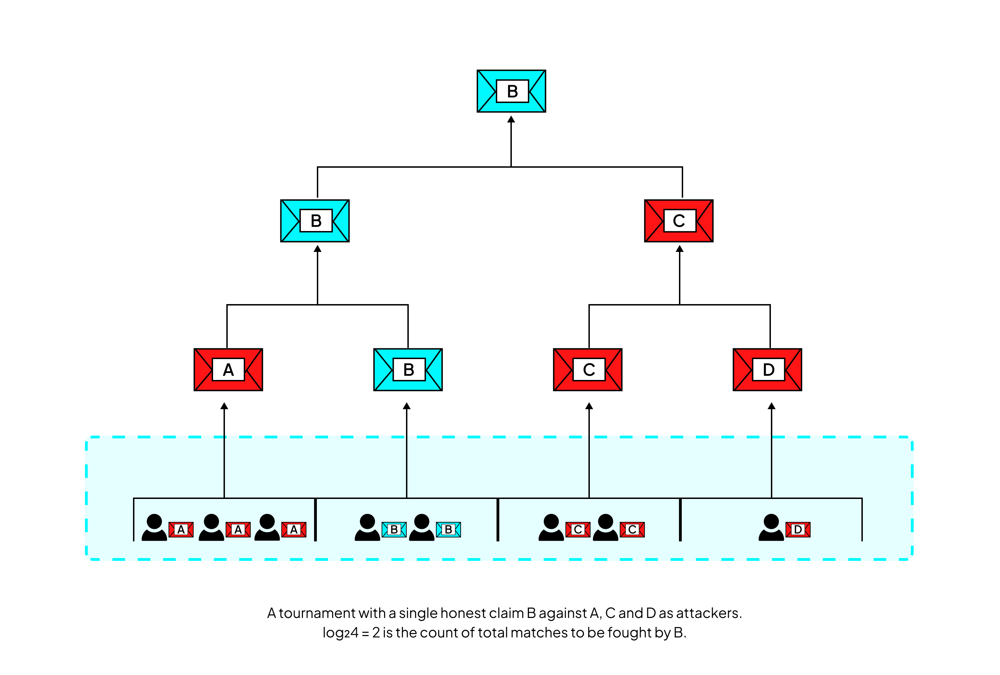

# Permissionless Refereed Tournament - A Brief Introduction

The Permissionless Refereed Tournament (PRT) is the foundational algorithm of Cartesi’s fraud-proof system. It is designed so that anyone - even on a modest computer - can be a participating validator and still defeat any number of dishonest adversaries, including the resources of a nation state.

In this section, we’ll look into the traditional fraud-proof models and how PRT overcomes the struggle of sybil attacks with its design elements. 

## Background: Traditional Fraud Proof Systems
Traditional fraud-proof protocols are based on the work of [Canetti et. al](add link). Consider the simplest setup with two players. The basic mechanism involves players agreeing on an initial state and state-transition function (STF), then running computations locally to submit final state claims to the blockchain. 

If both players submit the same claim, the system accepts it. If they disagree, a verification game begins. The game proceeds in two phases. First, a bisection phase runs as a binary search over the computation, narrowing down where the players first diverge. Once the divergent step is found, the blockchain itself applies the STF once in a one-step execution, and the dishonest party is eliminated.

This two-player model is simple and robust. However, when extended naively to many players, it reveals a fundamental weakness.

#### Fragility Under Sybils
In the traditional model, each claim is tied to an individual player, and players cannot pool defences even if they agree. Every player must defend their claim personally, and their signatures are bound into the protocol. This allows for Sybil attacks: an adversary can spawn many identities, post the honest claim, and then deliberately lose verification games, causing the honest claim to be eliminated.

In short, the approach does not reveal lies, it only reveals liars as called out in the EthResearch post [here](link). This fragility makes the approach unsuitable for permissionless environments, where Sybils are inevitable. Early fraud proof systems, such as those used in Cartesi and Arbitrum, would suffer indefinite settlement delays, since resolution time grows linearly with the number of Sybils.

## Introducing PRT algorithm
Permissionless Refereed Tournaments (PRT), developed by Cartesi, address this fragility by rethinking the nature of claims. Instead of committing only to the final state, PRT introduces computation hashes (explained in the Basic Concepts section), which are stronger commitments to the entire path of the computation.
A computation hash is built as a Merkle tree, where each leaf represents the state at every transition. In this way, a claim encodes not just an endpoint, but the full history of the computation. To defend a claim during a bisection, a player must provide a Merkle proof showing that an intermediate state is consistent with the computation hash. This eliminates the possibility of an adversary deliberately misplaying an honest claim, since the Merkle proofs themselves guarantee correctness.

With computation hashes, the protocol shifts from revealing liars to revealing lies. This shift has profound consequences. Players who agree on the same computation hash no longer need to defend claims in isolation. They can be grouped together and collaborate without requiring trust, forming what the literature calls the “hero” side of the dispute.

Claims are arranged in a bracket-style tournament: incompatible claims face off in matches, with half eliminated at each stage. Because each Sybil must post a bond to introduce a claim, while the hero needs only a single stake to participate, Sybil attacks become exponentially expensive for the adversary. Meanwhile, the honest hero’s workload grows only logarithmically in the number of Sybils. This economic and computational asymmetry ensures that the system remains secure and decentralized.

PRT also introduces refinements for scaling disputes. A fully dense computation hash, where every state transition is hashed, is often impractical for large computations. Instead, PRT begins with sparse computation hashes, where each leaf may represent many transitions.

When two sparse claims diverge, the dispute is reduced to a smaller computation, which can then be re-committed using denser computation hashes. This recursive tournament structure continues until the divergence is small enough to resolve through a standard one-step proof. The technique makes PRT feasible in practice, though it introduces additional delay: multi-stage tournaments can extend settlement time to logarithm squared in the number of Sybils.

In summary, PRT enables fraud proofs that are secure where 1-of-N honesty suffices, decentralized where anyone can participate, and do not compromise of liveness where disputes settle within bounded, logarithmic time.

