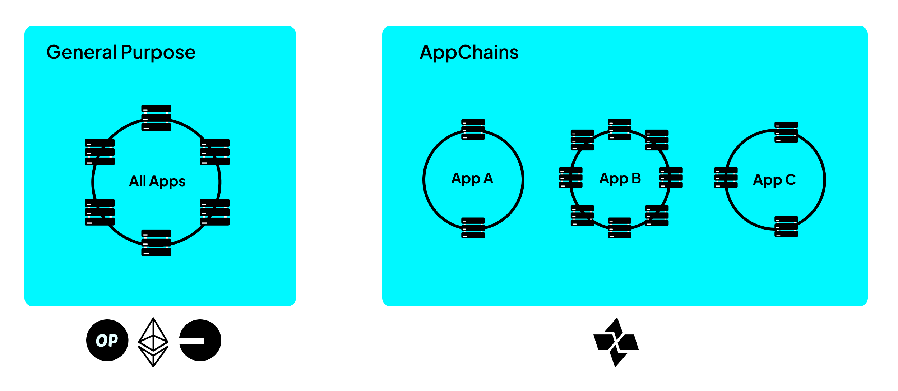

# Appchains

Cartesi enables application developers to build and deploy app-specific rollups, in other words, Cartesi AppChains. Built on top of the Cartesi Rollups framework, these appchains allow developers to deploy complex, high-performance decentralized applications without sacrificing decentralization or security and overcome the limitations of general-purpose Layer 1 and Layer 2 blockchains.
By isolating application logic from the base layer, Cartesi Appchains provide a scalable and customizable execution environment that supports familiar programming stacks, such as Linux, and heavy computational workloads that are infeasible onchain.

## Why Appchains?

#### Scalability and Performance

General-purpose blockchains(such as Ethereum) and rollup solutions(like Optimism and Arbitrum) are shared by thousands of applications, which compete for limited blockspace and computational resources. This often leads to network congestion, high gas fees and delayed transaction finality. By contrast, Appchains are dedicated rollups tailored to a single application, eliminating resource contention and enabling optimized throughput and cost control.

#### Application-Level Customization

Different apps may have very different requirements for throughput, finality, State size and history and interactivity with users or other chains. With Cartesi Appchains, developers have the freedom to define custom data availability strategies, use application-specific finality mechanisms, pick a consensus model and choose execution logic and libraries that best fit their needs.

## Composability and Interoperability

Cartesi Appchains can interoperate with the Ethereum ecosystem and other chains, albeit with some constraints. Each appchain is logically isolated but can use the base layer contracts(rollups-contracts) to share messages. Messaging across appchains or between an appchain and another dApp (like an L1 Uniswap pool) may require developers to build custom bridges or relayers.

## Bridging Assets

Migrating assets from the base layer(Layer 1 or Layer 2) requires the user to interact with the pre-deployed Portal smart contracts of the rollups infrastructure. For the security and consistency across the appchain, it becomes necessary for the application developers to only accept assets received from the portal contracts. 

For instance, to **deposit assets**, the client makes a request to a dedicated portal smart contract. The portal contract then submits this request to the generic input contract of the rollups, which is then finally read by the node. This gives a representation of your assets on the appchain. 

**Withdrawal of assets**, on the other hand, works when the application creates a special kind of  output called *voucher*. As discussed in the prior optimistic rollups section, this output must be validated before its execution. Note that while deposits are near instant, withdrawals can take time(dependent on epoch duration) before a user sees it in their base layer wallet.

## Application Deployment

Cartesi Appchains are designed to be EVM-compatible, meaning they can seamlessly integrate with the Ethereum ecosystem and smart contract infrastructure. This allows Cartesi’s on-chain components - the rollups contracts - to be deployed across any EVM-compatible chain.

Cartesi Appchains can be deployed on:
- Layer 1 (Ethereum): For maximum security and decentralization, especially for apps handling high-value assets.

- Layer 2 Rollups (e.g., Optimism, Arbitrum, Base): For reduced gas costs and faster transaction finality while retaining strong security guarantees.

This gives developers flexibility to optimize for cost, performance, and user reach depending on the application's needs. You can start building your appchain in minutes with the quickstart guide [here](/get-started/quickstart/).
