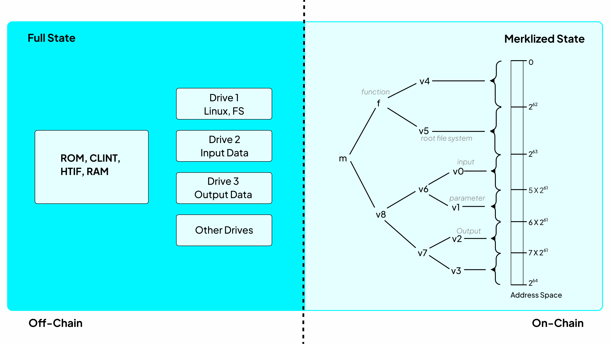

Execution environments in blockchain systems are where smart contracts and decentralized applications (dApps) run and process transactions. They provide the necessary infrastructure and rules to execute code and manage the state of the blockchain. *Ethereum Virtual Machine(EVM)* is a popular example running at the core of Ethereum.

## Introduction
The Cartesi Machine serves as the execution environment for Cartesi Rollups protocol. This virtual machine enables off-chain computations for blockchain applications. Built upon *RISC-V* - an instruction set for processors - the Cartesi Machine can run a full Linux OS, within which a decentralized application's backend is executed.

Cartesi Machines are executed inside a special emulator that has three unique properties:
- **Self-contained** - They run in isolation from any external influence on the computation;
- **Reproducible** - Two parties performing the same computation always obtain exactly the same results;
- **Transparent** - They expose their entire state for external inspection.

## Significance of RISC-V
The Cartesi Machine is built on [RISC-V](https://riscv.org/) instruction set - a real-world, open standard instruction set architecture (ISA) that offers access to a vast and growing ecosystem of hardware and software. This strategic choice brings substantial benefits to developers building decentralized applications.

RISC-V enables full access to standard libraries, offering powerful abstractions, data structures, algorithms, and crucial interfaces for interacting with file systems, memory, and processes. RISC-V makes it possible to boot full operating systems like Linux, transforming the Cartesi Machine into a hosted environment. This is critical because standard libraries rely on operating system support, and without an OS, the development experience is severely limited.

By enabling Linux and other OS support, the RISC-V architecture unlocks access to decades of open-source tooling. Developers can leverage compilers like GCC and Clang, debuggers such as GDB, as well as standard file systems, shell environments, and package managers. They also gain access to rich standard libraries across languages like C, C++, Rust, and Python.

## Architecture

The Cartesi Machine architecture involves two layers: an off-chain component that runs the full RISC-V emulator and maintains the complete machine state, and an on-chain component that holds a Merkle root representing that state for verification purposes. 

### Off-chain
The Cartesi Machine comprises a processor and a board. The processor handles computations via a fetch-execute loop and manages registers. The board provides the environment, including ROM, RAM, flash memory, and other devices. For verifiability, Cartesi Machines map their complete state - processor internals, board components, and attached devices - to physical memory in a structured manner.

Cartesi Machines support a 64-bit address space with memory protection. The design balances blockchain requirements with off-chain flexibility. Most instructions are basic and easy to simulate, with a small processor state for verifiability. Cartesi's implementation includes specific registers for privilege levels and operational status.

The communication between the board and the processor happens through designated memory areas. When the machine starts, it reads instructions from a special read-only memory (ROM) which also describes the hardware. A startup program in the ROM sets things up and then jumps to the main memory (RAM) to begin the actual work. There's also space for flash memory, like storage drives.

The machine's memory is organized using Physical Memory Attribute records (PMAs), which define different areas like RAM and flash, and what can be done with them (read, write, execute). These settings are mostly fixed after the machine starts, defining the limits of its storage and capabilities.

### On-chain

Smart contracts cannot afford to store or execute full Cartesi Machine states on-chain. The cost of replicating Linux-level computations across all nodes would be prohibitive in terms of storage and gas. To address this, Cartesi uses cryptographic hashes - **Merkle tree roots** - to represent machine states. From the blockchain’s perspective, a computation is defined simply by a pair of hashes: the initial and final states.

Each Cartesi Machine state, covering its 64-bit address space (RAM, ROM, CPU registers, devices), is deterministically mapped into a Merkle tree. The root of this tree acts as a unique commitment to that state. This allows smart contracts to reference complex off-chain state transitions using small, constant-size data while preserving the ability to verify them when challenged.

To enforce correctness, Cartesi uses a **verification game**. If one party submits an invalid result, another can dispute it. The smart contract then runs a binary search over the execution trace to identify the single instruction where they disagree. This interactive protocol narrows a potentially massive computation down to just one contested step, which the blockchain can verify efficiently.

In the final step, the smart contract replays the disputed instruction using a lightweight RISC-V emulator implemented in Solidity. It verifies all memory accesses using Merkle proofs provided by the disputing party. The post-instruction state is recomputed and compared to the claimed hash. If it matches, the transition is valid; if not, the dispute is resolved in favor of the challenger. This allows the blockchain to verify large computations at minimal cost without needing full access to the underlying state.

## State Transition function
A Cartesi computation progresses through a sequence of machine states, starting from an initial state and ending in a halting state, guided by a deterministic transition function, where each state, though encompassing the entire 64-bit address space, often focuses on specific memory regions, with state transitions occurring at the granularity of each executed instruction, marking a clear and auditable progression of the computation.

## Linux Runtime
The Cartesi Machine can run a full Linux operating system. This allows developers to use familiar tools and libraries for complex computations off-chain. Setting up Linux involves building the necessary components using a cross-compiling toolchain and creating a root file system. Cartesi's development frameworks(Cartesi Rollups) provide a convenient Docker container with a preconfigured Linux environment to abstract the infrastructure. The Linux system runs with a bootloader and interacts with the Cartesi Machine emulator. The root file system and additional data can be stored on virtual flash devices. This enables running complex applications with flexible inputs and outputs on the Cartesi Machine.

To conclude, the Cartesi Machine is the foundational component of the Cartesi infrastructure. Each Cartesi Node includes a reference implementation of the machine, enabling applications to perform deterministic, verifiable computations off-chain. In the next section, you'll see how the Cartesi Machine integrates into blockchain rollups.
