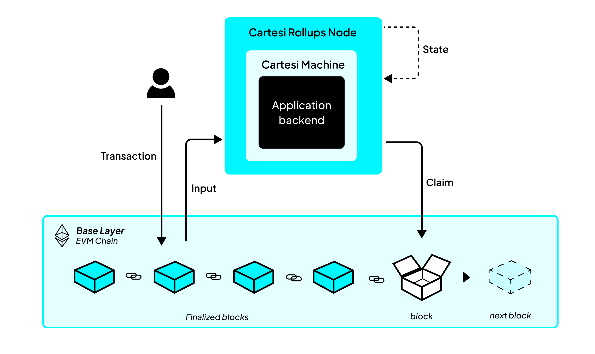

# Optimistic Rollups

## What is a Blockchain Rollup?

A rollup is a blockchain scalability solution that offloads complex computations "off-chain," meaning they run on a separate computing environment (execution layer) outside the base layer, such as Ethereum.

When employing rollups, the blockchain receives and logs transactions. In rare instances of an active attack or the involvement of a malicious agent, parties may disagree with a computation’s outcomes, and the blockchain will resolve these disputes. However, it's important to note that disagreements are not expected to occur under normal circumstances.

Users interact with a rollup through transactions on the base layer. They send messages (inputs) to the rollup on-chain smart contracts to define a computation to be processed and, as such, advance the state of the computing environment on the execution layer. Interested parties run an off-chain component (a node on the execution layer) that watches the blockchain for inputs, understanding, and executing the state updates.

Once in a while, the state is checkpointed on the chain; at this point, it is considered finalized and can thus be accepted by any smart contract on the base layer.

Ensuring this operation is secure is vital, meaning that the execution layer node must somehow prove the new state to the base layer.

Consider this question: _"How does Ethereum know that the data posted by an off-chain L2 node is valid and was not submitted maliciously?"_

The answer depends on the rollup implementation, which falls within one of two categories according to the type of proof used:

1. **Zero-knowledge Rollups (ZK Rollups)**, which use validity proofs.

2. **Optimistic Rollups (ORs)**, which use fraud proofs.

## Zero-knowledge Rollups (ZK Rollups)

In ZK rollups, which use validity proof schemes, every state update is accompanied by a cryptographic proof created off-chain, attesting to its validity. The update is only taken if the proof successfully passes verification on-chain. Validity proofs(ZK Rollups) bring the enormous benefit of instant finality—as soon as a state update appears on-chain, it can be fully trusted and acted upon.

The choice, however, also brings less than ideal properties: generating ZK proofs for general-purpose computations is, when possible, immensely expensive, and each on-chain state update must pay the extra gas fee for including and verifying a validity proof.

## Optimistic Rollups (ORs)

Optimistic Rollups, which use fraud-proof schemes, work by a different paradigm. State updates come unaccompanied by proofs; they’re proposed and, if not challenged, confirmed on-chain. Challenging a state update proposal using fraud proofs has two categories: **non-interactive** and **interactive**.

Non-interactive refers to the fact that the challengers can prove that a state update is invalid in one step. With interactive fraud proofs, the claimer and challenger must, mediated by the blockchain, partake in something similar to a verification game.

The assumption that state updates will likely be honest often gives solutions like this the name of Optimistic Rollups.

This optimism is reinforced by financial incentives that reward honest behavior. Furthermore, any proposed false state will only be accepted if it remains undisputed for a prolonged period.

The main advantage of Optimistic Rollups is that they are much cheaper than ZK Rollups. Posting a state update on-chain is minimal, and challenging a state update is also low.

The main disadvantage is that state updates take time to finalize and are not entirely accepted immediately. During this period, they are considered "optimistic" and can be challenged.

